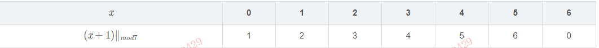
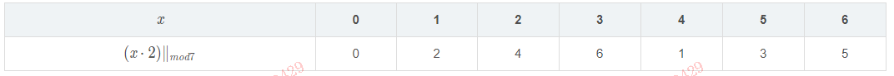
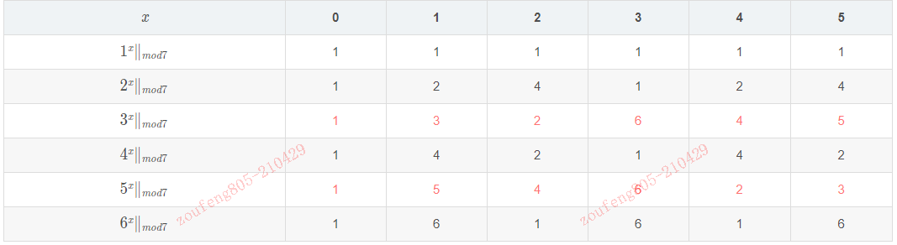
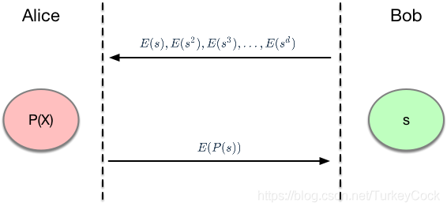
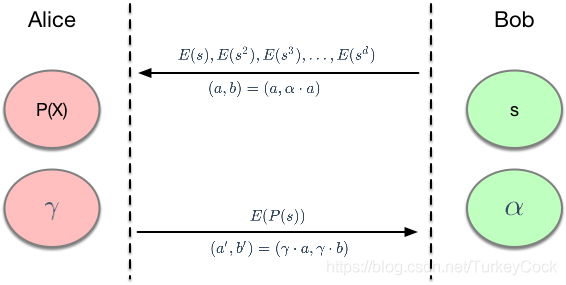
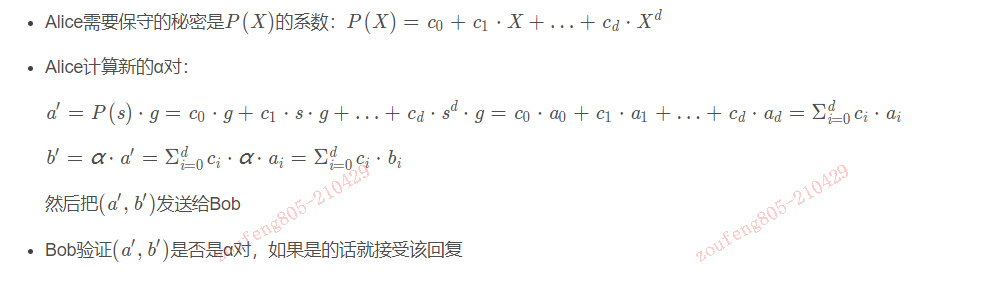
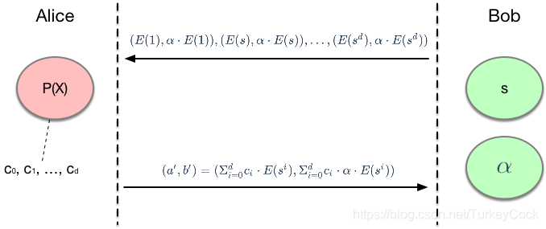
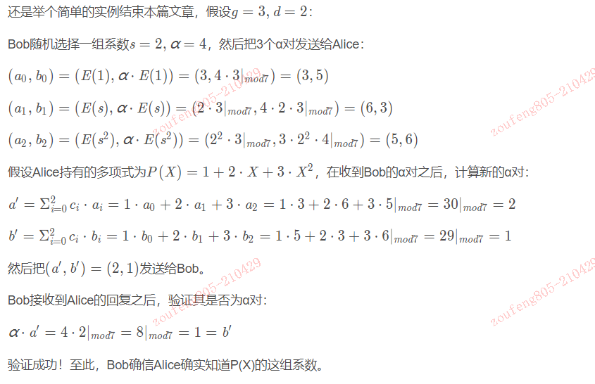

所谓零知识证明，指的是在不泄露秘密的前提下，证明我知道这个秘密。

下面是实现零知识证明的一些原理：

## 同态隐藏
https://blog.csdn.net/TurkeyCock/article/details/91365155

举个简单例子，假设我一个月工资2000，我老婆一个月工资3000。
我不会把这两个数字透露给你，但是我可以告诉你，我俩每个月的工资加起来是5000。
你可以通过某种方式验证我俩的工资加起来确实是5000，但是你没办法反推出来我每个月的工资是多少，我老婆每个月工资是多少。

要做到这一点，需要引入一个概念，叫做同态隐藏。这需要一些数论的知识，不过别担心，我也没有学过数论，所以我会尽可能用简单的语言来解释这个概念。

我们把上面那个问题用数学语言描述一下：已知两个数 x 和 y ，需要在不泄漏这两个数的前提下，证明 x + y = 5 。

要实现这一点，我们需要引入一个同态隐藏函数 E(x)，该函数满足下面3个条件：

- 知道 E(x)的值，没法反推出x的值。这个很容易理解，如果能反推的话，秘密就暴露了
- 如果x/=y,那么 E(x)/=E(y) 也就是说，这是一个单射，或者叫一一映射
- 如果知道了E(x)和 E(y)，就可以算出E(x+y)。举个例子：E(x+y)=E(x)⋅E(y)
- 如果找到了这个同态隐藏函数，问题就简单了：我把 E(x)跟 E(y)的值告诉你，
  你用它们算出 E(x+y)，然后判断一下是不是等于 E(5)就行了。
  也就是说，把验证x+y=5转化成了验证 E(x+y)=E(5)。

这个同态隐藏函数，用普通的加减乘除运算是没法实现的，我们需要引入2个新的运算。

### 模P运算
p可以是任意整数，不过为了获得一些特殊性质，p一般取一个素数，比如7。

所谓模p加法，就是加完之后对p取模（除以p取余数）。比如下面的例子：

我们把集合 {0,1,…,p−1}跟模p加法运算一起称为一个有限群。

集合的元素个数称为有限群的阶，所以上面是一个7阶有限群。

### 模p乘法
和模p加法类似，模p乘法就是相乘之再对p取模。比如下面的例子：

显然，这也是一个7阶有限群。

另外还有一个有趣的现象，如果让集合{1,p−1}中的每个元素对自身不断地做模p乘法（即乘方），观察我标红的那两行：

有没有发现，集合{1,p−1}中的每个元素都可以被生成出来（只不过顺序被打乱了）？
这种群被称为循环群，元素3或者5称为一个生成元。实际上，**所有素数阶的有限群都是循环群**。

### 同态隐藏函数
有了上面这些背景知识，我们就可以来寻找同态隐藏函数  E(x)了。

在上面的例子里，生成元 g∈{3,5}。假设我们取3，定义  E(x) = g^x|modp = 3^x|mod7

这个 E(x)函数是不是真的满足之前提到的3个条件呢？我们来确认一下：

由于生成的元素的顺序是乱的，所以没法根据E(x)反推出 x。你可能会说，根据上面那张表不就能反推出来了吗？
在实际应用中，p通常是一个很大的素数，比如2^256 量级的数，所以以目前计算机的计算能力，
是没有办法算出完整的表的（术语叫离散对数难题）
- 如果x/=y,那么 E(x)/=E(y)这条是满足的，因为生成元的作用就是生成集合中的每一个元素，从表中的数据也可以看出来
- 根据 E(x)和 E(y)可以算出  E(x+y)。在这个例子里，E(x+y)=E(x)⋅E(y)。
  注意这里 x和 y的取值范围是{0,p−2}，所以这里的的加法是模p-1加法，为了公式简洁没有显式指明。
  我们来证明一下，根据指数运算法则： 
  E(x+y) = g^(x+y)|mod(p-1)=(g^x)*(g^y)|modp=E(x)⋅E(y)
  
好了，现在我们有同态隐藏函数了，接下来通过实际的例子加深理解。

我们要保护的秘密是 x=2,y=3。我们计算出 E(x)和  E(y)，把它们的值提供给验证者：

- E(x) = E(2) = 3^2|mod7 = 9|mod7 = 2
- E(y) = E(3) = 3^3|mod7 = 27|mod7 = 6

验证者验证 E(x+y)是否等于  E(5)：

- E(x+y)=E(x)⋅E(y)=2⋅6∣mod 7 = 5
- E(5) = 3^5|mod7 = 243|mod7 = 5

验证成功！现在验证者可以确认我知道 x跟y的值，并且x+y=5。但是，他并不知道x和 y的具体值是多少，我们的目的达到了。

总结一下：
>同态隐藏就是通过一种特殊的映射函数，打乱原始数据的顺序。
根据映射值不能反推出原始值，但是映射值之间的关系可以反映原始值之间的关系。

### 多项式盲计算
假设取  E(x) = g^x ，则 E(x+y)可以通过 E(x)和 E(y)计算出来：
> E(x+y)=E(x)⋅E(y)

实际上，不仅仅支持加法，支持所有`线性组合`的同态隐藏，比如 E(ax+by)：
> E(ax+by) = g^(ax+by） = g^ax ⋅ g^by = (g^x)^a ⋅ (g^y)^b = E(x)^a ⋅ E(y)^b

需要注意的是，上面的加法和乘法运算都是模p运算。

假设现在有一个d次多项式
> P(X) = a_0 + a_1⋅X + a_2⋅X^2 + … + a_d⋅X^d ，

其中的系数 a_0,…,a_d ∈{0,p−1}是Alice需要保护的秘密。

根据上面的特性，我们可以计算出E(P(X))：
>E(P(X)) = E(1)^a_0 ⋅ E(X)^a_1 ⋅ E(X^2)^{a_2} … ⋅E(X^d)^a_d

现在Bob想来验证Alice是不是真的知道这些秘密，于是他决定随机指定一个数s，要求Alice计算 E(P(s))等于多少。
但是，Bob不想直接把s的值告诉Alice，也就是说，这个s是Bob的秘密。
显然，这又需要一次同态隐藏，也就是说，Bob把下面这些值提供给Alice：
E(s), E(s^2), E(s^3), …, E(s^d)

然后Alice就可以根据上面的公式计算  E(P(s))的值：
E(P(s)) = E(1)^{a_0} ⋅ E(s)^{a_1} ⋅ E(s^2)^{a_2} … ⋅E(s^d)^{a_d}

最终的效果是：在Bob不知道P(X)中的系数是多少，而Alice也不知道s等于多少的情况下，
完成多项式的验证。这就是所谓的`多项式盲计算`。

下面举个例子来加深理解，假设E(x) = 3^x, P(X)=1+2X+3X^2, p = 7

Bob想验证 s=2这一点上的E(P(s))的值，那么他需要提供这2个值：E(s) = 2, E(s^2) = 4。

然后Alice根据这3个值计算E(P(s))的值然后返回给Bob：
> E(P(s)) = E(1)^1 ⋅ E(s)^2 ⋅ E(s^2)^3 = 3 ⋅ 4 ⋅ 64 |mod7 = 768|mod7 = 5

最后，我们来看一下 E(P(2))是不是真的等于5：
> E(P(2)) = E(1 + 2 ⋅ 2^1 + 3 ⋅ 2^2) = E(17|mod6) = E(5) = 3^5|mod7 = 243|mod7 = 5

实际上，这背后依赖的理论基础是**Schwartz-Zippel**原理：
> 在一个很大的集合中随机选择一组数，满足某个多项式取值的概率几乎为0。

因此，随机选一个点，然后在Alice不知道该点的值的情况下，提供多项式的值以供Bob验证。

那么问题来了：Bob怎么验证Alice提供的E(P(s))的值对不对呢？那就是下面更有趣的东西了。

### KCA系数知识假设
上面介绍了盲计算，所谓盲计算，就是Alice在不知道s的情况下完成多项式计算。

那么，Bob如何确定Alice的计算结果是正确的呢？要实现这一目标，需要先介绍一个概念：α对。

在有限循环群G中，如果 α , β ≠ 0 且b=α⋅a，那么就称 (a,b)为一个α对。

也就是说，b是a的α倍（模p）。有了这个概念，就可以进行一项"系数知识测试"：

Bob秘密选一个随机的α值，生成一个α对： (a,b)=(a,α⋅a)

Bob把这个α对 (a,b)发送给Alice

Alice需要回复一个不同的α对： ( a′ , b′ )

Bob验证 ( a′, b′)是不是一个α对，如果是则接受该回复

乍一看有点迷糊，既然 b=α⋅a，那Alice不就是可以反推出α等于多少了吗？请注意：这里的乘法是模p乘法。举个例子就清楚了：

假设Bob选定 a=2,α=4，那么b=α⋅a=4⋅2∣ mod7 =1，所以最终生成的α对是 (2,1)，
Alice没法反推出α的值是多少（在p非常大的情况下，这是一个离散对数难题）。

既然Alice不知道α，那么她就只有一种方法可以生成新的α对：给a和b各乘上同一个系数 γ。

举个例子，假设Alice秘密选定 γ=5，那么新生成的α对：
> (a′, b′) =(γ⋅a,γ⋅b)=(5⋅2∣ mod7，5⋅1∣ mod7)=(3,5)

Bob收到这个新的α对 (a′, b′)之后，验证 
α⋅a =4⋅3∣ mod7 =12∣ mod7 =5=b ，接受该回复。

也就是说，Alice秘密持有 γ，Bob秘密持有 α。跟上一篇文章中的图拼到一起：

这就是所谓的"系数知识假设"，英文是"Knowledge of Coefficient Assumption"，简称KCA。
一句话概括：所谓KCA，指的是如果Alice成功回复了一个α对，那么她一定持有某个γ使得 a′=γ⋅a。

### 如何验证多项式的值
现在正式介绍一下Bob如何验证Alice发过来的E(P(s))的值是否正确。实际上，我们想要实现2个目的：

- 双盲：Alice不知道s，Bob也不知道P(X)
- 可验证：Alice只有发送正确的 E(P(s))的值，才会被Bob接受
要实现第2个目标，需要用到上一篇文章里介绍的α对和KCA的概念。

上一篇文章里的KCA只用到了一个α对，我们可以扩展一下，让Bob给Alice发送多个α对（使用同一个α）：
(a_1,b_1),(a_2,b_2),…,(a_d,b_d)
Alice需要回复一个α对，根据之前介绍的方法，她可以从上面的α对中随机挑选一个 (a_i,b_i) ，
然后各自乘以一个系数： ( a′ , b′ ) = ( c ⋅ a_i , c ⋅ b_i )。
那么，除此之外，还有没有其他方法生成新的α对呢？答案是肯定的，我们可以通过`线性组合`来生成。

举个例子，随机选2个系数 c_1,c_2 c ，生成新的α对： 
> ( a′ , b′ ) = ( c1 ⋅ a1 + c2 ⋅ a2 , c1 ⋅ b1 + c2 ⋅ b2 ) 

我们来证明一下：
> b ′ = c1 ⋅ b1 + c2 ⋅ b2 = c1 ⋅ α ⋅ a 1 + c 2 ⋅ α ⋅ a 2 = α ⋅ ( c1 ⋅ a1 + c2 ⋅ a2 ) =α⋅a

可以发现，确实是一个α对。我们可以通过求和符号写出新α对的一般形式：

(a′,b′)=(Σi1d(ciai),Σi1d(cibi))

根据上面的分析，可以引出一个"d阶系数知识假设"，简称d-KCA：

假设G是一个有限循环群，g是它的一个生成元。Bob选取一个α和一个s，然后把下面这些α对发送给Alice：

( g , α ⋅ g ) , ( s ⋅ g , α s ⋅ g ) , … , ( s d ⋅ g , α s d ⋅ g )
如果Alice成功回复了一个新的α对，那么Alice一定持有一组系数 c 0 , c 1 , … , c d c_0,c_1,…,c_d，
使得 a′=Σi1d(ciai)。

可以发现，Bob发的这组α对不是随便给出来的，对应d次多项式的每一项。

有了d-KCA的保证，我们就可以来验证Alice给出的盲计算结果了：

- 假设G是一个有限循环群，g是它的一个生成元
- 选取同态隐藏函数  E(x)=x⋅g

Bob随机选择一个α和一个s，把生成的α对发送给Allice：
(a_0,b_0) =(E(1),α⋅E(1)), 
(a_1,b_1)=(E(s),α ⋅ E(s))
… …
 (a_d,b_d) = (E(s^d), α⋅ E(s^d))

Alice需要保守的秘密是P(X)的系数：
P(X) = c_0 + c_1 ⋅ X + … + c_d ⋅ X^d

经过这一过程，Bob就可以确认Alice确实知道这组系数了（根据d-KCA）。
因此，我们把上一篇文章中的图改一下，让Alice知道的2个秘密合二为一，就可以得到下面这张图了：

最终的效果是：在Bob不知道P(X)中的系数，Alice也不知道α跟s的情况下，确认了Alice的确知道这组多项式系数。

还是举个简单的实例结束本篇文章，假设 g = 3 , d = 2 g=3, d=2 g=3,d=2：

