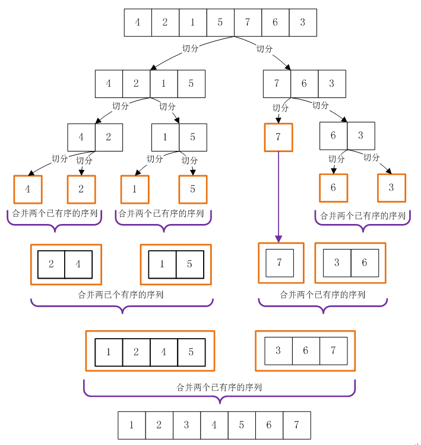

### 多路归并

多路归并主要有胜者树和败者树

事实证明外排序的效率主要依赖于磁盘，**归并阶段采用K路归并可以显著减少IO量**，最小堆并行k路归并，效率倍增。
> 1600个记录，一个物理块存储100个记录，内存中用于输入缓冲的空间为4个物理块(400个记录)如果使用二路归并，
那么先将1600个记录分为8份，每份200个记录，进行一次内部排序，需要读16次物理块，
然后进行二路归并，需要3趟，每趟读16次物理块，所以总计读64次物理块.

>而如果采用4路归并，那么应该先将1600个记录分为16份，每份100个记录，进行一次内部排序，需要读16次物理块，
然后进行4路归并，需要2趟，每趟读16次物理块，所以总计读48次物理块

二路归并的思路会导致非常多冗余的磁盘访问，两组两组合并确定的是当前的相对位置并不能一次确定最终的位置。

K路归并，每一轮归并直接确定的是最终的位置，不用重复访问，减少IO。
**该排序算法需要对每个整数做2次磁盘读和2次磁盘写**。

外排序的一个例子是外归并排序（External merge sort），它读入一些能放在内存内的数据量，
在内存中排序后输出为一个顺串（即是内部数据有序的临时文件），处理完所有的数据后再进行归并。
比如，要对900MB 的数据进行排序，但机器上只有100 MB的可用内存时，外归并排序按如下方法操作：

1. 读入100 MB的数据至内存中，用某种常规方式（如快速排序、堆排序、归并排序等方法）在内存中完成排序。
2. 将排序完成的数据写入磁盘。
3. 重复步骤1和2直到所有的数据都存入了不同的100 MB的块（临时文件）中。

在这个例子中，有900 MB数据，单个临时文件大小为100 MB，所以会产生9个临时文件。
读入每个临时文件（顺串）的前10 MB（ = 100 MB / (9块 + 1)）的数据放入内存中的输入缓冲区，最后的10 MB作为输出缓冲区。
（实践中，将输入缓冲适当调小，而适当增大输出缓冲区能获得更好的效果。）
执行九路归并算法，将结果输出到输出缓冲区。一旦输出缓冲区满，将缓冲区中的数据写出至目标文件，清空缓冲区。
一旦9个输入缓冲区中的一个变空，就从这个缓冲区关联的文件，读入下一个10M数据，除非这个文件已读完。

这是“外归并排序”能在主存外完成排序的关键步骤 -- 
因为“归并算法”(merge algorithm)对每一个大块只是顺序地做一轮访问(进行归并)，每个大块不用完全载入主存。

### 为什么多路归并是用败者树
“胜者树每上升一次需要访问两个节点：父节点和兄弟节点；而败者树只需要访问父节点。这就是访存优势。”比较好的回答了这个问题。

做一点设计层面的补充：
由于新加入的节点一定是替换了上一轮的胜者，那么对于胜者堆，从新节点到根之间路径节点存的都是上一轮的胜者，
这些数据事实上对于本轮比较来说是无用的，但每次还要与兄弟节点比较去更新它。

**而败者堆中，对于新更新的节点，它的父节点都是兄弟子堆的胜者，是最有价值、值得比较的数据，每次更新也都可以直接用于下轮比较**。

一言以蔽之，败者树取树顶节点后加入新节点的时候得出新的树顶节点的效率高

### 并行归并
自顶向下归并和自底向上

归并和快排
归并排序算法和快速排序算法是java.util.Arrays中使用的排序算。
- 对于一般的基本数据类型，Arrays.sort函数使用双轴快速排序算法
- 对于对象类型使用归并排序（准确的说使用的是TimSort排序算法，它是归并排序的优化版本）。

这样做的原因有两点：
- 第一个原因，归并排序是稳定的，而快速排序不是稳定的。
- 第二个原因，对于基本数据类型，排序的稳定性意义不大，但对于复合数据类型（比如对象）排序的稳定性就能帮助我们保持排序结果的某些性质。