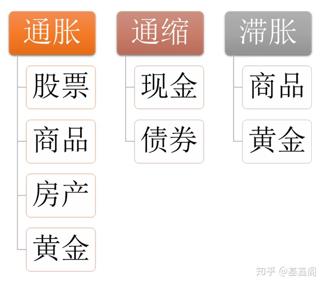

## 国家干预和调节经济的手段：
- **经济政策** ：
  国家通过经济政策进行干预和调节，具体所运用的手段，主要是：
  - 财政政策
  - 货币政策
  - 收入分配政策
  - 汇率政策等
- **法律手段** ： 制定法律来规范经济行为
- **行政监管** ：
  行政监管的内容包括工商行政管理、物价管理、公共环境卫生管理、工会和行业协会的管理、商品质量的监控管理等
- **道德规范** ：
  道德规范是在一定的经济基础上，通过社会舆论、传统习惯、内心信念等来维系的人们自我约束的行为规范。
  道德的行为规范称之为“非成文法”。任何经济行为都不能没有道德干预。
  市场经济不仅是法制经济，而且是道德经济。
  市场经济的道德规范，是商品经济内在本性和市场经济有序运行的客观要求。

国家干预经济是一种手段，是指国家运用各种手段对国民经济进行的控制和调节。
国家干预经济的首要目标是实现充分就业。还有就是保持经济总量平衡，抑制通货膨胀，促进经济结构优化，
实现经济稳定增长、保持国际收支平衡。

## 通俗理解何为通胀、通缩、滞胀。

### 通胀
起初，市场上100块肉，货币100元，1块肉1元。

期间，央行增发100元，充足流动性有助于生产力提高，市场增加60块肉。

最后，市场上160块肉，货币200元，1块肉1.25元，通胀率25%。

### 通缩
起初，市场上100块肉，货币100元，1块肉1元。

期间，需求降低，人们只愿意拿出80元消费。

后来，市场上100块肉，货币80元，1块肉0.8元，通缩率20%

再后来，人们看到肉价下跌，期望能在将来以更低的价格买肉，消费意愿继续降低，形成循环。市场流动性逐渐降低，经济会因此而萧条崩溃。

### 滞胀
起初，市场上100块肉，货币100元，1块肉1元。

期间，央行增发100元，经济增长周期性停滞，生产力没有提高。

后来，市场上100块肉，货币200元，1块肉2元，通胀率100%。

以上三个事例分别解释了通胀、通缩和滞胀。

我们可以发现，这三种情况，**只有通胀是比较正面的**。虽然物价上涨25%，但是经济得到了发展，生产力有所提高。

通缩环境下，大家消费需求形成恶性循环逐渐下降，经济增长也随之陷入停滞萧条。
而经济不增长导致大量企业倒闭，失业率上升，民众收入减少，需求进一步降低，恶性循环下最终会走向崩溃。

**滞胀往往发生在长期通胀后**，经济增长也周期性停滞。如果继续增发货币，会导致通胀加剧；
如果加息收缩货币，长期处于货币宽松环境下的企业很可能会大规模崩溃。真是进退两难！此时只能靠财政政策刺激来走出困境。

综上，大家可以发现，**长期温和的通胀是比较适宜的经济环境**。

现实中，经济不可能处于长期稳定的状态，也就有了货币宽松、紧缩的周期。
而从局部来看，也可能出现结构性通缩、结构性通胀的情况。

而真实的经济环境是通缩、通胀还是滞胀，其实并不能纯看统计数据。只有深处生活中的我们才会有更直观的体会。

那么这三种环境下，如何投资保住自己的财富呢？
**经济增长我们肯定是要投资股市的**，毕竟股票可以认为是经济未来增长的折现。
另外，就是房产投资，经济增长会带来民众真实购买力和投资需求的提升。

**货币宽松的情况下，我们要投商品、黄金**，生产力少即供给少，而货币供给多，实物价格会上涨。

**通缩环境下，现金为王**，或者投资安全性高的债券，只有货币值钱。

结合我们上面的举例，其实逻辑是比较清晰的。三种环境下的适合的投资品类如下所示。

### 大宗商品
大宗商品：用于工农生产和消费使用的大批量买卖的物品，细分4个类别，即金属产品、化工产品、能源产品和农副产品；
- 金属产品：金、银、铜、不锈钢、铅等
- 化工产品：甲醇、苯乙烯、橡胶等
- 能源产品：焦煤、焦炭、原油等
- 农副产品：玉米、鸡蛋、白糖、大豆等

**大宗商品涨价导致大牛市预期减少的逻辑**：
1. 大宗商品含有金融属性，因此可以在股市中交易，焦煤、焦炭等大宗商品涨多跌少，投资者对大宗商品越来越喜欢，
所以买入的资金和人数越来越多，不断有资金进来接盘，因此很多品种的价格都创历史新高；

2. 因为价格普遍上升，就意味着通货膨胀越来越大，通货膨胀和通货紧缩对整个国家的金融体系都是不好的，要的是稳定，因此中央银行会加息；

3. 因为通胀，说明社会上的钱已经过多了，要想办法把一些钱收回来，也就是不要让这些钱在社会上流通，所以就通过增加利息的手段，去吸引资金往银行里存；

4. 因为股市的钱少了，对于流动性来说，钱都存银行了，那么就很少资金进入股市，股市中的流动性就紧缩了；

5. 因为股市中的资金少了，没人接盘，股价就很难推上去，所以短期内很难再有大牛市；

### 加息
加息是一个国家或地区的**中央银行提高利息的行为**，
从而使**商业银行对中央银行的借贷成本提高**，
进而迫使**市场的利息也进行增加**；
减少银行再大规模地往外贷款，减少钱在社会上流通；

那么，美元加息对经济有什么影响？
首先，美元加息加的是什么？
美元加息的目的是美元回流美国，增加美国资金的流通性？不是的，目的和职责是利用货币政策工具调节和稳定金融市场。
**一般加息指的是存款利息**，比如我国。
美国加息指的是银行间同业拆借利率，在美国叫做**联邦基金利率**（Federal funds rate）

联邦基金利率是最重要的短期利率，能很大程度上决定**官方贴现率**、**商业银行存贷利率**等各项参数。
> **贴现率**（Discount Rate），是指将未来支付改变为现值所使用的利率，或指持票人以没有到期的票据向银行要求兑现，银行将利息先行扣除所使用的利率。
> 这种贴现率也指再贴现率，即各成员银行将已贴现过的票据作担保，作为向中央银行借款时所支付的利息。 
> 换言之,当商业银行需要调节流动性的时候，要向央行付出的成本。
> 理论上讲，央行通过调整这种利率，可以影响商业银行向央行贷款的积极性，
> 从而达到调控整个货币体系利率和资金供应状况的目的，是央行调控市场利率的重要工具之一

不过要记住，这是银行和银行之间商量的事情，央行是不能轻易插手的。
所以美联储设置的是**联邦基金利率目标区间**（Target range for the federal funds rate）

美联储作为世界第一强国的中央银行，它的重要职责是利用货币政策工具调节和稳定金融市场。

常规的货币政策工具有三：**存款准备金制度**、**再贴现政策**和**公开市场业务**。

这里提到的公开市场业务，即美联储在公开市场上买卖有价证券（一般是美国国债）的做法。
当宣布联邦基金利率目标区间上调后，美联储会开始在公开市场上抛售国债换取美元，大量资金回到央行，市场上的货币总量减少。
货币总量的减少导致银行间市场的资金流动性开始紧张。这个时候再有其他银行来借钱，借款利率（联邦基金利率）会自然提高，因为地主家也没有余粮了。

所以说，**美联储只需要控制抛售国债的力度，就可以将利率稳定在它制定的目标区间内**。

美国进入加息周期后，由于国债被持续抛售，导致其价格走低，收益率升高。
需要降息的话，反向操作即可。 随后，银行资金成本的变动会传导到其他利率，包括与大家密切相关的存款和贷款利率。

### 美联储加息后的影响

#### 1.美联储是在本国经济增长率不错的时候加息
此时即时没有加息,资本也正在流向美国,因为经济增长率代表投资收益率的平均值,
加息之后 在美国国外的资本对已被上一轮放水吹起来的新兴市场的资产的兴趣开始减弱,甚至担心在美联储加息的预期下，
资本外流之势之下,这些新兴市场的资产被抛售而估值下跌,结果加速资本撤出不安全和低收益率的新兴市场，转而投向投资回投率更高的郭嘉或地区.
(当然各国也会推出各种对策,以免本币贬值太快,如限制换汇额度,换汇时间,降低外汇准备金,国内货币加息,升准等,)

#### 2.美国本土个人的资本
因为欠银行的房贷的利息也将变高(如果选择的是浮动的房贷的利率是),每月要还的利息也将变多,
没有比银行的利息更好的投资机会的话,个人就会把手上的美元或去换/买美元,然后拿去还债,这样,这样市场上美元进一步变少.

个人还有现金话,看到放在银行的无风险利息变高之后,同时发现外面很多中小企业破产中,部分民众也将会选择把钱存回银行.市场的美元变少.

#### 3.美国本地企业和很多国际企业
欠银行的债的利息(借时也是捆绑了浮动利率)将跟着上升, 越拖,后面加息越多,那么债务的利息将越高,甚至债务的利息率可能高到高于自己项目的收益率.
所以有了加息预期,在执行加息前,企业便开始挤出美元还债,手上没有美元的话,便去购买美元,造成市场的美元变少.

加息之后,欠债的利息被提高,欠债的本金也跟着变贵(因为市场上美元变少,美元购买力上升), 双跪.

总之,上面四个买美元的行为冲击之下,**市场上美元变少了,美元购买力上升,相对别国的货币也升值A**(前提是别国的货币的加息幅度不高)

**美元是否回流到美国,取决在别的国家收益率是否低于投资到美国的收益率**.

