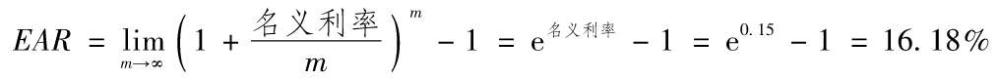
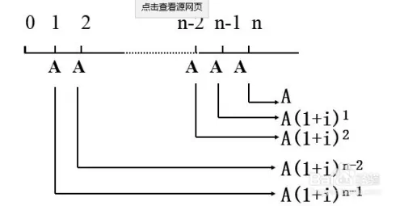

## 折现率
折现率（discount rate）是指将未来预期收益折算成现值时所用的折现比率。
分期付款购入的固定资产的折现率实质上就是提供贷款企业的所要求的必要报酬率。
终值与现值的转换公式可以表示为：FV=PV（1+r），
其中FV代表终值，PV代表现值，r代表要求回报率。
如果我们已知终值，要求现值，则改写上述公式：
```text
PV=FV/（1+r'）t
```
其中的r'指折现率。


### 折现率的确认
1. 最常用的确认方法：**累加法**

    累加法计算折现率公式：
    ```text
    折现率 = 无风险利润率 + 风险利润率 + 通货膨胀率
    ```
    其中
    ```text
    风险报酬率 = 行业风险 + 经营风险 + 财务风险
    ```
    
    折现率通常包括通货膨胀率、无风险报酬率、风险报酬率：
    1. 风险报酬率是指冒风险取得的报酬与资产的比率；
    2.  无风险报酬率是指资产在一般条件下的获利水平。

2.  反映整体资产的收益现值：社会平均收益率法
    
    社会平均收益率法可以客观反映企业整体资产的收益现值，
    主要是对企业整体资产的收益现值进行分析，用来确定确定本金化率或折现率。
    注意：其中风险系数、变动系数一般难以测定。
    将该方法用在企业价值评估中折现率的确定上，相关计算公式为：
    ```text
    折现率=无风险报酬率+(社会平均资产收益率-无风险报酬率)X风险系数。
    ```

3. 市场比较法

   市场比较法，主要是通过选取与评估对象相似规模、相近行业或者相同类型的资产案例，
   然后以此求出它们每个的折现率、风险报酬率等，再经过分析调整后，
   采用不同的权数对其修正，并且消除特殊因素的影响，
   最后经过综合计算得出被评估对象的折现率的方法。
   **需要注意：这种方法并不是很适合高技术的企业。**

一般证券的要求回报利率=名义无风险利率+违约风险溢价+流动性风险溢价+期限风险溢价

###名义年利率

###有效年利率 (effective annual return)
是一种计算投资产品年度复合收益的方法，即在本期收益基础上将利息记入本金再投资的年度收益率。
它是考虑了复利因素的收益概念。

```text
EAR = (1 + r/m)^m - 1
```
其中：
- r 是年利率
- m 是期数

A在0时刻往银行存入1元，银行1年期的收益率为10%，假设银行按年付息，那么1年后A可以拿到（1+10%）元。
可如果银行决定半年付息一次，半年的利率即为5%，
那么按复利进行计算，半年后A拿到的1×（1+5%）元将作为本金继续产生利息，
于是1年后A共收到本息（1+5%）+（1+5%）×5%，其1年内实际产生的收益率为(1+5%)^2-1。

通过上述计算我们不难看出，假定名义利率不变，随着计息频率越来越频繁，得到的有效年利率就越大。
当计息的期限无限短，即利息每时每刻都记入本金参与下一期的投资时，m就趋向于+∞。
这样，EAR就变成了连续复利的利率形式下的EAR。
借助数学推导以及指数函数，我们得到该类EAR的公示表达：
```text
EAR=e^r-1
```


### 货币的时间价值
一般终值公式如下：
```text
FV = PV x (1 + r/m)^m
```
- FV 终值
- PV 现值
- r 投资回报率
- m 期数

### 年金（annuity）
一组有限的持续的现金流序列。年金的形式具体分为以下三类

#### 1 普通年金普通年金（ordinary annuity）
又称后付年金，这是最为常见的年金表现形式。普通年金的现金流都发生在每个计息期间结束时的时间点上。
接下来我们通过例题的形式，讲解一下普通年金现值和终值的求解方法。

普通年金它具有定期性、等额性、系列性等特点。
比如我们的房租，就是每个月的固定时间交固定的租金。


```text
F = A + A *（1+i）^2 + …… + A * （1+i）^n
  = A * [1 + (1+i) + (1+i)^2 + ... + (1+i)^(n-1)]
  = A * [(1+i)^n - 1]/i
```

投资者老王购买了一个金融产品，该产品将从现在开始在接下来每年年初支付200美元给投资者，
总计支付5年。假定该投资品能够以5%的年利率进行投资，计算这项金融产品的终值。
```text
F = 200 * (1.05^5-1)/0.05=1105.12
```


#### 2 先付年金
因为先付年金每一笔现金流比同时间段的后付年金每笔现金流提早一期发放，所以在计算最终终值时，
我们只须把后付年金模式下得到的终值乘以（1+折现率）即能得到先付年金的终值。


在上例中：
```text
FB = A * (1+i)[(1+i)^n - 1]/i 
   = FE×（1+i）=1105.12×1.05
   = 1160.38（美元）
```

#### 年金折现计算
老王在一次出差途中不慎因公受伤，现在他所在单位为其提供补偿。
有两个方案供其选择，一种方案是一次支付给他1000000元补偿金，
另一种方案是从今天开始起每年年初支付300000的补助金，共计补助4年。
假设当前市场的折现率为6%，试问老王应该选择哪种方案。
图例见 先付年金示例图
```text
PV = FV + FV/(1+r) + FV/(1+r)^2 + ... + FV/(1+r)^(N-1)
   = FV * [(1+r) + (1+r)^2 + ... + (1+r)^(N-1)]/ (1+r)^(N-1)
   = FV * [(1+r)^N - 1]/[r * (1+r)^(N-1)]
```
- PV 现值
- FV 终值
- r 折现率
- N 期数

所以选择方案二得到当前得现值为
```text
PV = 300000 * (1.06^4 -1)/(0.06 * 1.06^3) 
   = 1101903.58 元
```
所以按6%的折现率来算的话，方案二比较划算。