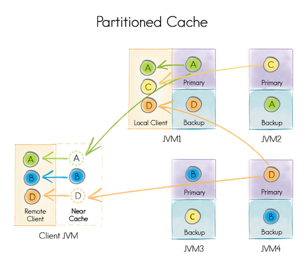
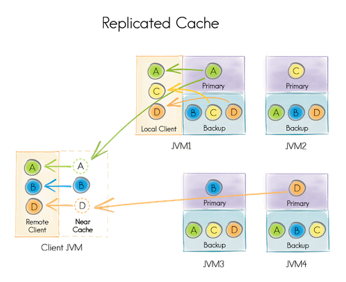

### 一、数据分区

数据分区有两种模式：
- partitioned

    所有分区在所有服务端节点间平均分配。此模式是可扩展性最高的分布式缓存模式，
    可以在所有节点上的总内存（RAM和磁盘）中存储尽可能多的数据，实际上节点越多，可以存储的数据就越多。
    
    更新成本很低，因为每个键只需要更新一个主节点（以及可选的一个或多个备份节点）。但是读取成本会高，因为只有某些节点才缓存有该数据。
    
    
    
- replicated

    在REPLICATED模式下，所有数据（每个分区）都将复制到集群中的每个节点。由于每个节点上都有完整的数据，此缓存模式提供了最大的数据可用性。
    但是每次数据更新都必须传播到所有其他节点，这可能会影响性能和可扩展性。
    
    
    
    因为相同的数据存储在所有集群节点上，所以复制缓存的大小受节点上可用内存（RAM和磁盘）的数量限制。
    对于缓存读多写少且数据集较小的场景，此模式是理想的。如果业务系统确实在80％的时间内都在进行缓存查找，那么应该考虑使用REPLICATED缓存模式。
    
    
### 二、数据备份
ignite默认会保存每个分区的单个副本（整个数据集的单个副本）。这时如果一个或多个节点故障，存储在这些节点上的分区将无法访问，
为避免这种情况，Ignite可以配置为每个分区维护备份副本。
> 备份默认禁用

备份副本的配置是缓存（表）级的。
如果配置2个备份副本，则集群将为每个分区维护3个副本。其中一个分区称为主分区，其他两个分区称为备份分区，
主分区对应的节点称为该分区中存储的键的主节点，否则称为备份节点。
当某些键的主分区对应的节点离开集群时，Ignite会触发分区映射交换（PME）过程，PME会将键的某个备份分区（如果已配置）标记为主分区。

备份分区提高了数据的可用性，在某些情况下还会提高读操作的速度。
因为如果本地节点可用，Ignite会从备份分区中读取数据（这是可以禁用的默认行为，具体请参见缓存配置章节）。
但是备份也会增加内存消耗或持久化存储的大小（如果启用）。

### 分区映射交换
分区映射交换（PME）是共享整个集群分区分布（分区映射）的信息的过程，以便每个节点都知道在哪里寻找特定的键。
无论是应用户请求还是由于故障，每当缓存的分区分配发生更改时（例如新节点加入拓扑或旧节点离开拓扑）都需要PME。

包括但不限于会触发PME的事件：
- 一个新节点加入/离开拓扑；
- 新的缓存开始/停止；
- 创建索引。

当发生PME触发事件时，集群将等待所有正在进行的事务完成，然后启动PME。同样在PME期间，新事务将推迟直到该过程完成。

>PME过程的工作方式是：
>1. 协调器节点向所有节点请求其拥有的分区信息，然后每个节点将此信息反馈给协调器。
>2. 协调器收到所有节点的消息后，会将所有信息合并为完整的分区映射，并将其发送给所有节点。
>3. 当协调器接收了所有节点的确认消息后，PME过程就完成了。