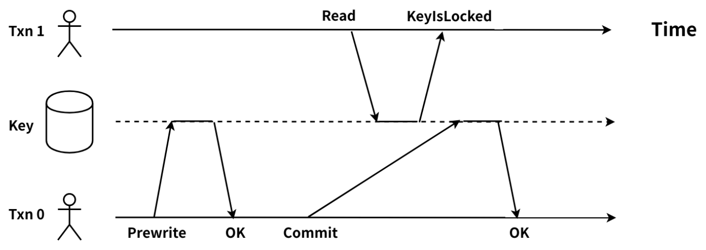

percolator简介
Percolator 是 Google 的上一代分布式事务解决方案。
构建在 BigTable 之上，在 Google 内部 用于网页索引更新的业务，原始的论文在此。
http://research.google.com/pubs/pub36726.html
原理比较简单，总体来说就是一个经过优化的二阶段提交的实现，进行了一个二级锁的优化。

### percolator多行数据的原子性
想保证多条指令作为整体执行的原子性，有单机并发编程基础的都应该知道，那就是通过加锁(原子操作不适合)，
要么你基于内存的mutex，要么基于文件系统的file lock，甚至于可以使用分布式锁服务。。。

Percolator的做法是对数据**扩展出一个lock列**。
对于多行数据，它随机选择一行作为主，通过BigTable的事务对这个primary主row的lock列写入信息表明持有锁，
而其他的rows则随后在其lock列写入primary锁的位置信息。

这样就完成了两件事：
1. 一个是把事务中的所有rows关联起来了；
2. 一个是互斥点唯一了，都在primary，如同加了分布式锁一样。

另外还需要考虑一个问题，Percolator为什么不怕lock信息丢失呢？
因为BigTable底层是GFS，是多副本，假定其能保证对外承诺的SLA下的可靠性，真发生了丢数据的问题那就人工处理呗。。。

### percolator 数据结构
基本上每行数据都有以下字段
- key
- data 
- lock 锁标记 主行记录start_ts,副行记录start_ts和主行lock位置
- write 当前key最新的版本号 主行记录commit_ts,副行记录commit_ts和start_ts
- timestamp

### 事务流程 
每一个事务开始的时候都会去授时服务获取一个start_ts。
- 写

    定义一个辅助函数：某行数据的**prewrite**,其实就是尝试Lock阶段
    1. 检测write列和lock列与本次事务是否冲突，如果冲突则直接取消本次事务
    2. 以start_ts对该行数据的lock列写入信息并写入data （相当于版本控制）
        (非primary行进行prewrite,写入lock列的信息包括start_ts,还有primary lock的信息，比如位置)
    
    写主要分两个阶段：
    1. 一个是客户端向Percolator SDK的事务对象写入mutations的阶段(Percolator SDK会缓存所有的mutations)（主要是update/delete）
    2. 一个是客户端本身的commit阶段(即调用Percolator SDK的事务对象的commit)。
    
    Percolator SDK中事务对象的commit分为两个阶段，即分布式事务的2PC：
    1. 选出primary，对primary执行prewrite，失败返回
    2. 对所有其他rows执行prewrite，失败返回
    3. 获取一个commit_ts，转到步骤4
    4. 检查是不是有自己时间戳加的锁，如果有对primary解锁(解锁指的是删除lock列)，
        并在write列写入版本号commit_ts的标示(事务完成的标识)，内容指向start_ts的data，之后转到步骤5；
        如果没有自己start_ts加的锁，事务失败。
    5. 异步对其他rows执行4的处理   
    
    
- 读

    读本身很简单，这里就简单说了。
    
    先获取当前的时间戳start_ts，**如果时间戳之内的数据有锁，则等**，等到一定程度还不行就清理掉锁，执行读操作。
    
    这里不可以直接返回当前小于start_ts的最新版本数据，会造成幻读。
    
    因为如果当前读不等锁，再次读的话可能锁释放数据提交了，假如提交的时间戳小于读事务的开始时间戳，
    就会读到比之前读到的版本数据大但是依然小于start_ts的新数据，这样就产生了不可重复读或者幻读。     
    

- FAQ
    
    1. 为什么写提交的时候primary成功了其他的row异步就可以？
    > 因为其他row的lock列都指向了primary，primary决议完怎么做之后，其他rows就都知道该怎么处理了。
    当其他rows面临访问的时候，如果当前有lock，则去看看primary怎么处理的进而对自己执行abort或commit
    (访问primary的lock和write列就知道该怎么做了)
    
    2. 为什么client作为协调者挂了无所谓？
    > client挂了其事务也无非是完成/未完成的状态，无论哪种状态都不会导致数据不一致，仔细想想Percolator的lock和commit机制就都明白了。
    
    3. **为什么读的时候如果等到一定程度还等不到无锁就可以主动清理锁以继续**？
    > 这和2其实是一个问题，只不过回答的时候额外多了一个考虑，那就是线性一致性的考虑。
    
    为什么这里不会影响到用户视角的数据的线性一致性呢？
    因为计算机的世界但凡涉及网络的请求都是3中情况：成功、失败和不知道。
    
    读等不及了要主动清理锁无非是下面2种情况:
    - a. 写的协调者挂了。那对于发起写的用户结果就是不可预知，他需要后续自己发请求确认到底执行的如何。
    - b. 写的协调者hang了。清理锁之后如果写协调者又活过来了，其执行commit的时候也必然失败，
        因为它持有的版本号的lock已经没了，只能取消，不会影响一致性。
    
    4. Percolator会有write skew问题吗？
    会。
    
###  tidb实现
TiDB 的事务模型沿用了 Percolator 的事务模型。 总体的流程如下：

- 读写事务

    事务提交前，在客户端 buffer 所有的 update/delete 操作。
    - Prewrite 阶段:
        1. 首先在所有行的写操作中选出一个作为 primary，其他的为 secondaries。

            Prewrite: 对 Row 写入lock列(上锁)，Lock 列中记录本次事务的开始时间戳。写入 Lock 列前会检查:
            是否已经有别的客户端已经上锁 (Locking)。
            是否在本次事务开始时间之后，检查 write 列，是否有更新 [startTs, +Inf(超时时间) 的写操作已经提交 (Conflict)。
            在这两种种情况下会返回事务冲突。否则，就成功上锁。将行的内容写入 row 中，时间戳设置为 startTs。

        2. 将 primaryRow 的锁上好了以后，进行 secondaries 的 prewrite 流程:
            1. 类似 primaryRow 的上锁流程，只不过lock的内容为事务开始时间start_ts及 primaryRow 的 Lock 的信息(主要是位置信息)。
            2. 检查的事项同 primaryRow 的一致。
            3. 当锁成功写入后，写入 row，时间戳设置为 startTs。

        以上 Prewrite 流程任何一步发生错误，都会进行回滚：删除 Lock，删除版本为 startTs 的数据。

    - 当 Prewrite 完成以后，进入 Commit 阶段，当前时间戳为 commitTs，且 commitTs> startTs :

        1. commit primary： write 列写入新数据，时间戳为 commitTs，内容为 startTs，表明数据的最新版本是 startTs 对应的数据。
        2. 删除lock列。
        
        如果 primary row 提交失败的话，全事务回滚，回滚逻辑同 prewrite。如果 commit primary 成功，
        则可以异步的 commit secondaries, 流程和 commit primary 一致， 失败了也无所谓。

- 事务中的读操作

    检查该行是否有 lock 列，时间戳为 [0, startTs]，如果有，表示目前有其他事务正占用此行，
    如果这个锁已经超时则尝试清除，否则等待超时或者其他事务主动解锁。
    
    注意此时不能直接返回老版本的数据，否则会发生幻读的问题。
    读取至 startTs 时该行最新的数据，方法是：读取 W 列，时间戳为 [0, startTs], 获取这一列的值，
    转化成时间戳 t, 然后读取此列于 t 版本的数据内容。
    
    由于锁是分两级的，primary 和 seconary，只要 primary 的行锁去掉，就表示该事务已经成功 提交，
    这样的好处是 secondary 的 commit 是可以异步进行的，只是在异步提交进行的过程中 ，
    如果此时有读请求，可能会需要做一下锁的清理工作。
    
    
### tidb 锁冲突
在两阶段提交的 Prewrite 阶段，TiDB 会对目标 key 分别上 primary lock 和 secondary lock。
在冲突严重的场景中，会出现写冲突 (write conflict)、keyislocked 等报错。具体而言，这个阶段可能会遇到的锁相关的报错信息如下。

#### 读写冲突
在 TiDB 中，读取数据时，会获取一个包含当前物理时间且全局唯一递增的时间戳作为当前事务的 start_ts。
事务在读取时，需要读到目标 key 的 commit_ts 小于这个事务的 start_ts 的最新的数据版本。

当读取时发现目标 key 上存在 lock 时，因为无法知道上锁的那个事务是在 Commit 阶段还是 Prewrite 阶段，
所以就会出现读写冲突的情况，如下图：

分析：

Txn0 完成了 Prewrite，在 Commit 的过程中 Txn1 对该 key 发起了读请求，
Txn1 需要读取 start_ts > commit_ts 最近的 key 的版本。此时，Txn1 的 start_ts > Txn0 的 lock_ts，
需要读取的 key 上的锁信息仍未清理，故无法判断 Txn0 是否提交成功，因此 Txn1 与 Txn0 出现读写冲突。

你可以通过如下两种途径来检测当前环境中是否存在读写冲突：

处理建议：
- 在遇到读写冲突时会有 backoff 自动重试机制，如上述示例中 Txn1 会进行 backoff 重试，单次初始 100 ms，单次最大 3000 ms，总共最大 20000 ms
- 可以使用 TiDB Control 的子命令 decoder 来查看指定 key 对应的行的 table id 以及 rowid：

悲观锁
在 v3.0.8 之前，TiDB 默认使用的乐观事务模式会导致事务提交时因为冲突而失败。
为了保证事务的成功率，需要修改应用程序，加上重试的逻辑。
悲观事务模式可以避免这个问题，应用程序无需添加重试逻辑，就可以正常执行。

TiDB 悲观锁复用了乐观锁的两阶段提交逻辑，重点在 DML 执行时做了改造。

在两阶段提交之前增加了 Acquire Pessimistic Lock 阶段，简要步骤如下。

1. （同乐观锁）TiDB 收到来自客户端的 begin 请求，获取当前版本号作为本事务的 StartTS。
2. TiDB 收到来自客户端的更新数据的请求：TiDB 向 TiKV 发起加悲观锁请求，该锁持久化到 TiKV。
3. （同乐观锁）客户端发起 commit，TiDB 开始执行与乐观锁一样的两阶段提交。

**如果出现非常频繁，需要调整业务代码来降低死锁发生概率。**

### percolator 时钟支持
tidb时钟支持

tidb Placement Driver (简称 PD) 是整个集群的管理模块，其主要工作有三个：
1. 存储集群的元信息（某个 Key 存储在哪个 TiKV 节点）；
2. 对 TiKV 集群进行调度和负载均衡（如数据的迁移、Raft group leader 的迁移等）；
3. 提供时间服务。

TiDB的时间服务是由PD提供的，使用的是中心授时服务。

PD的TSO使用的是中心式的混合逻辑时钟。其使用64位表示一个时间，其中低18位代表逻辑时钟部分，
剩余部分代表物理时钟部分，其结构如下图所示。

|<----------- 48位 ------------->|<--------18位---------->|

|---------物理时钟部分----------|------逻辑时钟部分---|

由于其逻辑部分为18位，因此理论上每秒可以分配时间戳为 2^18 * 1000 = 262144000个，即每秒可以产生2.6亿个时间戳。

PD采用了中心式的时钟解决方案，本质上还是混合逻辑时钟。但是由于其是单点授时，所以是全序的。
中心式的解决方案实现简单，但是跨区域的性能损耗大，因此实际部署时，会将PD集群部署在同一个区域，避免跨区域的性能损耗；

PD通过引入etcd解决了单点问题，一旦Leader节点故障，会立刻选举新的Leader继续提供服务；
而由于TSO服务只通过PD的Leader提供，所以可能会出现性能瓶颈，但是理论上PD每秒可以产生2.6亿个时间戳，
并且经过了很多优化，从目前使用情况看，TSO并没有出现性能瓶颈。