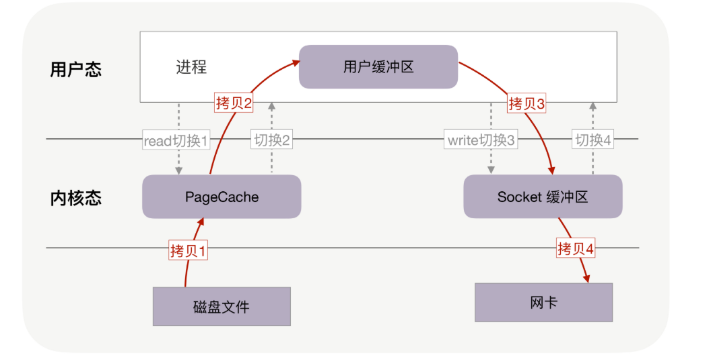
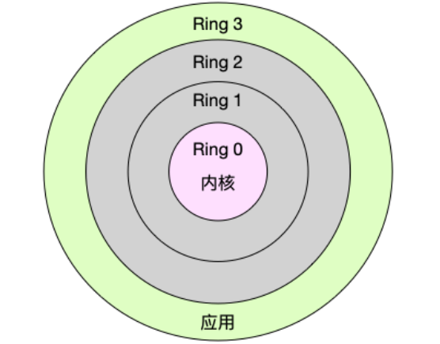
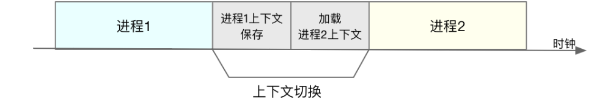
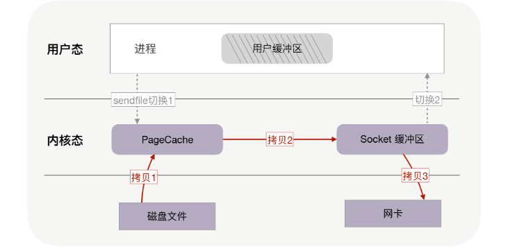
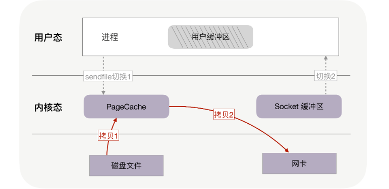
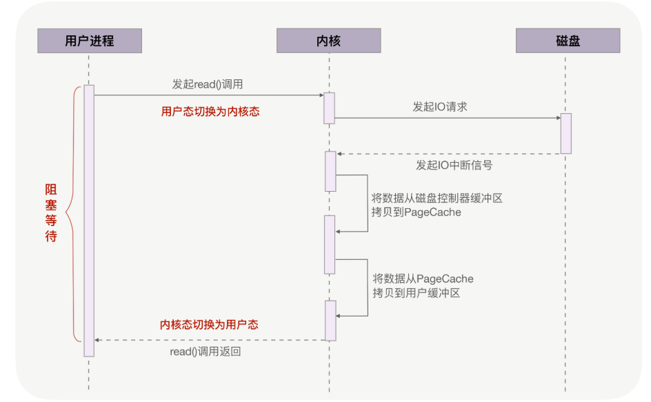
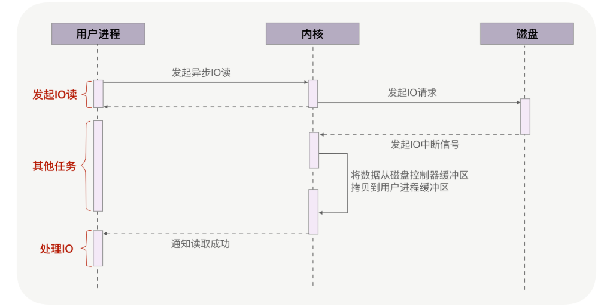

一般的文件传输
服务器提供文件传输功能，需要将磁盘上的文件读取出来，通过网络协议发送到客户端。
如果需要你自己编码实现这个文件传输功能，你会怎么实现呢？

通常，你会选择最直接的方法：从网络请求中找出文件在磁盘中的路径后，如果这个文件比较大，假设有 320MB，
可以在内存中分配 32KB 的缓冲区，再把文件分成一万份，每份只有 32KB，这样，从文件的起始位置读入 32KB 到缓冲区，
再通过网络 API 把这 32KB 发送到客户端。接着重复一万次，直到把完整的文件都发送完毕。如下图所示：

不过这个方案性能并不好，主要有两个原因。

首先，它至少经历了 4 万次用户态与内核态的上下文切换。因为每处理 32KB 的消息，就需要一次 read 调用和一次 write 调用，
每次系统调用都得先从用户态切换到内核态，等内核完成任务后，再从内核态切换回用户态。
可见，每处理 32KB，就有 4 次上下文切换，重复 1 万次后就有 4 万次切换。

这个系统调用的内容，我们可以结合下面补充的三种“上下文切换”来理解，**上下文切换分别是进程，线程，中断三种**。

### 上下文切换
#### 进程上下文切换
Linux 按照特权等级，把进程的运行空间分为内核空间和用户空间，分别对应着下图中， 
CPU 特权等级的 Ring 0 和 Ring 3。内核空间（Ring 0）具有最高权限，可以直接访问所有资源，
而用户空间（Ring 3）只能访问受限资源，不能直接访问内存等硬件设备，必须通过系统调用陷入到内核中，才能访问这些特权资源

换个角度看，也就是说，进程既可以在用户空间运行，又可以在内核空间中运行。
进程在用户空间运行时，被称为进程的用户态，而陷入内核空间的时候，被称为进程的内核态。
从用户态到内核态的转变，需要通过系统调用来完成。
比如，当我们查看文件内容时，就需要多次系统调用来完成：
首先调用 open() 打开文件，然后调用 read() 读取文件内容，并调用 write() 将内容写到标准输出，最后再调用 close() 关闭文件。

那么系统调用的过程是如何发生 CPU 上下文的切换的呢？我们再了解两个概念：

- CPU 寄存器，是 CPU 内置的容量小、但速度极快的内存。
- 程序计数器，则是用来存储 CPU 正在执行的指令位置、或者即将执行的下一条指令位置。
  它们都是 CPU 在运行任何任务前，必须的依赖环境，因此也被叫做 CPU 上下文。
  
知道了什么是 CPU 上下文，我想你也很容易理解 CPU 上下文切换。
CPU 上下文切换，就是先把前一个任务的 CPU 上下文（也就是 CPU 寄存器和程序计数器）保存起来，
然后加载新任务的上下文到这些寄存器和程序计数器，最后再跳转到程序计数器所指的新位置，运行新任务。
而这些保存下来的上下文，会存储在系统内核中，并在任务重新调度执行时再次加载进来。
这样就能保证任务原来的状态不受影响，让任务看起来还是连续运行。

回到系统调用的问题上，CPU 寄存器里原来用户态的指令位置，需要先保存起来。
接着，为了执行内核态代码，CPU 寄存器需要更新为内核态指令的新位置。
最后才是跳转到内核态运行内核任务。而系统调用结束后，CPU 寄存器需要恢复原来保存的用户态，然后再切换到用户空间，继续运行进程。
所以，一次系统调用的过程，其实是发生了两次 CPU 上下文切换。

不过，需要注意的是，**系统调用过程中，并不会涉及到虚拟内存等进程用户态的资源，也不会切换进程**。
这跟我们通常所说的进程上下文切换是不一样的：

> 进程上下文切换，是指从一个进程切换到另一个进程运行。 系统调用过程中一直是同一个进程在运行。

那么，进程上下文切换跟系统调用又有什么区别呢？
首先，你需要知道，进程是由内核来管理和调度的，进程的切换只能发生在内核态。
所以，进程的上下文不仅包括了虚拟内存、栈、全局变量等用户空间的资源，还包括了内核堆栈、寄存器等内核空间的状态。

因此，进程的上下文切换就比系统调用时多了一步：
**在保存当前进程的内核状态和 CPU 寄存器之前，需要先把该进程的虚拟内存、栈等保存下来；
而加载了下一进程的内核态后，还需要刷新进程的虚拟内存和用户栈**。

保存上下文和恢复上下文的过程并不是“免费”的，需要内核在 CPU 上运行才能完成。

每次上下文切换都需要几十纳秒到数微秒的 CPU 时间。
这个时间还是相当可观的，特别是在进程上下文切换次数较多的情况下，很容易导致 CPU 将大量时间耗费在寄存器、
内核栈以及虚拟内存等资源的保存和恢复上，进而大大缩短了真正运行进程的时间。
Linux 通过 TLB（Translation Lookaside Buffer）来管理虚拟内存到物理内存的映射关系。
当虚拟内存更新后，TLB 也需要刷新，内存的访问也会随之变慢。
特别是在多处理器系统上，缓存是被多个处理器共享的，刷新缓存不仅会影响当前处理器的进程，还会影响共享缓存的其他处理器的进程。

TLB，这个东西的资料比较晦涩难懂，我大致搜了一下，非常多的专业术语，不太建议大家展开了，
等到我们真的要用上的时候，再去了解也不晚，大致内容我觉得如果要展开，那就展开我下面的这个部分就已经足够了。

TLB 是一种高速缓存，内存管理硬件使用它来改善虚拟地址到物理地址的转换速度。
当前所有的个人桌面，笔记本和服务器处理器都使用 TLB 来进行虚拟地址到物理地址的映射。
使用 TLB 内核可以快速的找到虚拟地址指向物理地址，而不需要请求 RAM 内存获取虚拟地址到物理地址的映射关系。

虚拟地址和物理地址的话，大致是这么理解的。每个进程都有自己独立的 4G 内存空间，各个进程的内存空间具有类似的结构。
一个新进程建立的时候，将会建立起自己的内存空间，此进程的数据，代码等从磁盘拷贝到自己的进程空间，哪些数据在哪里，
都由进程控制表中的 task_struct 记录，它会有一条链表，记录中内存空间的分配情况，哪些地址有数据，哪些地址无数据，
哪些可读，哪些可写，都可以通过这个链表记录。每个进程已经分配的内存空间，都与对应的磁盘空间映射。

可是计算机明明没有那么多内存（n 个进程的话就需要 n*4G）内存。
还有建立一个进程，就要把磁盘上的程序文件拷贝到进程对应的内存中去，对于一个程序对应的多个进程这种情况是根本不需要这样操作的。

所以，每个进程的 4G 内存空间只是虚拟内存空间，每次访问内存空间的某个地址，都需要把地址翻译为实际物理内存地址。
所有进程共享同一物理内存，每个进程只把自己目前需要的虚拟内存空间映射并存储到物理内存上。
进程要知道哪些内存地址上的数据在物理内存上，哪些不在，还有在物理内存上的哪里，需要用页表来记录。
页表的每一个表项分两部分，第一部分记录此页是否在物理内存上，第二部分记录物理内存页的地址（如果在的话）。
当进程访问某个虚拟地址，去看页表，如果发现对应的数据不在物理内存中，则缺页异常。
缺页异常的处理过程，就是把进程需要的数据从磁盘上拷贝到物理内存中。

知道了进程上下文切换潜在的性能问题后，我们再来看，究竟什么时候会切换进程上下文。
显然，只有在进程调度的时候，才需要切换上下文。Linux 为每个 CPU 都维护了一个就绪队列，
将活跃进程（即正在运行和正在等待 CPU 的进程）按照优先级和等待 CPU 的时间排序，
然后选择最需要 CPU 的进程，也就是优先级最高和等待 CPU 时间最长的进程来运行。

**那么，进程在什么时候才会被调度到 CPU 上运行呢？**
最容易想到的一个时机，就是进程执行完终止了，它之前使用的 CPU 会释放出来，这个时候再从就绪队列里，拿一个新的进程过来运行。
其实还有很多其他场景，也会触发进程调度，在这里我给你逐个梳理下。

- 其一，为了保证所有进程可以得到公平调度，CPU 时间被划分为一段段的时间片，这些时间片再被轮流分配给各个进程。
  这样，当某个进程的时间片耗尽了，就会被系统挂起，切换到其它正在等待 CPU 的进程运行。

- 其二，进程在系统资源不足（比如内存不足）时，要等到资源满足后才可以运行，这个时候进程也会被挂起，并由系统调度其他进程运行。

- 其三，当进程通过 sleep 这样的方法将自己主动挂起时，自然也会重新调度。

- 其四，当有优先级更高的进程运行时，为了保证高优先级进程的运行，当前进程会被挂起，由高优先级进程来运行。

- 最后一个，发生硬件中断时，CPU 上的进程会被中断挂起，转而执行内核中的中断服务程序。

#### 线程上下文切换
线程与进程最大的区别在于，线程是调度的基本单位，而进程则是资源拥有的基本单位。
说白了，所谓内核中的任务调度，实际上的调度对象是线程；而进程只是给线程提供了虚拟内存、全局变量等资源。所以，对于线程和进程，我们可以这么理解：

- 当进程只有一个线程时，可以认为进程就等于线程。
- 当进程拥有多个线程时，这些线程会共享相同的虚拟内存和全局变量等资源。这些资源在上下文切换时是不需要修改的。
- 另外，线程也有自己的私有数据，比如栈和寄存器等，这些在上下文切换时也是需要保存的。

这么一来，线程的上下文切换其实就可以分为两种情况：
- 第一种， 前后两个线程属于不同进程。此时，因为资源不共享，所以切换过程就跟进程上下文切换是一样。

- 第二种，前后两个线程属于同一个进程。此时，因为虚拟内存是共享的，所以在切换时，虚拟内存这些资源就保持不动， 
  只需要切换线程的私有数据、寄存器等不共享的数据。到这里你应该也发现了，
  虽然同为上下文切换，但同进程内的线程切换，要比多进程间的切换消耗更少的资源，而这，也正是多线程代替多进程的一个优势。
  
#### 中断上下文切换
一个场景也会切换 CPU 上下文，那就是中断。
为了快速响应硬件的事件，中断处理会打断进程的正常调度和执行，转而调用中断处理程序，响应设备事件。
而在打断其他进程时，就需要将进程当前的状态保存下来，这样在中断结束后，进程仍然可以从原来的状态恢复运行。

**跟进程上下文不同，中断上下文切换并不涉及到进程的用户态**。
所以，即便中断过程打断了一个正处在用户态的进程，也不需要保存和恢复这个进程的虚拟内存、全局变量等用户态资源。
中断上下文，其实只包括内核态中断服务程序执行所必需的状态，包括 CPU 寄存器、内核堆栈、硬件中断参数等。
对同一个 CPU 来说，中断处理比进程拥有更高的优先级，所以中断上下文切换并不会与进程上下文切换同时发生。

同样道理，由于中断会打断正常进程的调度和执行，所以大部分中断处理程序都短小精悍，以便尽可能快的执行结束。
另外，跟进程上下文切换一样，中断上下文切换也需要消耗 CPU，切换次数过多也会耗费大量的 CPU，严重降低系统的整体性能。

总结一下，CPU 上下文切换，是保证 Linux 系统正常工作的核心功能之一，一般情况下不需要我们特别关注。
但过多的上下文切换，会把 CPU 时间消耗在寄存器、内核栈以及虚拟内存等数据的保存和恢复上，从而缩短进程真正运行的时间，导致系统的整体性能大幅下降。

刚刚我们的场景，每处理 32KB，就有 4 次上下文切换，重复 1 万次后就有 4 万次切换。
上下文切换的成本并不小，虽然一次切换仅消耗几十纳秒到几微秒，但高并发服务就会放大这类时间的消耗。
其次，这个方案做了 4 万次内存拷贝，对 320MB 文件拷贝的字节数也翻了 4 倍，到了 1280MB。
很显然，过多的内存拷贝无谓地消耗了 CPU 资源，降低了系统的并发处理能力。
**所以要想提升传输文件的性能，需要从降低上下文切换的频率和内存拷贝次数两个方向入手**。

### 零拷贝如何提升文件传输性能
再提一句，为什么读取磁盘文件时，一定要做上下文切换呢？
这是因为，读取磁盘或者操作网卡都由操作系统内核完成。内核负责管理系统上的所有进程，它的权限最高，工作环境与用户进程完全不同。
只要我们的代码执行 read 或者 write 这样的系统调用，一定会发生 2 次上下文切换：
首先从用户态切换到内核态，当内核执行完任务后，再切换回用户态交由进程代码执行。
因此，如果想减少上下文切换次数，就一定要减少系统调用的次数。
解决方案就是把 read、write 两次系统调用合并成一次，在内核中完成磁盘与网卡的数据交换。

其次，我们应该考虑如何减少内存拷贝次数。每周期中的 4 次内存拷贝，其中与物理设备相关的 2 次拷贝是必不可少的，
包括：把磁盘内容拷贝到内存，以及把内存拷贝到网卡。
但另外 2 次与用户缓冲区相关的拷贝动作都不是必需的，因为在把磁盘文件发到网络的场景中，用户缓冲区没有必须存在的理由。
如果内核在读取文件后，直接把 PageCache 中的内容拷贝到 Socket 缓冲区，待到网卡发送完毕后，再通知进程，这样就只有 2 次上下文切换，和 3 次内存拷贝。

如果网卡支持 SG-DMA（The Scatter-Gather Direct Memory Access）技术，还可以再去除 Socket 缓冲区的拷贝，这样一共只有 2 次内存拷贝。
在DMA传输数据的过程中，要求源物理地址和目标物理地址必须是连续的。可是连续的存储器地址在物理上不一定是连续的，所以DMA传输要分成多次完成。
如果在传输完一块物理上连续的数据后引起一次中断，然后再由主机进行下一块物理上连续的数据传输。
Scatter-gather DMA方式则不同，它使用一个链表描述物理上不连续的存储空间，然后把链表首地址告诉DMA master。
DMA master在传输完一块物理连续的数据后，不用发起中断，而是根据链表来传输下一块物理上连续的数据，直到传输完毕后再发起一次中断。

实际上，这就是零拷贝技术。它是操作系统提供的新函数，同时接收文件描述符和 TCP socket 作为输入参数，(java 里面就是filechannel 的sendfile)
这样执行时就可以完全在内核态完成内存拷贝，既减少了内存拷贝次数，也降低了上下文切换次数。
而且，零拷贝取消了用户缓冲区后，不只降低了用户内存的消耗，还通过最大化利用 socket 缓冲区中的内存，
间接地再一次减少了系统调用的次数，从而带来了大幅减少上下文切换次数的机会。

你可以回忆下，没用零拷贝时，为了传输 320MB 的文件，在用户缓冲区分配了 32KB 的内存，把文件分成 1 万份传送，
然而，这 32KB 是怎么来的？为什么不是 32MB 或者 32 字节呢？这是因为，在没有零拷贝的情况下，我们希望内存的利用率最高。
如果用户缓冲区过大，它就无法一次性把消息全拷贝给 socket 缓冲区（这里是 socket 的大小有所限制）；
如果用户缓冲区过小，则会导致过多的 read/write 系统调用。

那用户缓冲区为什么不与 socket 缓冲区大小一致呢？
这是因为，socket 缓冲区的可用空间是动态变化的，它既用于 TCP 滑动窗口，也用于应用缓冲区，还受到整个系统内存的影响。尤其在长肥网络中，它的变化范围特别大。

零拷贝使我们不必关心 socket 缓冲区的大小。比如，调用零拷贝发送方法时，尽可以把发送字节数设为文件的所有未发送字节数，
例如 320MB，也许此时 socket 缓冲区大小为 1.4MB，那么一次性就会发送 1.4MB 到客户端，而不是只有 32KB。
这意味着对于 1.4MB 的 1 次零拷贝，仅带来 2 次上下文切换，而不使用零拷贝且用户缓冲区为 32KB 时，经历了 176 次（4 * 1.4MB/32KB）上下文切换。

综合上述，对文章开头提到的 320MB 文件的传输，当 socket 缓冲区在 1.4MB 左右时，只需要 4 百多次上下文切换，
以及 4 百多次内存拷贝，拷贝的数据量也仅有 640MB，这样，不只请求时延会降低，处理每个请求消耗的 CPU 资源也会更少，从而支持更多的并发请求。

此外，零拷贝还使用了 PageCache 技术

### PageCache，磁盘高速缓存
回顾上文中，你会发现，读取文件时，是先把磁盘文件拷贝到 PageCache 上，再拷贝到进程中。为什么这样做呢？有两个原因所致。

由于磁盘比内存的速度慢许多，所以我们应该想办法把读写磁盘替换成读写内存，比如把磁盘中的数据复制到内存中，就可以用读内存替换读磁盘。
但是，内存空间远比磁盘要小，内存中注定只能复制一小部分磁盘中的数据。通常，刚被访问的数据在短时间内再次被访问的概率很高。
用 PageCache 缓存最近访问的数据，当空间不足时淘汰最久未被访问的缓存（即 LRU 算法）。
读磁盘时优先到 PageCache 中找一找，如果数据存在便直接返回，这便大大提升了读磁盘的性能。

而且读取磁盘数据时，需要先找到数据所在的位置，对于机械磁盘来说，就是旋转磁头到数据所在的扇区，再开始顺序读取数据。
其中，旋转磁头耗时很长，为了降低它的影响，PageCache 使用了预读功能。
也就是说，虽然 read 方法只读取了 0-32KB 的字节，但内核会把其后的 32-64KB 也读取到 PageCache，这后 32KB 读取的成本很低。
如果在 32-64KB 淘汰出 PageCache 前，进程读取到它了，收益就非常大。这一讲的传输文件场景中这是必然发生的。

综上可以看到 PageCache 的优点，它在 90% 以上场景下都会提升磁盘性能，
但在某些情况下，PageCache 会不起作用，甚至由于多做了一次内存拷贝，造成性能的降低。在这些场景中，使用了 PageCache 的零拷贝也会损失性能。

具体就是在传输大文件的时候。比如，你有很多 GB 级的文件需要传输，每当用户访问这些大文件时，
内核就会把它们载入到 PageCache 中，这些大文件很快会把有限的 PageCache 占满。
然而，由于文件太大，文件中某一部分内容被再次访问到的概率其实非常低。这带来了 2 个问题：
首先，由于 PageCache 长期被大文件占据，热点小文件就无法充分使用 PageCache，它们读起来变慢了；
其次，PageCache 中的大文件没有享受到缓存的好处，但却耗费 CPU 多拷贝到 PageCache 一次。

所以，高并发场景下，为了防止 PageCache 被大文件占满后不再对小文件产生作用，大文件不应使用 PageCache，进而也不应使用零拷贝技术处理。
用看电影来举例的话，就是我只想看前10分钟，就要把整部都下下来，这明显是亏的。
而高并发场景处理大文件时，应当使用异步 IO 和直接 IO 来替换零拷贝技术。

### 异步和直接
回到开头的例子，当调用 read 方法读取文件时，实际上 read 方法会在磁盘寻址过程中阻塞等待，导致进程无法并发地处理其他任务，
如下图所示：也就是在拉数据的过程中，一整个流程下来进程都是阻塞的意思。

异步 IO（异步 IO 既可以处理网络 IO，也可以处理磁盘 IO，这里我们只关注磁盘 IO）可以解决阻塞问题。
它把读操作分为两部分，前半部分向内核发起读请求，但不等待数据就位就立刻返回，此时进程可以并发地处理其他任务。
当内核将磁盘中的数据拷贝到进程缓冲区后，进程将接收到内核的通知，再去处理数据，这是异步 IO 的后半部分。如下图所示：

从图中可以看到，异步 IO 并没有拷贝到 PageCache 中，这其实是异步 IO 实现上的缺陷。
经过 PageCache 的 IO 我们称为缓存 IO，它与虚拟内存系统耦合太紧，导致异步 IO 从诞生起到现在都不支持缓存 IO。
绕过 PageCache 的 IO 是个新物种，我们把它称为直接 IO。对于磁盘，异步 IO 只支持直接 IO。

直接 IO 的应用场景并不多，主要有两种：
1. 应用程序已经实现了磁盘文件的缓存，不需要 PageCache 再次缓存，引发额外的性能消耗。 比如 MySQL 等数据库就使用直接 IO；
2. 高并发下传输大文件，我们上文提到过，大文件难以命中 PageCache 缓存，又带来额外的内存拷贝，
   同时还挤占了小文件使用 PageCache 时需要的内存，因此，这时应该使用直接 IO。

直接 IO 的缺点就是无法享受 PageCache 的好处，也就是内核（IO 调度算法）会试图缓存尽量多的连续 IO 在 PageCache 中，
最后合并成一个更大的 IO 再发给磁盘，这样可以减少磁盘的寻址操作；
另外，内核也会预读后续的 IO 放在 PageCache 中，减少磁盘操作。这些它都是做不到的。

### 小结

基于用户缓冲区传输文件时，过多的内存拷贝与上下文切换次数会降低性能。
零拷贝技术在内核中完成内存拷贝，天然降低了内存拷贝次数。它通过一次系统调用合并了磁盘读取与网络发送两个操作，降低了上下文切换次数。
尤其是，由于拷贝在内核中完成，它可以最大化使用 socket 缓冲区的可用空间，从而提高了一次系统调用中处理的数据量，进一步降低了上下文切换次数。

零拷贝技术基于 PageCache，而 PageCache 缓存了最近访问过的数据，提升了访问缓存数据的性能，
同时，为了解决机械磁盘寻址慢的问题，它还协助 IO 调度算法实现了 IO 合并与预读（这也是顺序读比随机读性能好的原因），这进一步提升了零拷贝的性能。
几乎所有操作系统都支持零拷贝，如果应用场景就是把文件发送到网络中，那么零拷贝确实是个好方法。

> Tips：其实这里如果是使用SSD这类固态硬盘（不用旋转磁头），PageCache就没有很大的影响，
> 细节请参照我上一篇的那个SSD的文章：https://juejin.cn/post/6854573209501564941。

不过，零拷贝有一个缺点，就是不允许进程对文件内容作一些加工再发送，比如数据压缩后再发送。
另外，当 PageCache 引发负作用时，也不能使用零拷贝，此时可以用异步 IO+ 直接 IO 替换。
我们通常会设定一个文件大小阈值，针对大文件使用异步 IO 和直接 IO，而对小文件使用零拷贝。