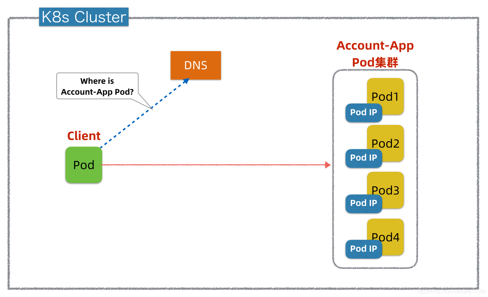
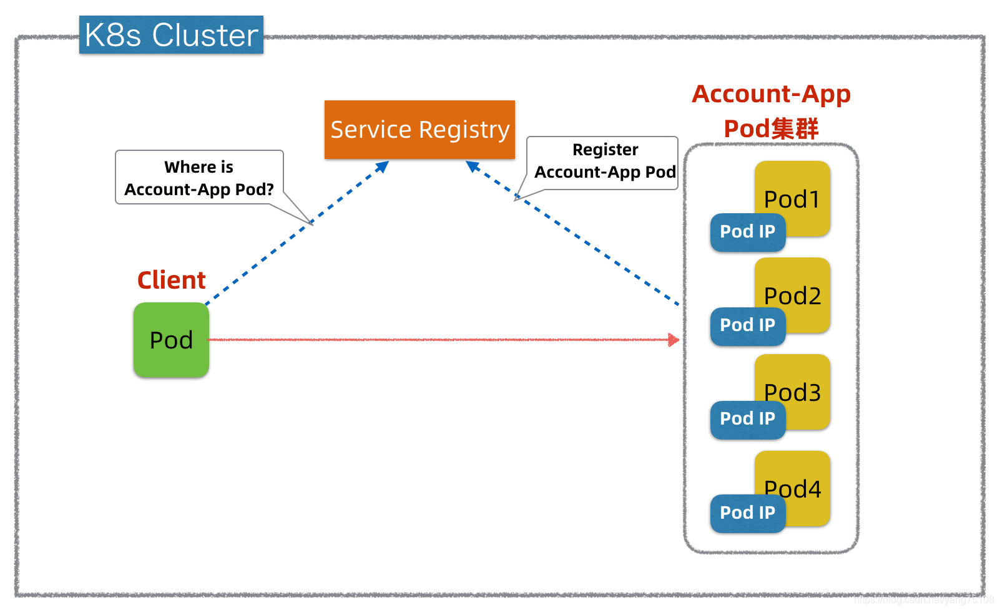
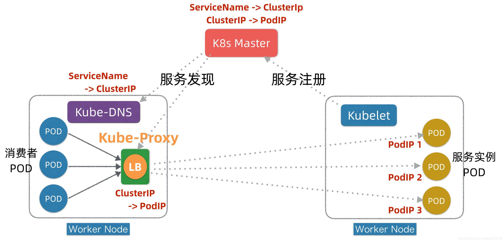

### 前言
在上一篇《Kubernetes网络三部曲～Pod网络》中，波波讲解了K8s的4层网络中的第1层Pod网络。
有了Pod网络，K8s集群内的所有Pods在逻辑上都可以看作在一个平面网络内，可以正常IP寻址和互通。
但是Pod仅仅是K8s云平台中的虚拟机抽象，最终，我们需要在K8s集群中运行的是应用或者说服务(Service)，
而一个Service背后一般由多个Pods组成集群，这时候就引入了服务发现(Service Discovery)和负载均衡(Load Balancing)等问题，
这就是第2层Service网络要解决的问题，也是本文我要展开分析的问题。

### Service网络概念模型
我们假定第1层Pod网络已经存在，下图是K8s的第2层Service网络的简化概念模型:

我们假定在K8s集群中部署了一个Account-App应用，这个应用由4个Pod(虚拟机)组成集群一起提供服务，每一个Pod都有自己的PodIP和端口。
我们再假定集群内还部署了其它应用，这些应用中有些是Account-App的消费方，也就说有Client Pod要访问Account-App的Pod集群。
这个时候自然引入了两个问题：

- 服务发现(Service Discovery)： Client Pod如何发现定位Account-App集群中Pod的IP？
    况且Account-App集群中Pod的IP是有可能会变的(英文叫ephemeral)，这种变化包括预期的，比如Account-App重新发布，
    或者非预期的，例如Account-App集群中有Pod挂了，K8s对Account-App进行重新调度部署。
    
- 负载均衡(Load Balancing)：Client Pod如何以某种负载均衡策略去访问Account-App集群中的不同Pod实例？以实现负载分摊和HA高可用。

实际上，K8s通过在Client和Account-App的Pod集群之间引入一层Account-Serivce抽象，来解决上述问题：

- 服务发现：Account-Service提供统一的ClusterIP来解决服务发现问题.
    Client只需通过ClusterIP就可以访问Account-App的Pod集群，不需要关心集群中的具体Pod数量和PodIP，
        即使是PodIP发生变化也会被ClusterIP所屏蔽。注意，这里的ClusterIP实际是个虚拟IP，也称Virtual IP(VIP)。
        
- 负载均衡：Account-Service抽象层具有负载均衡的能力，支持以不同策略去访问Account-App集群中的不同Pod实例，以实现负载分摊和HA高可用。
    K8s中默认的负载均衡策略是RoundRobin，也可以定制其它复杂策略。
    
K8s中为何要引入Service抽象？背后的原理是什么？后面我将以技术演进视角来解释这些问题。

#### 服务发现技术演进
DNS域名服务是一种较老且成熟的标准技术，实际上DNS可以认为是最早的一种服务发现技术。

在K8s中引入DNS实现服务发现其实并不复杂，实际K8s本身就支持Kube-DNS组件。假设K8s引入DNS做服务发现(如上图所示)，
运行时，K8s可以把Account-App的Pod集群信息(IP+Port等)自动注册到DNS，Client应用则通过域名查询DNS发现目标Pod，然后发起调用。
这个方案不仅简单，而且对Client也无侵入(目前几乎所有的操作系统都自带DNS客户端)。但是基于DNS的服务发现也有如下问题：

- 不同DNS客户端实现功能有差异，有些客户端每次调用都会去查询DNS服务，造成不必要的开销，
- 而有些客户端则会缓存DNS信息，默认超时时间较长，当目标PodIP发生变化时(在容器云环境中是常态)，存在缓存刷新不及时，会导致访问Pod失效。
- DNS客户端实现的负载均衡策略一般都比较简单，大都是RoundRobin，有些则不支持负载均衡调用。

考虑到上述不同DNS客户端实现的差异，不在K8s控制范围内，所以K8s没有直接采用DNS技术做服务发现。
注意，实际K8s是引入Kube-DNS支持通过域名访问服务的，不过这是建立在CusterIP/Service网络之上，这个我后面会展开。

另外一种较新的服务发现技术，是引入Service Registry+Client配合实现，在当下微服务时代，这是一个比较流行的做法。
目前主流的产品，如Netflix开源的Eureka + Ribbon，HashiCorp开源的Consul，还有阿里新开源Nacos等，都是这个方案的典型代表。

在K8s中引入Service Registry实现服务发现也不复杂，K8s自身带分布式存储etcd就可以实现Service Registry。
假设K8s引入Service Registry做服务发现(如上图所示)，运行时K8s可以把Account-App和Pod集群信息(IP + Port等)自动注册到Service Registry，
Client应用则通过Service Registry查询发现目标Pod，然后发起调用。这个方案也不复杂，而且客户端可以实现灵活的负载均衡策略，
但是需要引入客户端配合，对客户应用有侵入性，所以K8s也没有直接采用这种方案。

K8s虽然没有直接采用上述方案，但是它的Service网络实现是在上面两种技术的基础上扩展演进出来的。
它融合了上述方案的优点，同时解决了上述方案的不足，下节我会详细剖析K8s的Service网络的实现原理。

#### K8s的Service网络原理
前面提到，K8s的服务发现机制是在上节讲的Service Registry + DNS基础上发展演进出来的，下图展示K8s服务发现的简化原理：

在K8s平台的每个Worker节点上，都部署有两个组件，一个叫Kubelet，另外一个叫Kube-Proxy，这两个组件+Master是K8s实现服务注册和发现的关键。
下面我们看下简化的服务注册发现流程。

1. 首先，在服务Pod实例发布时(可以对应K8s发布中的Kind: Deployment)，Kubelet会负责启动Pod实例，
    启动完成后，Kubelet会把服务的PodIP列表汇报注册到Master节点。
2. 其次，通过服务Service的发布(对应K8s发布中的Kind: Service)，K8s会为服务分配ClusterIP，相关信息也记录在Master上。
3. 第三，在服务发现阶段，Kube-Proxy会监听Master并发现服务ClusterIP和PodIP列表映射关系，并且修改本地的linux iptables转发规则，
    指示iptables在接收到目标为某个ClusterIP请求时，进行负载均衡并转发到对应的PodIP上。
4. 运行时，当有消费者Pod需要访问某个目标服务实例的时候，它通过ClusterIP发起调用，这个ClusterIP会被本地iptables机制截获，
    然后通过负载均衡，转发到目标服务Pod实例上。
    
实际消费者Pod也并不直接调服务的ClusterIP，而是先调用服务名，因为ClusterIP也会变(例如针对TEST/UAT/PROD等不同环境的发布，ClusterIP会不同)，
只有服务名一般不变。
为了屏蔽ClusterIP的变化，K8s在每个Worker节点上还引入了一个KubeDNS组件，它也监听Master并发现服务名和ClusterIP之间映射关系。
这样， 消费者Pod通过KubeDNS可以间接发现服务的ClusterIP。

注意，K8s的服务发现机制和目前微服务主流的服务发现机制(如Eureka + Ribbon)总体原理类似，但是也有显著区别(这些区别主要体现在客户端)：

-  首先，两者都是采用客户端代理(Proxy)机制。和Ribbon一样，K8s的代理转发和负载均衡也是在客户端实现的，
    但Ribbon是以Lib库的形式嵌入在客户应用中的，对客户应用有侵入性，而K8s的Kube-Proxy是独立的，
    每个Worker节点上有一个，它对客户应用无侵入。K8s的做法类似ServiceMesh中的边车(sidecar)做法。
    
-  第二，Ribbon的代理转发是穿透的，而K8s中的代理转发是iptables转发，虽然K8s中有Kube-Proxy，
    但它只是负责服务发现和修改iptables(或ipvs)规则，实际请求是不穿透Kube-Proxy的。
        注意早期K8s中的Kube-Proxy代理是穿透的，考虑到有性能损耗和单点问题，后续的版本就改成不穿透了。
        
-  第三，Ribbon实现服务名到服务实例IP地址的映射，它只有一层映射。
    而K8s中有两层映射，Kube-Proxy实现ClusterIP->PodIP的映射， Kube-DNS实现ServiceName->ClusterIP的映射。

个人认为，对比目前微服务主流的服务发现机制，K8s的服务发现机制抽象得更好，它通过ClusterIP统一屏蔽服务发现和负载均衡，一个服务一个ClusterIP，这个模型和传统的IP网络模型更贴近和易于理解。ClusterIP也是一个IP，但这个IP后面跟的不是一个服务实例，而是一个服务集群，所以叫集群ClusterIP。同时，它对客户应用无侵入，且不穿透没有额外性能损耗。

### 总结
- K8s的Service网络构建于Pod网络之上，它主要目的是解决服务发现(Service Discovery)和负载均衡(Load Balancing)问题。
- K8s通过一个ServiceName+ClusterIP统一屏蔽服务发现和负载均衡，底层技术是在DNS+Service Registry基础上发展演进出来。
- K8s的服务发现和负载均衡是在客户端通过Kube-Proxy + iptables转发实现，它对应用无侵入，且不穿透Proxy，没有额外性能损耗。
- K8s服务发现机制，可以认为是现代微服务发现机制和传统Linux内核机制的优雅结合。

有了Service抽象，K8s中部署的应用都可以通过一个抽象的ClusterIP进行寻址访问，
并且消费方不需要关心这个ClusterIP后面究竟有多少个Pod实例，它们的PodIP是什么，会不会变化，如何以负载均衡方式去访问等问题。
但是，K8s的Service网络只是一个集群内可见的内部网络，集群外部是看不到Service网络的，也无法直接访问。
而我们发布应用，有些是需要暴露出去，要让外网甚至公网能够访问的，这样才能对外提供服务。K8s如何将内部服务暴露出去？
这个是波波在下一篇《Kubernetes网络三部曲～外部接入网络》要展开的问题，敬请期待。