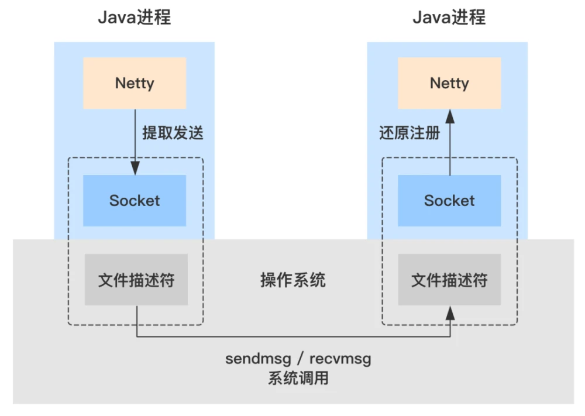

后端服务器程序大都是7X24小时不间断的对外提供服务，那么对于服务的更新或者部署，怎么能做到零停机时间，就是非常有意义的一项工作。


### 结合软负载均衡器
一般实现零停机部署是通过nginx或者haproxy 等负载均衡软件来实现。

当需要对后端的web或者其他应用服务程序更新时，先会将对应更新的后端程序从nginx或haproxy的配置中剔除，
之后reload nginx或haproxy，等后台服务没有请求了再进行更新服务，
更新程序后，再加入到nginx或haproxy配置中，这样就可以继续提供服务。

而对于一般的CDN厂商也是类似的方法，只不过他们的负载均衡是DNS域名解析服务，
需要将设备从域名解析服务中剔除，然后等待没有新请求了，再对服务器上的程序进行部署更新。
上述的方式可以做到零停机部署服务，但是，非常耗时，需要一台一台处理，自动化程度低。

### linux零停机部署

linux的零停机时间部署方案是通过linux 的**端口重用机制**，
也就是 SO_REUSEPORT + SIGHUP来实现零停机时间部署。

在linux 内核3.9之前一个ip+port只能被监听一次。
从3.9版本开始，通过设置
> SO_REUSEPORT，setsockopt(sockfd, SOL_SOCKET, SO_REUSEPORT, &opt_val, sizeof(opt_val)

来实现一个ip+port被多次监听使用。
内核会均衡的把到来的请求分配到监听的fd上。
对于多进程和多线程程序来说，监听同一个ip+port，也可以省去锁的使用，提高系统的处理效率。

比如程序A，出现了bug，那么就有了修改完后的程序B，这就需要程序B部署替换程序A。
1. 首先启动程序B监听程序A的相同的端口，这时，A和B两个程序同时对外提供服务。
2. 程序B在启动就绪后，向程序A发送一个SIGHUP，要求A终止服务。
3. A在收到信号后关闭监听的fd，将已连接上的请求处理完成后自动退出。

这样就实现了平滑的程序更新部署。

```c
//实现示例代码
int create_listen()
{
    int socketfd = socket(AF_INET, SOCK_STREAM, IPPROTO_TCP);
    struct sockaddr_in S;
    memset(&S,0,sizeof(S));
    S.sin_family = AF_INET;
	S.sin_port = htons(9556);
    int opt_val=1;
    if(setsockopt(socketfd, SOL_SOCKET, SO_REUSEPORT, &opt_val, sizeof(opt_val)))
    {
        printf("set fd[%d] SO_REUSEPORT failed[%d] %s\n",socketfd,errno,strerror(er             rno));
        return -1;
    }
    if(bind(socketfd,(struct sockaddr *) &S, sizeof(S))){
        printf("bind fd[%d] failed[%d] %s\n",socketfd,errno,strerror(errno));
        return -1;
    }
    if(listen(socketfd,5)<0){
        printf("listen fd[%d] failed[%d] %s\n",socketfd,errno,strerror(errno));
        return -1;
    }
    return socketfd;
}

int main()
{
    int pid=0;
    struct sockaddr_in req_addr;
    int sock_size;
    int req_fd;
    sock_size = sizeof(req_addr);
    int socketfd=create_listen();
    if(socketfd<0)
        return 0;
    printf("p: create listen fd=%d\n",socketfd);
    pid = fork();
    if(pid<0)
    {
        printf("p: fork failed[%d] %s\n",socketfd,errno,strerror(errno));
        return 0;
    }
    else if(pid>0){//parent
        printf("p: fork child %d\n",pid);
        while(1){
            req_fd = accept(socketfd, (struct sockaddr *)&req_addr, &sock_size));
            printf("p: pid=%d recv request\n",getpid());
            close(req_fd);
        }
        return 0;
    }
    ///////child////////////
    close(socketfd);
    socketfd=create_listen();
    if(socketfd<0)
        return 0;
    printf("c: create listen fd=%d\n",socketfd);
    while((req_fd = accept(socketfd, (struct sockaddr *)&req_addr, &sock_size))>0){
        printf("c: pid=%d recv request\n",getpid());
        close(req_fd);
    }
    return 0;
}

输出结果：
p: create listen fd=3
p: fork child 69355
c: create listen fd=3
p: pid=69354 recv request
p: pid=69354 recv request
c: pid=69355 recv request
c: pid=69355 recv request
子进程退出后：
p: pid=69354 recv request
p: pid=69354 recv request
p: pid=69354 recv request
```

### docker 零停机部署
docker的零停机部署实现上是采用端口转发规则的改变

docker daemon启动时缺省情况会启用iptables规则，当iptables规则启用时优先选择iptables，
通过增加参数–iptables=false可以禁用iptables规则改为直接由docker-proxy转发请求。
了解了docker的端口映射机制再回到零停机时间部署上面来，我们不难发现docker容器实现零停机部署大致过程如下：
1. 启动app-v1@containerA，但不配置端口映射
2. 增加iptables规则将主机端口映射到containerA上
3. 启动app-v2@containerB，但不配置端口映射
4. 调整iptables规则将主机端口映射到containerB上
5. 停止app-v1@containerA

回滚差不多：
1. 启动app-v1@containerA
2. 调整iptables规则将主机端口映射到containerA上
3. 停止app-v2@containerB

### k8s 零停机部署
快速回顾一下创建Pod时发生的情况：

1. Pod存储在etcd中。
2. 调度程序分配一个节点。它将节点写入etcd。
3. 向kubelet通知新的和预定的Pod。
4. kubelet将创建容器的委托委派给容器运行时接口（CRI）。
5. kubelet代表将容器附加到容器网络接口（CNI）。
6. kubelet将容器中的安装卷委托给容器存储接口（CSI）。
7. 容器网络接口分配IP地址。
8. Kubelet将IP地址报告给控制平面。
9. IP地址存储在etcd中。

如果您的Pod属于服务：
1. Kubelet等待成功的Readiness探针。
2. 通知所有相关的endpoint（对象）更改。
3. Endpoint将新endpoint（IP地址+端口对）添加到其列表中。
4. Endpoint更改将通知Kube-proxy。Kube-proxy更新每个节点上的iptables规则。
5. 通知Endpoint变化的入口控制器。控制器将流量路由到新的IP地址。
6. CoreDNS通知Endpoint更改。如果服务的类型为Headless，则更新DNS条目。
7. 向云提供商通知Endpoint更改。如果服务为type: LoadBalancer，则将新Endpoint配置为负载均衡器池的一部分。
8. Endpoint更改将通知群集中安装的所有服务网格。
9. 订阅Endpoint更改的其他运营商也会收到通知。
如此长的列表令人惊讶地只是一项常见任务 — 创建Pod。

Pod正在运行。现在是时候讨论删除它时会发生什么。


### 其他 service mesh sidecar 升级
为了实现 Agent 迭代升级过程无需业务团队参与，该过程对业务开发人员必须是无感知的，“平滑升级”流程需要满足

- 业务进程不重启
- 业务进程的流量保持不变

常规的流量切换方案，需要借助新的 Agent IP 或端口、经过复杂的流量调度过程，才能接近实现业务进程流量保持不变。
我们选择采用业务感知更为友好的**FD迁移方案**。
通过调用 Linux 操作系统的 sendmsg / recvmsg 接口，
旧进程能够将所持有连接的的 FD（文件描述符）发送给新进程，新进程能够将接收的 FD 还原成连接继续进行读写操作。

Java 本身的 JDK 并未暴露操作系统的底层接口，需要通过 JNI 的方式进行调用。
Java 的网络框架 Netty 已经实现了相关接口的封装，在 Netty 提供的 Java API 基础上开发即可实现 FD 迁移的相关机制。



### fd 迁移机制
今天介绍一个可以拿出去吹牛的功能：实现socket句柄在进程之间迁移！

我们的服务器上，运行着大量的server实例（instance）。
这些instance，每个都要承载着数十万的连接和非常繁忙的网络请求。
能够把这样的连接数，这样的流量，玩弄于股掌之间，是每个互联网程序员的梦想。

但软件总是要升级的，每当升级的时候，就需要先停掉原来的instance，然后再启动一个新的。
在这一停一起之间，数十秒就过去了，更不要说JAVA这种启动时间就能生个孩子的速度了。

传统的做法，是先把这个instance从负载均衡上面摘除，然后启动起来再加上；
对于微服务来说，就要先隔离，然后启动后再取消隔离。这些操作，对于海量应用来说，就是个噩梦。

1. 零停机更新
   有没有一种方法，能够把一个进程所挂载的连接（socket），转移到另外一个进程之上呢？
   这样，我在升级的时候，就可可以先启动一个升级版本的进程，然后把老进程的socket，one by one的给转移过去。

实现零停机更新。

这个是可以的。Facebook就实践过类似的技术，它们把这项技术，叫做Socket Takeover。
千万别用百度搜这个关键字，你得到的可能是一堆垃圾。

这么牛x的技术，还这么有用，为什么就没人科普呢？
别问我，我也不知道，可能大家现在都在纠结怎么研究茴香豆的茴字写法，没时间干正事吧。

这个牛x的功能，是由Linux一对底层的系统调用函数所实现的：sendmsg()和recvmsg()。
我们一般在发送网络数据包的时候，一般会使用send函数，
但send函数只有在socket处于连接状态时才可以使用；
与之不同的是，sendmsg在任何时候都可以使用。

2. 技术要点

在c语言网络编程中，首先要通过listen函数，来注册监听地址，然后再用accept函数接收新连接。比如：

```c
int listen_fd = socket(addr->ss_family, SOCK_STREAM, 0);
...
bind(listen_fd, (struct sockaddr *) addr, addrlen);
...
int accept_fd = accept(fd, (struct sockaddr *) &addr, &addrlen);
```

我们首先要做的，就是把listen_fd，从一个进程，传递到另外一个进程中去。
怎么发送呢？肯定是要通过一个通道的。在Linux上，那就是UDS，全称Unix Domain Sockets。

2.1 Unix Domain Sockets监听
UDS（Unix Domain Sockets）在Linux上的表现，是一个文件。
相比较于普通socket监听在端口上，一个进程也可以监听在一个UDS文件上，比如/tmp/xjjdog.sock。
由于通过这个文件进行数据传输，并不需要走网卡等物理设备，所以通过UDS传输数据，速度是非常快的。

但今天我们不关心它有多块，而是关心它多有用。
通过bind函数，我们同样可以通过这个文件接收连接，就像端口接收连接一样。

```c
struct sockaddr_un addr;
char *path="/tmp/xjjdog.sock";
int err, fd;
fd = socket(AF_UNIX, SOCK_STREAM, 0);
memset(&addr, 0, sizeof(struct sockaddr_un));
addr.sun_family = AF_UNIX;
strncpy(addr.sun_path, path, strlen(path));
addrlen = sizeof(addr.sun_family) + strlen(path);
err = bind(fd, (struct sockaddr *) &addr, addrlen);
...
accept_fd = accept(fd, (struct sockaddr *) &addr, &addrlen);
```

这样。其他的进程，就可以通过两种不同的方式，来连接我们的服务。

- 通过端口：进行正常的服务，输出正常的业务数据。执行正常业务
- 通过UDS：开始接收listen_fd和accept_fd们。执行不停机迁移socket业务

2.2 fd迁移技术要点
怎么迁移呢？我们关键看第二步。

实际上，当新升级的服务通过UDS连接上来，我们就开始使用sendmsg函数，将listen_fd给转移过去。

我们来看一下sendmsg这个函数的参数。

```c
ssize_t sendmsg(
int socket,
const struct msghdr *message,
int flags
);
```

socket可以理解为我们的UDS连接。关键在于msghdr这个结构体。

```c
struct msghdr {
void            *msg_name;      /* optional address */
socklen_t       msg_namelen;    /* size of address */
struct          iovec *msg_iov; /* scatter/gather array */
int             msg_iovlen;     /* # elements in msg_iov */
void            *msg_control;   /* ancillary data, see below */
socklen_t       msg_controllen; /* ancillary data buffer len */
int             msg_flags;      /* flags on received message */
};
```

其中， msg_iov表示要正常发送的数据，比如HelloWord；
还有两个ancillary (附属的) 的变量，提供了附加的功能，那就是变量msg_control和msg_controllen。
其中，msg_control又指向了另外一个结构体cmsghdr。

```c 
struct cmsghdr {
socklen_t cmsg_len;    /* data byte count, including header */
int       cmsg_level;  /* originating protocol */
int       cmsg_type;   /* protocol-specific type */
/* followed by */
unsigned char cmsg_data[];
};
```

在这个结构体中，有一个叫做cmsg_type的成员变量，是我们实现socket迁移的关键。

它共有三个类型。
- SCM_RIGHTS
- SCM_CREDENTIALS
- SCM_SECURITY
其中，SCM_RIGHTS就是我们所需要的，它允许我们从一个进程，发送一个文件句柄到另外一个进程。

```c 
struct msghdr msg;
...
struct cmsghdr *cmsg = CMSG_FIRSTHDR(&msg);
cmsg->cmsg_level = SOL_SOCKET;
cmsg->cmsg_type = SCM_RIGHTS;

//socket fd列表，设置在cmsg_data上
int *fds = (int *) CMSG_DATA(cmsg);
```

依靠sendmsg函数，socket句柄就发送到另外一个进程了。

3. 接收和还原
   同样的，recvmsg函数，将会接收这部分数据，然后将其还原成cmsghdr结构体。
   然后我们就可以从cmsg_data中获取句柄列表。

为什么能这么做呢？因为socket句柄，在某个进程里，其实只是一个引用。
**真正的fd句柄，其实是放在内核中的。所谓的迁移，只不过是把一个指针，从一个进程中去掉，再加到另外一个进程中罢了**。

fd句柄的属性，有两种情况。
- 监听fd，直接调用accept函数作用在fd上即可
- 普通fd，需要将其还原成正常的socket

对于普通fd，肯定要调用与原新连接到来时相同的代码逻辑。
所以，一个大体的迁移过程，包括：
1. 首先迁移listener fd到新进程，并开启监听，以便新进程能快速接收新的请求。
   如果我们开启了SO_REUSEADDR选项，新老服务甚至能够一起进行服务
2. 等待新进程预热之后，停掉原进程的监听
3. 迁移原老进程中的大量socket，这些socket可能有数万条，最好编码能看到迁移进度
4. 新进程接收到这些socket，陆续将其还原为正常的连接。相当于略过了accept阶段，直接就获取了socket列表
5. 迁移完毕，老进程就空转了，此时可以安全的停掉


这是一项黑科技，其实已经在一些主流的应用中使用了。
你会看到一些非常眼熟的软件，这项功能是它们的一大卖点。
比如HAProxy，运行在4层网络的负载均衡；比如Envoy，Istio默认的数据平面软件，使用类似的技术完成热重启。

其实，在servicemesh的推进过程中，proxy的替换，也会使用类似的技术，比如SOFA。
对于golang和C语言来说，由于API暴露的比较好，这种功能可以很容易的实现；
但在Java中，却有不少的困难，因为Java的跨平台特性不会做这种为Linux定制的API。

可以看到，sendmsg和recvmsg这两个函数，可以实现的功能非常的酷。
它比较适合无状态的proxy服务，如果服务内有状态存留，这种迁移并不见得安全，当然也可以尝试把此项技术运用在一些中间件上。
但无论如何，这种黑科技，有一种别样的暴力美，肯定会把windows server用户给馋哭的。