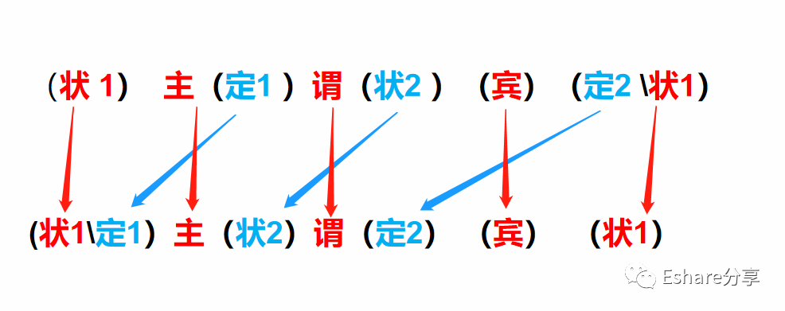

### 数学建模
因为中文与英语不同，**中文并没有疑问句式，而是通过疑问词组成疑问句，语序不会发生变化**。

>这是一本书。 
> This is a book.
>这是一本书吗？ 
> Is this a book?

以下公式**基于陈述句建模**，理科推导公式：f(x)=y

y是函数值，x是自变量，f()是对应法则，假设英语是x，翻译中文是f()，那么翻译出来的中文意思就相当于y

- 英语：(状1) 主 (定1) 谓 (壮2) (宾)  (定2) (状1)
- 中文：(状1 定1）主 (壮2) 谓 (定2) (宾) （状1）
  
蓝色表示英中顺序相反，黑色表示中英文顺序一致

**注意事项**：

有一个特例，当宾语后面没有其他东西的时候，状语2需要放宾语后面，因为**英语习惯是头轻脚重**

例如：
> I love you very much  
> 不能改成
>  I love very much you

在公式里面，主语前置的定语是当作一个主语整体，例如  A pretty girl  是一个主语整体

公式顺序

举个栗子：

去年，我用我所有的钱买了一个没啥用处的玩具。
Last year, I bought with all my money a toy that
is useless.

### 2 公式使用规则
#### 2.1 中英文差异
中英逻辑比对：后重和前重

**中文习惯把重点放后面，前面会用一堆修饰，后面再表达重点**

> 在北京，没有钱没有老婆没有工作没有房子没有文凭也没有车，但是有个好爸爸的年轻人以这种方式也能实现他们心中的梦想。

**英语习惯把重点放前面，先表达重点，再修饰**。
  
> In Beijing, the young who have no money, no wife, no job, no house, no diploma and no car but have a good father 
  can realize in this way their dreams in their hearts.

#### 2.2 寻找主干成分
一个句子的基本构成是主语+谓语+（宾语）,宾语有时候可以忽略，所有的句子都是主干+其他句子构成

##### 主语
句首的独立名词性结构
- 名词: In his eyes, Jack is a liar.
- 代词
- 分词: Living in a city is always convenient.
- 从句: 
    -  That no one can live without water  is true.
    - It is true  that no one can live without water .

##### 谓语
可以通过排除法找出真正谓语，一般主语后第一个动词是谓语

- 排除从句中和介词短语中动词: The man who is smiling is jack.
- 排除主语前动词: In fighting, the brave wins.
- 排除分词前无助词(have be)的动词
    - I am working. 正例
    - I have married..正例
    - I am married. 正例
    - Coming...,xxx
- 谓语可以是动词词组
    - I  want to see  you
    - I want her to see you.  动词词组可以被隔开
      

**举个栗子**：

The methods that a community devises to perpetuate itself come into being to preserve aspects of the cultural legacy 
that that community perceives as essential.

分解：

The methods （that a community  devises to  perpetuate itself come into being to )
 preserve  aspects (of the cultural legacy
(that that community perceives as essential)).

一个社区设计让自己永存的方法是保护该社区认为必不可少的的文化遗产的各个方面

> come into being to 形成，开始存在

#####  宾语 
谓语后的独立名词结构，宾语可以没有。

句=主+谓

He left.
He is smart.

#####  插入语
插入语不属于主干成分，一般用逗号、分号或者破折号隔开，与主干成分无关的句子，翻译时可以暂时忽略放到最后再翻译，不影响中文意思

The emphasis on data gathered first hand , ~~combined with a cross cultural perspective brought to the analysis of cultures past and present~~, 
makes this study a unique one.

#### 2.3 中译英寻找主干技巧
中文有时候会省略主干，因此翻译英语之前需要补全句子完整

- 不作死不会死 -> (他) 不作死不会死
- 他很好 -> 他 (是) 很好
- 山无棱天地合，始敢与君绝 -> 山无棱天地合，(我) 始敢与君绝
- 我的英语是体育老师传授的。-> 我的英语是 (被) 体育老师传授的

#### 2.4 短语的三种形式
**实际上所有短语都是从句的变形**
- 介词短语
- 从句
- 分词结构

举个栗子:
I know the man who is singing in the car.

in the car -> who is in the car
who is singing -> sining
**变形**: I know the man singing who is in the car.

#### 2.5 排序
按短语排序

##### 2.5.1 内部排序运行算法 R1
按公式找出主干后，然后按短语划分意群，围绕主干倒序，按从句内部短语倒序翻译（中文和英文修饰的顺序刚好相反）
Although not so reasonable,a man that is so weak in daily business is always a loser that can't fulfill his dreams in his life.

- 1.找出主干并按短语划分意群

(Although not so reasonable), A man  (that is so weak | in daily business)  is always a loser   (that can't fulfill his dreams | in his life).

- 2.按英中万能公式排序

(Although not so reasonable)，(that is so weak | in daily business) a man always is (that can't fulfill his dreams | in his life) a loser

- 3.从句内部按倒序排序

(Although not so reasonable)，(in daily business | that is so weak) a man always is (in his life | that can't fulfill his dreams) a loser.

- 4.英译中
(尽管不是那么的合理)，(在日常事务当中 | 非常脆弱的) 一个人 通常都 是 (在他一生当中 无法履行梦想的) 失败者。

##### 2.5.2 并列排序运行算法 R2
R2法则核心是短语围绕主干倒序，并列部分不变序，假如遇到句子有并列，只需要关注并列之内非并列部分的倒序，并列句部分内部排序并不影响并列外的倒序

##### 2.5.3 简单并列关系排序公式:
- If 123
- 2 and 3
- So 231

**公式解释**:

- 存在一个英文句子(非主干部分)有3个短语，顺序是: 123
- 如果短语2与3之间是并列关系: 2 and 3
- 那么翻译成中文时，要把2和3看成一个整体，2和3顺序不变，与短语1倒序，最终排序结果应该 231

**举个栗子**：
A man without passion and without ideas at work will not make any progress.

- 1.找出主干

 A man   (without passion and without ideas at work)  will not make any progress .

- 2.找出并列短语

A man (without passion and without ideas)at work will not make any progress.

- 3.短语之前排序，并列部分不变序

at work(without passion and without ideas) A man will not make any progress.

- 4.英译中

一个在工作上没有激情和想法的 男人 永远不会取得 任何进步

##### 2.5.4 复合并列关系排序公式
- If 12345
- (23) and (45)
- X and Y
- Then XY1
- So (32)(54)1

**公式解释**:

如果存在一个英文句子(非主干部分)有5个短语
短语 2 和3，4和5 分别构成两个不同的句子，2和3的整体 与 4和5构成的整体 是外部并列关系
把2和3这个整体当作变量X，4和5这个整体当作变量Y
然而句子整体的排序关系就是 XY1
那么XY再进行内部倒序排序，整个句子的排序就是 32541

**举个栗子** 
In your life, a man who helps you when you are in trouble and who leaves you when you are successful is a real friend.

1.找出主干

In your life,  a man  who helps you when you are in trouble and 
who leaves you when you are successful  is a real friend .

2.找出并列结构，以下两定语从句是并列关系，句子内部还包含其他短语，因此构成了复合并列关系

In your life, a man (who helps you when you are in trouble and who leaves you when you are successful) is a real friend.

3.先把并列部分看做整体，与其他短语进行排序

In your life, (who helps you when you are in trouble and who leaves you when you are successful) a man is a real friend.

3.对并列部分的内部短语进行排序

In your life, (who when you are in trouble helps you and who when you are successful leaves you ) a man is a real friend.

4.英译中

在一生当中，当你有困难的时候帮助你和当你成功的时候离开你的 人 才是 真的朋友。

**寻找并列句子结构技巧**
- 并列必定是对称的，不是只有and才是并列，还有less...than类似这些使用连接词构成的并列结构。
- 并不是所有的逗号都是插入语，它还可以是并列，大于两个的并列就是用逗号隔开，逗号分号破折号只能是插入语和并列
- 一般我们关注的是短语间并列，而不是单词并列，单词并列并不影响我们的整体翻译

#### 2.6复杂句子运用套路
以上技巧都不足以解决大多数复杂的句子，因为复杂的句子往往是由多种主干成分组成，对于复杂句子，首先确定它属于什么模型，再运用公式进行拆解

##### 双黄蛋模型
**双黄蛋模型指的是至少2个并列的句子组成的一个句子，这两个句子分别具有独立的主干，即 句+句**

形式

I love you and I hate you.
Although I love you, you hate me.
I love you because I hate you.

**技巧**

先分析句子模型，如果是双黄蛋模型，运用原有的套路分别对这两个独立句子划分主干，然后用公式对围绕各自主干成分的短语进行内部排序，然后再组合翻译

**举个栗子**

The creation of books is a big progress for human beings, but the invention of computer is even more valuable.

- 1.分析是否属于双黄蛋模型，按并列方式划分句子结构

( The creation   of books  is a big progress   for human beings),
(but   the invention  of computer  is even more valuable ).

- 2.分别对两个句子进行主干成分划分

The creation of books is a big progress for human beings
but the invention of computer is even more valuable

- 3.分别对两个句子进行内部排序

of books The creation is for human beings a big progress
but of computer the invention is even more valuable

- 4.分别英译中

图书的创造是人类一个伟大进步
但是计算机的发明更有价值

- 5.将两个句子组合

图书的创造是人类一个伟大进步,但是计算机的发明更有价值

##### 单黄蛋模型
单黄蛋模式也可以称为简单模式，指的是有主干并列，但是整个句子只有一个完整主干，可以多个主语并列，或者多个谓语并列等，即 非句 + 非句

形式

I love and hate you.
I love you and her.
you and I are friends

**技巧**

先分析句子模型，如果是单黄蛋，运用原有的套路这个句子用公式划分主干，然后对围绕各自主干成分的短语进行内部排序翻译

举个栗子
You were, are and will always be in my heart.

1.分析是否属于单蛋模型，划分主干成分

主语：You
谓语：were, are and will always be
状语：in my heart

2.排序，由于这个句子比较简单不需要排序

3.英译中

你，过去，现在，未来永远都会在我心里

翻译基本套路技巧

- 1.通过并列结构和主干成分去分析单/双黄蛋模型
- 2.划分句子主干(双黄蛋模型拆分两个独立句子分析)
- 3.划分句子内的并列结构
- 4.排序
- 5.翻译

### 小试牛刀
例句：

Liberties give us the freedom to act, or to refuse to act, or even just to think in certain ways,
but liberties do not always mean the freedom to do these things without any interference.

1.分析句子模型

该句子通过连接词But构成一个并列结构的句子，实际上这两个并列句子可以组成一个完整的句子，都具有独立主干，因此是双黄蛋模型

2.划分主干成分

小句1:Liberties give us the freedom to act, or to refuse to act, or even just to think in certain ways

- Liberties 主
- give 谓
- us 宾1
- the freedom 宾2
- to act 定
- or to refuse to act 定
- or even just to think in certain ways 定

小句2: but liberties do not always mean the freedom to do these things without any interference
- but 连接词
- liberties 主
- do not always mean 谓
- the freedom 宾
- to do these things without any interference 定

3.划分句子内的并列结构

小句1:Liberties give us the freedom (to act, or to refuse to act, or even just or even just to think in certain ways)

4.排序

- 小句1:Liberties give us (to act, or to refuse to act, or even just in certain ways | to think ) the freedom
- 小句2: but liberties do not always mean without any interference | to do these things the freedom

5.英译中

自由权 给予 我们去做一些事，或拒绝做一些事，或甚至仅仅以某些方式思考的自由，但自由权并不总是意味着不受任何干涉地去做这些事情的自由 。

