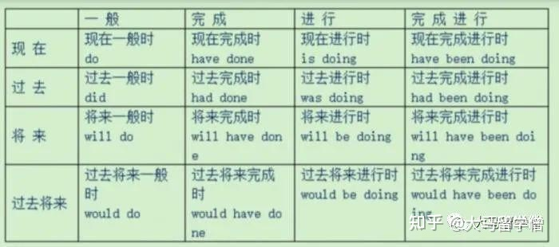

### 时态
很多人总会以为时态很难，**其实一点也不难**。首先学习时态之前必须知道：
「时」意味着「时间」，而时态的「态」则意味着「状态」。
在时态这两方面就各自有4个，也就是时有4个，态有4个，4 x 4 =16。

#### 一、时态的时
包括过去、现在、将来和过去将来。

过去、现在和将来相信大家都懂是什么，那么过去将来是什么呢？
其实过去将来就是过去的将来，并不考虑现在的情况。
也就是过去将来我们要设想有两个时间点，其中一个时间点一定是在过去，另一个时间点可以是在过去、现在或将来，不管是哪一个，都一定是过去时间点的将来。

**举例说明-过去将来**：
1. 两个时间点在过去

去年5月（2020）的时候，我说今年1月（2021）一定要重新开始！

第一个时间点：去年5月

第二个时间点：今年1月（今天已经是2月了哦，所以今年的1月依然是现在的过去）

2. 一个时间点在过去，一个时间点在现在

昨天我说今天3点也就是现在会和闺蜜一起去逛街。

第一个时间点：昨天

第二个时间点：今天3点（假设现在就是3点）

3. 一个时间点在过去，另一个时间点在将来

我昨天说，今年一定要学好英文！

第一个时间点：昨天

第二个时间点：今年（12月31日之前）

其实也不用搞到这么复杂，总之在过去将来的这一块，你只要知道在过去的时间里提到将来就可以了。

#### 二、时态的态
状态分成 一般，进行，完成，完成进行。

- **一般**通常是在说明事实，例如我每个星期都会打球；
- **进行**就是动作正在进行，例如我在看电视；
- **完成**则是完成了某个动作，例如我做完功课了！
- **完成进行**就是完成了某项动作但还要继续进行那个动作，例如我吃完了3粒苹果，但我还要继续吃多1粒才开心！

知道了4个时间和4个状态，基本上就很容易理解16个语法了。
也就是把4个状态放在不同的时间段而已。
**通常时态就是让我们去强调某个时间的某个状态**。只要搞清楚这点，我们就能进一步学习时态的语法结构啦！

**以上是重点**

----------------

### 一些特殊语法
#### 1. 状语从句的主将从现
主将从现是指在时间状语从句、条件状语从句和让步状语从句中，如果主句表达将来含义，从句用一般现在时替代一般将来时。是一种英语语法。

常见的有以下六种情况：
- 一、如果主句是将来时或表示将来含义时，那么条件和时间状语从句多用一般现在时

如： When I grow up, I will be a nurse and look after patients/ I want to be a nurse and look after patients.
我长大后要当一名护士，照顾病人。
  
- 二、如果主句是祈使句，那么从句通常要用一般现在时

如：Don’t laugh at me when I make a mistake.
我犯错误的时候不要笑话我。

- 三、如果主句是含有情态动词的一般现在时，根据需要从句多用一般现在时

如：You should be quiet when you are in the reading room
在阅览室时应保持安静。

- 四、 如果if的条件状语从句遇到变换间接和直接时 , 祈使句应用not　to....

如：“Don'tclose the window if the rain stops,” she said.
→She said not to close the window if the rain stops.
常见的时间状语从句的连词有：as soon as,when,while ,as,until等

- 五、主将从现说的是在含有时间状语从句和条件状语从句的主从复合句中，如果主句的时态是一般将来时，那么从句要用一般现在时。

例如：I will tell him about it when he comes.
If it is fine tomorrow, we will go outing.

- 六、如果主句的时态是过去将来时，那么从句要用一般过去时 。例如：

He said that he would have another try if he had the chance.
I knew he could help me if he was free the next day.

主要标志有：if 、unless 、until、 when 、as soon as等。

### 练习题
1. —I called you at 4:00 yesterday afternoon, but no one answered.

—Sorry, I _____ with my friends at that time.

A. swim B. swam C. will swim D, was swimming

2. —Excuse me, where is Mr. Brown's office?

—Sorry, I don't know. I_____ here for only a few days.

A. work B. worked C. have worked D. will work

3. —Where is Bob?

—He______to Harbin for a meeting.

A. went B. has been C. has gone

4. Don't make so much noise. The children_______an English lesson.

A. have B. are having C. were having

5. I was very angry with John—he just_______ when I spoke to him.

A. isn’t listening B. hasn’t listened C. didn’t listen D. wasn’t listening

6. — Are you going to the bank, Laura?

—No, I _______ to the bank already.

A. have been B. have gone C. am going D. had been

7. Mr. Black is going to marry a girl he _______ in Japan last year.

A. meets B. met C. has met D. would meet

8. So far this year, many new houses ________ in Wenchuan with the help of the government.

A. build B. are built C. will build D. have been built

9. My grandmother ______ a lot of changes in Tianjin since she came here.

A．sees B. can see C. will see D. has seen

10.The meeting _ by the time I got there yesterday.

A. was on B. has been on C. had begun D. has begun

11. —You have found your lost umbrella, haven’t you?

—Yes. I _____ it behind the door this afternoon.

A. have found B. will find C. found

12. Listen! The phone ＿＿＿. Please go to answer it.

A. rings B. is ringing C. rang D. will ring

13．I __ many new friends since I came here．

A．make B．made C．will make D．have made

14. I met a good friend of mine while I ___ on the street.

A. walks B. walk C. was walking D. am walking

15. – I don’t know if Mr. Li ____ to the party this evening.

-- I think he will come if he ____ free.

A. will come; is B. will come; will be C. comes; is D. comes; will be

----------
### 答案
1.答案：D。考查动词时态。首句说：我昨天下午4点钟给你打电话，但是没人接。下句显然是要告诉对方当时正在做什么，故用过去进行。句意：…，我当时和我的朋友们在一起。

2.答案：C。考查动词时态及情景交际。句意：…。我在这儿才几天

3.答案：C词义辨析。have been to 指“去过”，have gone to 指“去了”， 即不在说话者所在地。根据句义，“他去哈尔滨参加会议”，所以选C。

4.答案：B时态考查。根据情境：不要闹动静，因为孩子们正在上英语课，故用现在进行时。

5.答案：D考查动词的时态。句意“我生约翰的气，当我和你说话的时候，他就是不听。”过去进行时强调过去某时间正在做的事情。

6.答案A考查动词时态的用法。由上句句意“……你打算去银行吗？－不。”和“already”推测他已经去过了，用现在完成时。
Have/has been+地点意为“去过某地（已回来）”；have/has gone+地点意为“到某地去了（现在不在这儿）”。故选A。

7. 答案：B本题考查过去分词做定语的用法。句意为“布莱克先生打算和他去年在日本结识的女孩结婚”。故选B。

8.答案：D考查动词的时态。句中有So far“到目前为止”，使用现在完成时态，故选D。

9.答案：D 动词的时态。 “Since，自从……以来”是现在完成时的标志词，因此这句话用现在完成时。

10.答案：C “我昨天到哪儿”是过去，“会议开始在我到哪儿之前”应是过去的过去。故用过去完成时。

11.答案C根据答语的句意：今天下午找到的。可知动作发生在过去用一般过去时故选C。

12.答案：B句意：听，电话响了。请接一下。根据句意可以判断应该用现在进行时，故答案为B。

13.解析：本题考查动词时态。since…是现在完成时的时间状语标志，故答案选D。

14.答案：C “我在街上走的时候，突然碰到了我的一个好朋友。”遇见我的好朋友时，我正在街上走着，故应用过去进行时。

15.答案：A 本题考察if引导的从句时态的考察，第一个if引导的是宾语从句，“李老师今晚是不是将参加我们的聚会”应用一般将来时；第二个if引导的是条件状语从句应“主将从现”。