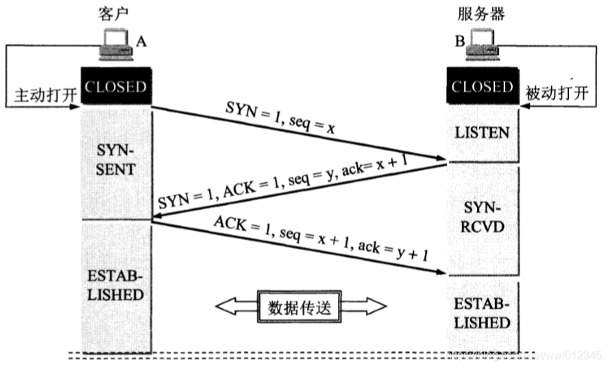
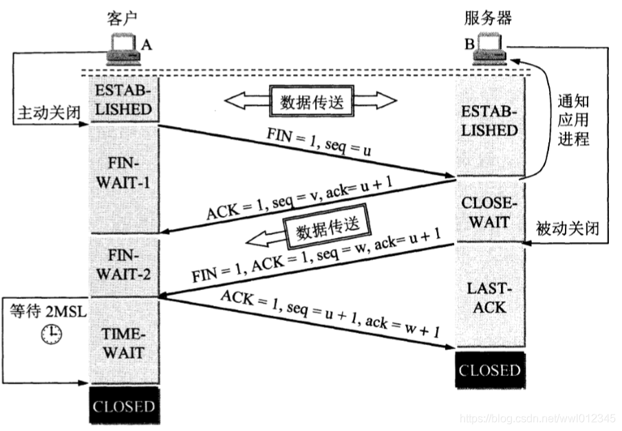
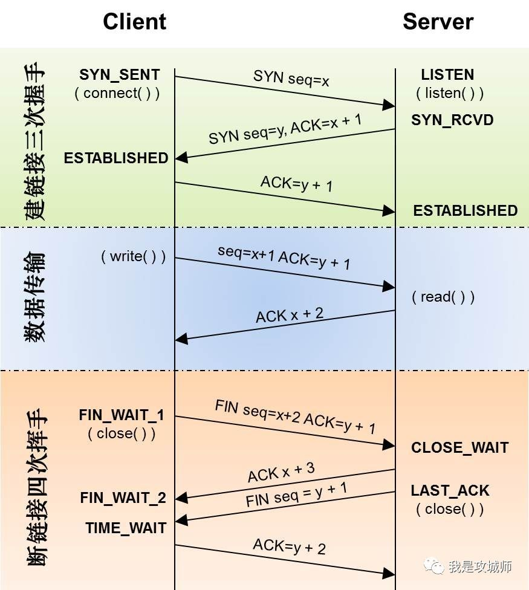

# 建立连接
TCP是面向连接的协议。运输连接是用来传送TCP报文的。TCP的运输连接有三个过程，即建立连接、数据传输和连接释放。

TCP连接建立过程中要解决以下三个问题：
1. 要使每一方都能够确认对方的存在。
2. 要允许双方协商一些参数
3. 能够对运输实体资源进行分配

TCP连接的建立采用客户机／服务器模式，主动发起连接建立的应用进程叫做客户机，而被动等待连接建立的应用进程叫做服务器。

tcp建立连接过程如下图：


1. 首先，客户机与服务器的TCP进程都处于CLOSED（关闭）状态，当要进行TCP连接时，
   客户机主动打开连接，服务器被动打开连接（这是因为服务请求总是由客户机向服务器发起，
   因为想要请求的资源都在服务器上，所以客户机想要获取资源就必须主动向服务器发起请求，
   而不能是等待服务器向自己（客户机）发起请求）。

2. 然后，服务器的TCP进程先创建传输控制块TCB
   （传输控制块TCB存储了每一个连接中的重要信息，如：TCP连接表，指向发送和接收缓存的指针，指向重传队列的指针，
   当前的发送和接收序号，等等），此时，服务器就处于LISTEN（收听）状态。
   同样的，客户机也会首先创建一个传输控制块TCB发送给服务器。这样，准备工作就做好了。

3. 现在就可以开始真正的三次握手了。首先，客户机先向服务器发送连接请求报文段，
   该报文段中将首部中的同步位SYN置为１（只有当SYN置为１时，才能表明客户机想要和服务器建立连接），
   并且随机选择一个初始序号ｘ，注意此时的SYN数据报中并没有携带数据，但是仍旧要消耗掉一个序号
   （意思就是下次客户机发送数据的时候，序号为x+１），**此时客户机进入到SYN-SENT（同步已发送）状态**。

4. 此时，服务器收到客户机的请求时，如果同意与该客户机进行连接，则需要向客户机发送确认报文。
   **在发送报文中需要将SYN与ACK都置为１**（当ACK置为1时，表明服务器同意与客户机进行连接；
   同时将SYN置为1，表明服务器想要和客户机建立连接），并且随机选择一个初始序号y，
   确认号为x+1（确认号表明服务器渴望收到的下一个报文段的第一个数据字节的序号，因为之前发送了x，所以下一个序号为x+1），
   注意此时的SYN数据报中并没有携带数据，但是也要消耗掉一个序号（同样的，也就是说服务器下次发送数据的时候，序号为y+1），
   **此时TCP服务器进程进入到SYN-RCVD（同步收到）阶段**。

顺便提一句，在这两个阶段会发送SYN　Flooding攻击，可以看本人另外一篇博客SYN　Flooding攻击。

5. TCP客户端收到服务器的确认后，还要再向服务器给出确认。
   确认报文段中ACK置为1，确认号为ack=y+1
   (因为之前服务器给客户机发送的序号为y，因此现在客户机向服务器发送的确认号为ack=y+1，
   意思是客户机渴望收到的下一个报文段的第一个数据字节为y+1)。
   此时客户机的发送序号为x+1（这是因为刚才刚才客户机向服务器发送连接请求时消耗了序号x，因此此时的序号为x+1） 
   **注意：在进行第三次握手时，ACK报文段可以携带数据，也可以不携带数据，如果携带数据，则消耗一个序列，
   这样客户机下次发送报文段时的序号为x+2，如果不携带数据则不消耗序号，下次客户机发送报文段时的序号为x+1**。
   这时**TCP连接已经建立，客户机和服务器都进入到ESTABLISHED（已建立连接）状态**。

## 简化理解连接过程
其实上面的三次握手实质上就相当于是下列的对话：

- 客户机：服务器，我想要和你建立连接，你同意吗？（SYN＝１）
- 服务器：客户机，我同意和你建立连接（ACK＝１）；我也想和你建立连接，你同意吗？（SYN＝１）
- 客户机：服务器，我同意和你建立连接。（ACK＝１）

其实，在进行第二次握手时（即服务器向客户机进行应答时），可以看作时发了两次包，
先回答客户机的服务请求（ACK＝１，ack＝x+１），然后再向客户机发出请求（SYN＝１，seq＝ｙ）

## 连接常见面试问题：
问：三次握手中，为什么客户机最后还要再向服务器发送一次确认呢？

答：这是为了防止已失效的连接请求报文段突然又传到了服务器。所谓`已失效的连接请求报文段`是这样产生的。
考虑一种正常的情况，客户机发出连接请求，但因为连接请求报文丢失而未收到确认。
于是客户机再重传了一次连接请求，后来收到了确认，建立了连接。数据传输完后，就释放了连接。
客户机共发送了两个连接请求报文段，其中第一个丢失，第二个到达了服务器，没有所谓的`已失效的连接请求报文段`。

但是如果出现了一种异常情况，即客户机发出的第一个报文段并没有丢失，而是在某个节点上长时间滞留了，
直至客户机向服务器发送了第二个报文段并且已经完成数据传输释放了连接，
此时，第一个报文到达服务器后会被误以为是客户机重新发起的一次连接请求，实质上是一个早已失效的连接请求。
如果没有第三次握手，那么这个连接就建立了，但是客户机并不会向服务器发送任何请求，
这样连接就会一直持续，白白的消耗网络资源。

## syn攻击
在三次握手过程中，服务器发送SYN-ACK之后，收到客户端的ACK之前的TCP连接称为半连接(half-open connect).
此时服务器处于Syn_RECV状态.当收到ACK后，服务器转入ESTABLISHED状态.

Syn攻击就是`攻击客户端`在短时间内伪造大量不存在的IP地址，向服务器不断地发送syn包，服务器回复确认包，
并等待客户的确认，由于源地址是不存在的，服务器需要不断的重发直至超时，这些伪造的SYN包将长时间占用未连接队列，
正常的SYN请求被丢弃，目标系统运行缓慢，严重者引起网络堵塞甚至系统瘫痪。

Syn攻击是一个典型的DDOS攻击。检测SYN攻击非常的方便，当你在服务器上看到大量的半连接状态时，
特别是源IP地址是随机的，基本上可以断定这是一次SYN攻击.在Linux下可以如下命令检测是否被Syn攻击
```bash
netstat -n -p TCP | grep SYN_RECV
```

一般较新的TCP/IP协议栈都对这一过程进行修正来防范Syn攻击，修改tcp协议实现。
主要方法有SynAttackProtect保护机制、SYN cookies技术、增加最大半连接和缩短超时时间等.
但是不能完全防范syn攻击。

# 断开连接

1. 数据传输结束后，通信的双方都可以释放连接。此时，客户机和服务器都处于ESTABLISHED（已建立连接）状态。

2. 假设客户机请求完资源了，想要释放连接。首先，客户机的应用进程先向服务器发出连接释放报文段，
   该报文段中将首部的终止控制位FIN置为１（只有当FIN置为１时，才能表明客户机想要和服务器断开连接），
   并且序号为ｕ（**注意：此时的ｕ不是随机产生的，而是之前客户机传送的数据的最后一个字节的序号加１**）。
   **此时客户机进入到FIN－WAIT－１（终止等待１）状态，等待服务器的确认**。

3. 服务器收到连接释放报文后发出确认，在发送报文中将首部中的ACK置为１（ACK置为１，表面服务器同意与客户机释放连接），
   并且产生序号ｖ（**注意：此时的v不是随机产生的，而是之前服务器传送的数据的最后一个字节的序号加１**），
   并且发出确认号为u+１（确认号表明服务器渴望收到的下一个报文段的第一个数据字节的序号，因为之前发送了u，所以下一个序号为u+1）。
   此时**服务器就进入CLOSE－WAIT（关闭等待）状态，客户机进入FIN-WAIT-2状态**。

此时，从客户机到服务器这个方向的连接就被释放了，也就是说，客户机已经没有数据要向服务器发送了，
但是如果服务器向客户机发送数据，客户机仍要接收数据。
也就是说：从客户机到服务器的连接已经被释放了，但是从服务器到客户机的连接还没被释放。**此时，TCP连接处于半关闭状态**。

4. 如果服务器向客户机也没有要发送的数据的话，那么服务器的应用进程就可以向客户机发出连接释放报文段
   （注意此时还是服务器向客户机发送数据），该报文段中将首部的终止控制位FIN置为1
   （只有当FIN置为１时，才能表明客户机想要和服务器断开连接），ACK也置为1，
   并且序号为w（重点注意，此时的w不一定等于v+1。如果在客户机释放了连接之后，
   服务器向客户机仍旧发送了一部分数据，那么此时w不等于v+1，但是如果期间没有再发送数据，那么w就等于v+1。
   总而言之，这个w等于服务器上一次发送的数据的最后一个字节加1），
   并且发送确认号为u+1（确认号表明服务器渴望收到的下一个报文段的第一个数据字节的序号，
   因为之前发送了u，所以下一个序号为u+1）。**此时服务器就进入了LAST-ACK（最后确认）状态**。

5. 客户机收到服务器的连接释放报文后，必须对此报文进行确认。
   在该报文段中将ACK置为1，确认号为w+1
   （确认号表明服务器渴望收到的下一个报文段的第一个数据字节的序号，因为之前发送了w，所以下一个序号为w+1），
   产生序号为u+1（因为上一个发送的数据的序号为u）。
   **此时服务器进入到TIME-WAIT（等待时间）状态。
   但是，此时TCP连接还没有被释放掉。必须经过2MSL后服务器才能进入到CLOSED状态。
   （注：MSL叫做最长报文段寿命，RFC建议为两分钟，也就是说，要经过四分钟才能进入到CLOSED状态）**。

服务端收到客户端回复的「ACK」消息后，直接从 LAST-ACK 状态进入 CLOSED 状态

### 简化4次挥手
其实上面的四次挥手实质上就相当于是下列的对话：

- 客户机：服务器，我想和你断开连接，你同意吗？（FIN=1）
- 服务器：我同意（ACK=1）
   （在此期间，服务器可能还会向客户机发送数据，但是客户机却不能再向服务器发送数据）
- 服务器：客户机，我想要和你断开连接，你同意吗？（FIN=1）
- 客户机：我同意。（ACK=1）
- 再等待2MSL时间后就真正断开了连接。

### 常见面试问题：
问：为什么客户机发送完最后一个数据后要在TIME-WAIT状态等待 2MSL（四分钟）的时间呢？

- 第一：**为了保证客户机最后发送的那个ACK报文段能够到达服务器**。这个ACK报文段可能会丢失。 
  因而使处在LAST-ACK状态的B收不到对已发送的FIN＋ACK报文段的确认。
  服务器会超时重传这个FIN＋ACK报文段，而客户机就能在2MSL时间内收到这个重传的FIN+ACK报文段。
  接着客户机重传一次确认，重新启动2MSL计时器，最后客户机和服务器都可以进入到CLOSED（关闭）状态。
  如果没有2MSL等待时间，那么就无法收到重传的FIN+ ACK包，无法进入正常的CLOSED状态。

- 第二，防止`已失效的连接请求报文段`出现在本连接中。客户机在发送完最后一个ACK报文段， 
  再经过时间2MSL，就可以使本连接持续的时间内所产生的报文段都从网络中消失。
  这样就可以使下一个新的连接中不会出现这种旧的连接请求报文段。

总结：再三次握手和四次挥手中这些数字都比较重要，最好都记住，以防后面会用到。


### 其他面试问题
#### 1.服务器出现大量的TIME_WAIT,一般是什么原因？怎么优化？
问题场景:

线上有几台QPS每秒几万请求的服务器，大致访问链路如下：client -> nginx -> web 服务器，
由于每台机器上混布了多个web服务并通过nginx反向代理统一分发请求，在服务升级的时候经常出现端口被占用的情况，
排查问题时，发现系统过存在几万多个 time_wait状态。统计命令如下：

第一种使用netstat（性能一般）
```BASH
netstat -n | awk '/^tcp/ {++state[$NF]} END {for(key in state) print key,"\t",state[key]}'
```

第二种使用ss命令（性能较高）
```BASH
ss -s
```

显示：
```TEXT
Total: 4122 (kernel 0)
TCP:   37241 (estab 3157, closed 33193, orphaned 858, synrecv 0, timewait 33176/0), ports 0

Transport Total     IP        IPv6
*   0         -         -
    RAW   1         1         0
    UDP   4         4         0
    TCP   4048      4048      0
    INET    4053      4053      0
    FRAG    0         0         0
```
可以看到timewait的链接有3万多个

##### 1.TIME_WAIT状态是如何产生的？

因为TCP连接是双向的，所以在关闭连接的时候，两个方向各自都需要关闭。
先发FIN包的一方执行的是主动关闭；后发FIN包的一方执行的是被动关闭。
主动关闭的一方会进入TIME_WAIT状态，并且在此状态停留两倍的MSL时长。

常见的场景是爬虫服务器，在发出大量http请求爬取到资源后主动断开链接，
爬虫服务器作为主动关闭方会出现大量的TIME_WAIT状态。

##### 2.TIME_WAIT状态过多的危害

TIME_WAIT状态是TCP链接中正常产生的一个状态，但凡事都有利弊，TIME_WAIT状态过多会存在以下的问题：

- **在socket的TIME_WAIT状态结束之前，该socket所占用的本地端口号将一直无法释放**。
- 在高并发（每秒几万qps）并且采用短连接方式进行交互的系统中运行一段时间后，
  系统中就会存在大量的time_wait状态，如果time_wait状态把系统所有可用端口
  都占完了且尚未被系统回收时，就会出现无法向服务端创建新的socket连接的情况。此时系统几乎停转，任何链接都不能建立。
- 大量的time_wait状态也会系统一定的fd，内存和cpu资源，当然这个量一般比较小，并不是主要危害

##### 3.如何优化TIME_WAIT过多的问题
总体来说，有两种方式：调整系统内核参数和短链接改为长连接

###### 方式一：调整系统内核参数
修改/etc/sysctl.conf文件，一般涉及下面的几个参数：

```shell
#表示开启SYN Cookies。当出现SYN等待队列溢出时，
# 启用cookies来处理，可防范少量SYN攻击，默认为0，表示关闭；
net.ipv4.tcp_syncookies = 1 
#表示开启重用。允许将TIME-WAIT sockets重新用于新的TCP连接，默认为0，表示关闭；
net.ipv4.tcp_tw_reuse = 1 
# 表示开启TCP连接中TIME-WAIT sockets的快速回收，默认为0，表示关闭。
net.ipv4.tcp_tw_recycle = 1
#修改系统默认的 TIMEOUT 时间
net.ipv4.tcp_fin_timeout =  
#表示系统同时保持TIME_WAIT套接字的最大数量，(默认是18000). 
# 当TIME_WAIT连接数量达到给定的值时，所有的TIME_WAIT连接会被立刻清除，并打印警告信息。
# 但这种粗暴的清理掉所有的连接，意味着有些连接并没有成功等待2MSL，就会造成通讯异常。一般不建议调整
net.ipv4.tcp_max_tw_buckets = 5000 
#(默认即为1)60s内同一源ip主机的socket connect请求中的timestamp必须是递增的。
# 也就是说服务器打开了 tcp_tw_reccycle了，就会检查时间戳，
# 如果对方发来的包的时间戳是乱跳的或者说时间戳是滞后的，那么服务器就会丢掉不回包，
# 现在很多公司都用LVS做负载均衡，通常是前面一台LVS，后面多台后端服务器，这其实就是NAT，
# 当请求到达LVS后，它修改地址数据后便转发给后端服务器，但不会修改时间戳数据，
# 对于后端服务器来说，请求的源地址就是LVS的地址，加上端口会复用，所以从后端服务器的角度看，
# 原本不同客户端的请求经过LVS的转发，就可能会被认为是同一个连接，加之不同客户端的时间可能不一致，
# 所以就会出现时间戳错乱的现象，于是后面的数据包就被丢弃了，具体的表现通常是是客户端明明发送的SYN，
# 但服务端就是不响应ACK，还可以通过下面命令来确认数据包不断被丢弃的现象，所以根据情况使用
net.ipv4.tcp_timestamps = 1
```
其他优化：
```shell
#增加可用端口范围，让系统拥有的更多的端口来建立链接，这里有个问题需要注意，
# 对于这个设置系统就会从1025~65535这个范围内随机分配端口来用于连接，
# 如果我们服务的使用端口比如8080刚好在这个范围之内，在升级服务期间，
# 可能会出现8080端口被其他随机分配的链接给占用掉，这个原因也是文章开头提到的端口被占用的另一个原因
net.ipv4.ip_local_port_range = 1024 65535 
#针对上面的问题，我们可以设置这个参数来告诉系统给我们预留哪些端口，不可以用于自动分配。
net.ipv4.ip_local_reserved_ports = 7005,8001-8100
```
优化完内核参数后，可以执行sysctl -p命令，来激活上面的设置永久生效

###### 方式二：调整短链接为长链接

短连接和长连接工作方式的区别：
- 短连接 :连接->传输数据->关闭连接

HTTP是无状态的，浏览器和服务器每进行一次HTTP操作，就建立一次连接，但任务结束就中断连接。
也可以这样说：短连接是指SOCKET连接后发送后接收完数据后马上断开连接。

- 长连接 :连接->传输数据->保持连接 -> 传输数据-> 。。。->关闭连接。 
  
长连接指建立SOCKET连接后不管是否使用都保持连接，但安全性较差。

从区别上可以看出，长连接比短连接从根本上减少了关闭连接的次数，减少了TIME_WAIT状态的产生数量，
在高并发的系统中，这种方式的改动非常有效果，可以明显减少系统TIME_WAIT的数量。

当使用nginx作为反向代理时，为了支持长连接，需要做到两点：
- 从client到nginx的连接是长连接
- 从nginx到server的连接是长连接

1. 保持和client的长连接：

默认情况下，nginx已经自动开启了对client连接的keep alive支持（同时client发送的HTTP请求要求keep alive）。
一般场景可以直接使用，但是对于一些比较特殊的场景，还是有必要调整个别参数（keepalive_timeout和keepalive_requests）。
```text
http {
keepalive_timeout  120s 120s; 
#第一个参数：设置keep-alive客户端连接在服务器端保持开启的超时值（默认75s）；
#值为0会禁用keep-alive客户端连接；
#第二个参数：可选、在响应的header域中设置一个值“Keep-Alive: timeout=time”；通常可以不用设置；

keepalive_requests 10000;
# keepalive_requests指令用于设置一个keep-alive连接上可以服务的请求的最大数量，
# 当最大请求数量达到时，连接被关闭。默认是100。
#这个参数的真实含义，是指一个keep alive建立之后，nginx就会为这个连接设置一个计数器，
# 记录这个keep alive的长连接上已经接收并处理的客户端请求的数量。
# 如果达到这个参数设置的最大值时，则nginx会强行关闭这个长连接，逼迫客户端不得不重新建立新的长连接。
# 大多数情况下当QPS(每秒请求数)不是很高时，默认值100凑合够用。
# 但是，对于一些QPS比较高（比如超过10000QPS，甚至达到30000,50000甚至更高) 的场景，默认的100就显得太低。
# 简单计算一下，QPS=10000时，客户端每秒发送10000个请求(通常建立有多个长连接)，每个连接只能最多跑100次请求，
# 意味着平均每秒钟就会有100个长连接因此被nginx关闭。同样意味着为了保持QPS，客户端不得不每秒中重新新建100个连接。
# 因此，就会发现有大量的TIME_WAIT的socket连接(即使此时keep alive已经在client和nginx之间生效)。
# 因此对于QPS较高的场景，非常有必要加大这个参数，以避免出现大量连接被生成再抛弃的情况，减少TIME_WAIT。
}
```

2. 保持和server的长连接

为了让nginx和后端server（nginx称为upstream）之间保持长连接，典型设置如下：
（默认nginx访问后端都是用的短连接(HTTP1.0)，一个请求来了，Nginx 新开一个端口和后端建立连接，后端执行完毕后主动关闭该链接）
Nginx 1.1以上版本的upstream已经支持keep-alive的，所以我们可以开启Nginx proxy的keep-alive来减少tcp连接：

```text
upstream http_backend {
server 127.0.0.1:8080;

keepalive 1000;//设置nginx到upstream服务器的空闲keepalive连接的最大数量
}

server {
...

location /http/ {
proxy_pass http://http_backend;
proxy_http_version 1.1;//开启长链接
proxy_set_header Connection "";
...
}
}
```

HTTP协议中对长连接的支持是从1.1版本之后才有的，因此最好通过proxy_http_version指令设置为"1.1"，
而"Connection" header应该被清理。清理的意思，是清理从client过来的http header，
因为即使是client和nginx之间是短连接，nginx和upstream之间也是可以开启长连接的。
这种情况下必须清理来自client请求中的"Connection" header。但这个地方
需要注意如果有一些认证鉴权的cookie或者session信息在head里面，不建议开启此选项，
或者对需要保留的header要保存下来，否则这些信息可能会丢掉从而发不到上游upstream的服务器上。

总结
本文主要介绍了在高并发场景中系统存在大量的TIME_WAIT的问题和优化策略，通过调整内核参数+nginx长链接优化方式，
最终将几万的TIME_WAIT状态给下降的到几千，效果还是非常明显的，如果有遇到类似的情况，可以参考下本文的解决方式。

修改/etc/sysctl.conf文件，一般涉及下面的几个参数：
#### 2.服务器出现大量的CLOSE_WAIT
TIME_WAIT状态可以通过优化服务器参数得到解决，因为发生TIME_WAIT的情况是服务器自己可控的，
要么就是对方连接的异常，要么就是自己没有迅速回收资源，总之不是由于自己程序错误导致的。
但是CLOSE_WAIT就不一样了，从上面的图可以看出来，如果一直保持在CLOSE_WAIT状态，
那么只有一种情况，就是在对方关闭连接之后服务器程序自己没有进一步发出ACK信号。
换句话说，就是在对方连接关闭之后，程序里没有检测到，或者程序压根就忘记了这个时候需要关闭连接，于是这个资源就一直被程序占着。
个人觉得这种情况，通过服务器内核参数也没办法解决，服务器对于程序抢占的资源没有主动回收的权利，除非终止程序运行。

举个场景，来说明CLOSE_WAIT和TIME_WAIT的区别：
服务器A是一台爬虫服务器，它使用简单的HttpClient去请求资源服务器B上面的apache获取文件资源，
正常情况下，如果请求成功，那么在抓取完资源后，服务器A会主动发出关闭连接的请求，
这个时候就是主动关闭连接，服务器A的连接状态我们可以看到是TIME_WAIT。如果一旦发生异常呢？
假设请求的资源服务器B上并不存在，那么这个时候就会由服务器B发出关闭连接的请求，
服务器A就是被动的关闭了连接，如果服务器A被动关闭连接之后程序员忘了让HttpClient释放连接，那就会造成CLOSE_WAIT的状态了。

**所以如果将大量CLOSE_WAIT的解决办法总结为一句话那就是：查代码。因为问题出在服务器程序里头啊**。
