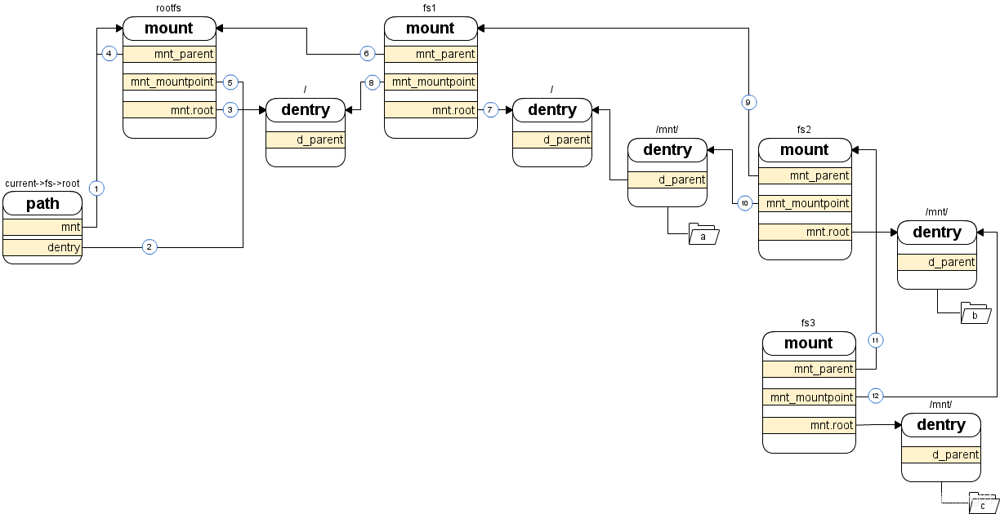

mount结构和原理

这是一个关于 mount（挂载）的故事。在 Kernel 世界里，挂载是一项很了不起的特性，
它可以将不同类型的文件系统组合成一个有机的整体，从使用者角度来看不同的文件系统并没有什么区别，
那么 Kernel 是怎么做到呢？

首先，Kernel 会为每个文件系统准备一个 mount 结构，然后再把这个结构加入到 vfs 这颗大树上就好了。

这么一个小小的 mount 结构就这么神奇？

请看图，一个 mount 中有三个很重要的成员:
他们分别指向父 mount 结构（6）、本文件系统自己的根目录（7）和本文件系统的挂载点（8）。

前两个很好理解，那么挂载点是什么呢？简单地说挂载点就是父级文件系统的某个目录（父级文件系统中的目录表示），
一旦将某个文件系统efs挂载到某个目录上/home/a/，这个目录/home/a/就成了该文件系统efs的根目录了。
并且该目录/home/a/的标志位 DCACHE_MOUNTED 将被置位，这将表明这个目录已经是一个挂载点了。
如果要访问这个目录/home/a/的话就要顺着 mount 结构访问另一个文件系统了
(因为efs能处理/home/a/以下的内容，之上的内容就是另一个文件系统里的内容了），原来的内容将变得不可访问。

现在我们从图的左边讲起，带你一窥 mount 的风采。一个进程有一个叫 root 的 path 结构，
它就是本进程的根目录（大多数情况下它就是系统根目录），
root 中两个成员分别指向某个文件系统的 mount 结构（其实是指向 mount.mnt 但这样理解没问题）（1）
（rootfs文件系统的mount结构）和该文件系统的根目录（2）（就是/目录），
这个文件系统就是所谓根文件系统（在图中就是 rootfs）。
由于它是根文件系统，所以它的父 mount 结构就是它自己（4）它的挂载点就是它自己的根目录（5）。

但是 rootfs 只是一个临时的根文件系统，在 Kernel 的启动过程中加载完 rootfs 之后会紧接着解压缩 initramfs 到 rootfs 中，
这里面包括了驱动以及加载真正的根文件系统的工具，Kernel 通过加载这些驱动、使用这些工具实现了挂载真正的根文件系统。
之后 rootfs 将退出历史舞台，但作为文件系统的总根 rootfs 并不会被卸载（注）。
图中 fs1 就是所谓的真正的根文件系统，Kernel 把它挂载到了 rootfs 的根目录上（8），
并且将它的父 mount 结构指向了 rootfs（6）。这时访问根目录的话就会直接访问到 fs1 的根目录，而 rootfs 就好像不存在了一样。
再看 fs1，他有一个子目录“mnt/”，以及“mnt/”的子目录“a”，此时路径“/mnt/a/”是可访问的。
但现在我们还有另一个文件系统 fs2，我们把它挂载到“/mnt/”上会发生什么呢？
首先 fs2 的父 mount 将指向 fs1（9），然后 fs2 的挂载点将指向 “/mnt/”（10），同时“mnt/”的 DCACHE_MOUNTED 将被置位。
此时路径“/mnt/a/”就不可访问了，取而代之的是“/mnt/b/”。

本着不怕麻烦的精神我们再折腾一下，把 fs3 也挂载到“/mnt/”上，这时和挂载 fs2 一样父 mount 将指向 fs2（11），
但是挂载点应该指向哪里呢？答案是 fs2 的根目录（12）。这时“/mnt/b/”也消失了，我们只能看见“/mnt/c”了。
这样整个结构就形成了一个挂载的序列，最后挂载的在序列末尾，Kernel 可以很容易的通过这个序列找到最初的挂载点和最终的文件系统。

在顺序查找的情景下，当遇到一个目录时 Kernel 会判断这个目录是不是挂载点（检查 DCACHE_MOUNTED 标志位），
如果是就要找到挂载到这个目录的文件系统，继而找到该文件系统的根目录，然后在判断这个根目录是不是挂载点，
如果是那就再往下找直到某个文件系统的根目录不再是挂载点。
反向查找也和顺序查找类似