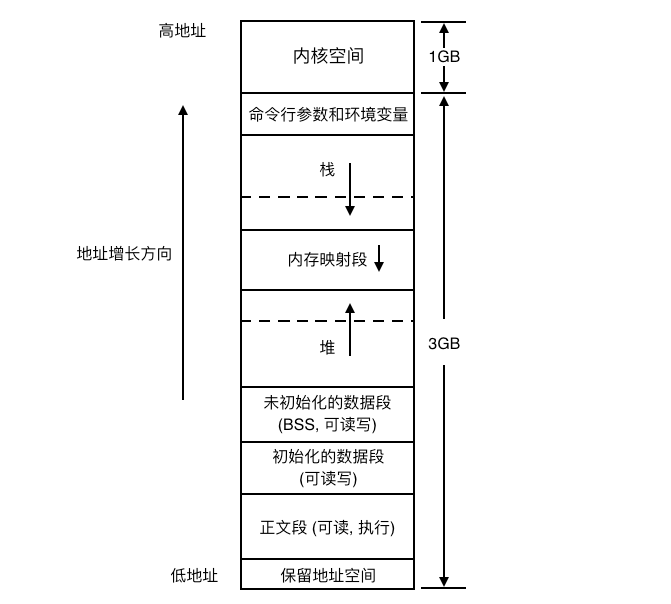

## 内存管理
内存是由内核来管理的。

内存被分为 n 个页框，然后进一步组织为多个区。而装入页框中的内容称为页。

当内核函数申请内存时，内核总是立即满足（因为内核完全信任它们，所以优先级最高）。
在分配适当内存空间后，将其映射到内核地址空间中（3-4GB 中的某部分空间），然后将地址映射写入页表。

申请内存空间的内核函数有 vmalloc, kmalloc, alloc_pages, __get_free_pages 等。

## 内核常驻内存

就是说，内核地址空间（3-4GB）中的页面所映射的页框始终在物理内存中存在，不会被换出。
即使是 vmalloc 动态申请的页面也会一直在物理内存中，直至通过相关内核函数释放掉。

其原因在于，一方面内核文件不是太大，完全可以一次性装入物理内存；另一方面在于即使是动态申请内存空间，也能立即得到满足。

因此，**处于内核态的普通进程或内核线程（后面会提到）不会因为页面没有在内存中而产生缺页异常**
（不过处于内核态的普通进程会因为页表项没有同步的原因而产生缺页异常）。

## 为什么要有虚拟地址空间

普通进程在申请内存空间时会被内核认为是不紧要的，优先级较低。因而总是延迟处理，在之后的某个时候才会真正为其分配物理内存空间。

比如，普通进程中的 malloc 函数在申请物理内存空间时，内核不会直接为其分配页框。

另一方面，普通进程对应的可执行程序文件较大，不能够立即装入内存，而是采取运行时按需装入。

要实现这种延迟分配策略，就需要引入一种新的地址空间，即 `虚拟地址空间`。
可执行文件在装入时或者进程在执行 malloc 时，内核只会为其分配适当大小的虚拟地址空间。

**虚拟地址空间并不单纯地指线性地址空间**。准确地说，指的是页面不能因为立即装入物理内存而采取折衷处理后拥有的线性地址空间。
因此，虽然普通进程的虚拟地址空间为 4GB，**但是从内核的角度来说，内核地址空间（也是线性空间）不能称为虚拟地址空间，内核线程不拥有也不需要虚拟地址空间**。
因此，虚拟地址空间只针对普通进程。

当然，这样的话就会产生所要访问的页面不在物理内存中而发生缺页异常。

## 虚拟地址空间的划分
每一个普通进程都拥有 4GB 的虚拟地址空间（对于 32 位的 CPU 来说，即 2^32 B）。

主要分为两部分，一部分是用户空间（0-3GB），一部分是内核空间（3-4GB）。每个普通进程都有自己的用户空间，但是内核空间被所有普通进程所共享。

如下图所示：

之所以能够使用 3-4GB 的虚拟地址空间（对于普通进程来说），是因为每个进程的页全局目录（后面会提到）中的后面部分存放的是内核页全局目录的所有表项。
当通过系统调用或者发生异常而陷入内核时，不会切换进程的页表。此时，处于内核态的普通进程将会直接使用进程页表中前面的页表项即可。
这也是为什么在执行系统调用或者处理异常时没有发生进程的上下文切换的真实原因。

同样，正因为每个进程的也全局目录中的后面部分存放的是内核页全局目录中的所有表项，所以所有普通进程共享内核空间。

另外，

- 用户态下的普通进程只能访问 0-3GB 的用户空间；
- 内核态下的普通进程既能访问 0-3GB 的用户空间，也能访问 3-4GB 的内核空间（内核态下的普通进程有时也会需要访问用户空间）。

## 普通线程的用户堆栈与寄存器
对于多线程环境，虽然所有线程都共享同一片虚拟地址空间，但是**每个线程都有自己的用户栈空间和寄存器，而用户堆仍然是所有线程共享的**。

栈空间的使用是有明确限制的，栈中相邻的任意两条数据在地址上都是连续的。试想，假设多个普通线程函数都在执行递归操作。
如果多个线程共有用户栈空间，由于线程是异步执行的，那么某个线程从栈中取出数据时，这条数据就很有可能是其它线程之前压入的，
这就导致了冲突。所以，每个线程都应该有自己的用户栈空间。

寄存器也是如此，如果共用寄存器，很可能出现使用混乱的现象。

而堆空间的使用则并没有这样明确的限制，某个线程在申请堆空间时，内核只要从堆空间中分配一块大小合适的空间给线程就行了。
所以，多个线程同时执行时不会出现向栈那样产生冲突的情况，因而线程组中的所有线程共享用户堆。

那么在创建线程时，内核是怎样为每个线程分配栈空间的呢？

由之前所讲解可知，进程/线程的创建主要是由 clone 系统调用完成的。而 clone 系统调用的参数中有一个 void *child_stack，
它就是用来指向所创建的进程/线程的堆栈指针。

而在该进程/线程在用户态下是通过调用 pthread_create 库函数而陷入内核的。对于 pthread_create 函数，
它则会调用一个名为 pthread_allocate_stack 的函数，专门用来为所创建的线程分配的栈空间（通过 mmap 系统调用）。
然后再将这个栈空间的地址传递给 clone 系统调用。这也是为什么线程组中的每个线程都有自己的栈空间。

普通进程与内核线程有如下区别：

- 内核线程只运行在内核态，而普通进程既可以运行在内核态，也可以运行在用户态；
- 内核线程只使用 3-4GB (假设为 32 位系统) 的内核地址空间（共享的），
    但普通进程由于既可以运行在用户态，又可以运行在内核态，因此可以使用 4GB 的虚拟地址空间。

## 内核线程

由于内核线程只运行在内核地址空间中，只会访问 3-4GB 的内核地址空间，不存在虚拟地址空间，因此每个内核线程的 task_struct 对象中的 mm 为 NULL。

普通线程虽然也是同主线程共享地址空间，但是它的 task_struct 对象中的 mm 不为空，指向的是主线程的 mm_struct 对象。

## 用户态和内核态

- **内核态**:当一个任务（进程）执行系统调用而陷入内核代码中执行时，我们就称进程处于内核运行态。
    此时处理器处于特权级最高的（0级）内核代码中执行。当进程处于内核态时，执行的内核代码会使用当前进程的内核栈。

- **用户态**:每个进程都有自己的内核栈。当进程在执行用户自己的代码时，则称其处于用户运行态。
    即此时处理器在特权级最低的（3级）用户代码中运行。当正在执行用户程序而突然被中断程序中断时，
    此时用户程序也可以象征性地称为处于进程的内核态。因为中断处理程序将使用当前进程的内核栈。
    这与处于内核态的进程的状态有些类似。 
    
    
用户态和内核态的区别：
用户态下和内核态下工作的程序有很多差别，但最重要的差别就在于特权级的不同，即权力的不同。
运行在用户态下的程序不能直接访问操作系统内核数据结构和程序。

特权级：
举个例子，fork()函数，对于任何操作系统来说，创建一个新的进程都是属于核心功能，因为它要做很多底层细致地工作，
消耗系统的物理资源，比如分配物理内存，从父进程拷贝相关信息，拷贝设置页目录页表等等，
这些显然不能随便让哪个程序就能去做，于是就自然引出特权级别的概念，
显然，最关键性的权力必须由高特权级的程序来执行，这样才可以做到集中管理，减少有限资源的访问和使用冲突。

### 用户态切换到内核态的3种方式：

1. 系统调用

    这是用户态进程主动要求切换到内核态的一种方式，用户态进程通过系统调用申请使用操作系统提供的服务程序完成工作，
    比如前例中fork()实际上就是执行了一个创建新进程的系统调用。而系统调用的机制其核心还是使用了操作系统为用户特别开放的一个中断来实现，
    例如Linux的int 80h中断。

2. 异常

    当CPU在执行运行在用户态下的程序时，发生了某些事先不可知的异常，这时会触发由当前运行进程切换到处理此异常的内核相关程序中，
    也就转到了内核态，比如缺页异常。

3. 外围设备的中断

    当外围设备完成用户请求的操作后，会向CPU发出相应的中断信号，这时CPU会暂停执行下一条即将要执行的指令转而去执行与中断信号对应的处理程序，
    如果先前执行的指令是用户态下的程序，那么这个转换的过程自然也就发生了由用户态到内核态的切换。比如硬盘读写操作完成，系统会切换到硬盘读写的中断处理程序中执行后续操作等。

这3种方式是系统在运行时由用户态转到内核态的最主要方式，其中系统调用可以认为是用户进程主动发起的，异常和外围设备中断则是被动的。

### 状态切换的实质

具体的切换操作从触发方式上看，可以认为存在前述3种不同的类型。

但是从最终实际完成由用户态到内核态的切换操作上来说，涉及的关键步骤是完全一致的，没有任何区别，都相当于执行了一个中断响应的过程，
**因为系统调用实际上最终是中断机制实现的，而异常和中断的处理机制基本上也是一致的**，关于它们的具体区别这里不再赘述。
关于中断处理机制的细节和步骤这里也不做过多分析，涉及到由用户态切换到内核态的步骤主要包括：

1. 从当前进程的描述符中提取其内核栈的ss0及esp0信息。

2. 使用ss0和esp0指向的内核栈将当前进程的cs,eip,eflags,ss,esp信息保存起来，
    这个过程也完成了由用户栈到内核栈的切换过程，同时保存了z暂停执行的程序的下一条指令。

3. 将先前由中断向量检索得到的中断处理程序的cs,eip信息装入相应的寄存器，开始执行中断处理程序，这时就转到了内核态的程序执行了。

[文章参考](https://www.cnblogs.com/alantu2018/p/8526916.html)