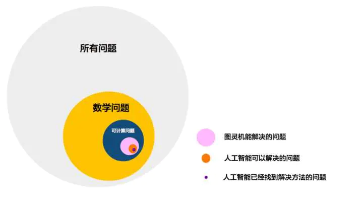

### 计算机的极限是什么？

今天我们就用工程中极限的思维方式，看看计算机的极限在哪里。我们今天所说的人工智能实际上是计算机的一个应用而已，
因此，如果说计算机不是万能的，那么人工智能自然也不是。

当然，谈这个本原性质的问题时，我们需要抛开具体的技术，回到原点，**从计算的本质来说说计算机的极限**。
这些思考方式当然不是我发明的，而是被誉为“计算机之父”的图灵博士采用的。

图灵博士被认为是神一样的人。在20世纪，全世界智力上可以和爱因斯坦平起平坐的人恐怕只有图灵和冯·诺依曼两人了
（而后者被认为智力甚至超过了爱因斯坦）。神人自然有超越常人的地方，这里就让我们看看他们之间的区别。先说说常人的。

在计算机的发展史上，常人想问题的方式是先做一两个能解决简单问题的计算机，然后越做越复杂。
实际上直到图灵之前，计算机的发展就是沿袭这个思路进行的。

西方科学史家有时也将这种发明的方式称为工匠式的，也就是经过长期经验积累，从量变到质变。关于计算机的历史，
我在后面还会讲到，因此这里我把细节跳过去。

当然，你听到“工匠式的”这四个字时可能感觉不太好，其实科学史家们并没有贬义，只是说出了这种方法的特点。
这种方法我们至今依然在采用，而且在大多数时候很有效。

我们所说的“迭代式进步”，“小步快跑”其实都是这种方法的其它称呼而已。
可以讲，这种方法符合人认识数字时，从1，2，3，一直数到一百的做法。

而图灵想问题的方式恰恰和常人相反。在上个世纪30年代中期，图灵在思考三个问题。

- 第一个问题，世界上是否所有数学问题都有明确的答案？

- 第二个问题，如果有明确的答案，是否可以通过有限步骤的计算得到答案？

- 第三个问题才是，对于那些有可能在有限步骤计算出来的数学问题，能否有一种假想的机械，
  让它不断运动，最后当机器停下来的时候，那个数学问题就解决了？

我们不妨仔细体会一下图灵和常人思维方式的差别。像图灵这样超越时代的人，他不是跟在蚂蚁后面来观察一件事情发展的规律，
而是在前面等着大家，找到极限所在，然后他告诉大家，就在极限里寻找具体问题的答案吧，
不要浪费时间纠结没有意义的事情，也就是那些试图超越极限的事情。

具体到计算机这件事，图灵首先考虑的是`数学问题是否都有明确的答案`。
因为这个问题不解决，就辛辛苦苦去解题，最后可能发现无解，一切努力都是在浪费时间。

存在答案或者说能找到答案不等于能够在有限步骤之内解决这个问题，
因此图灵考虑的第二件事就是划定一个范围，把计算机能解决的问题的范围又缩小了。
当然，这个范围划定以后，就要设计一种有效的，通用的办法，保证按照这个办法做事，最终能够找到答案。

而图灵设计的这种方法，是一个数学模型，后人称呼它为图灵机。
今天所有的计算机，包括全世界正在设计的新的计算机，从解决问题的能力来讲，都没有超出图灵机的范畴。

到此为止，图灵其实为今天的计算机和很长时间以后的未来计算机所能解决的问题划了一条不可超越的边界。

图灵机提出至今已经80年了，全世界的 IT 行业依然没有超出它，
由此可见用理论武装起来的工程的头脑，比直觉的头脑的影响力深远得多。

接下来，我们总结一下人工智能的边界。
1. 世界上有很多问题，其中只有一小部分是数学问题；
2. 在数学问题中，只有一小部分是有解的；
3. 在有解的问题中，只有一部分是理想状态的图灵机可以解决的；
4. 在后一类的问题中，又只有一部分是今天实际的计算机可以解决的；

而人工智能可以解决的问题，又只是计算机可以解决问题的一部分。

我把这个嵌套逻辑画成了下面这张图，从图中可以看到，人工智能所能解决的问题真的只是世界上问题的很小一部分。
对于人工智能来讲，我倒是觉得现在世界上没有解决的问题太多，无论是人还是机器（其实是它们背后编写程序的人），
都应该想办法解决各种问题，而不是杞人忧天，担心人工智能这个工具太强大了。

最后，讲回到认知。图灵的认知是一种高屋建瓴，自上而下的认知，和我们常人不同。
当然，你可能好奇为什么图灵能够有这样超越时代的认知，是他自己聪明还是有高人指导？其实两者兼而有之。

需要指出的是，图灵的境界能想到这一层，首先是受到另一位数学大师**希尔伯特**的启发。

希尔伯特在1900年的巴黎国际数学家大会上，提出了23个重要的、根本性的数学问题（也被称为希尔伯特问题）。

其中第十个问题讲的是这样一件事情，“随便给一个不确定的方程，能否通过有限步的运算，判定它是否存在整数解？”

如果答案是否定的，那么就说明很多数学问题其实上帝也不知道答案是否存在。
如果我们连答案是否存在都不知道，自然不可能去找到它。
正是希尔伯特的这个提问，让图灵明白了计算机的极限所在。

当然，你可能会问，随着技术的进步，图灵是否错了，是否所有的数学问题最终都有解？很遗憾，图灵没有错。

1970年，前苏联伟大的数学家马季亚谢维奇从数学上解决了希尔伯特的那个问题。
也就是说，的的确确有很多数学问题，上帝也不知道有没有答案，而且这样的问题比有答案的问题还要多得多。

这件事情对人类认知上的冲击，远比在数学上的影响大，因为它向世人宣告了很多问题无解。

第二个给予图灵巨大启示的人是他的精神导师冯∙诺依曼。

冯∙诺依曼当时是普林斯顿大学的教授，而图灵是那里的博士生。
图灵在读了冯∙诺依曼的《量子力学的数学原理》一书后，意识到**计算来自于确定性的机械的运动**。

至于21世纪的电子计算机，里面电子的运动其实等价于机械运动。
图灵同时猜测人的意识来自于测不准原理，这是宇宙本身的规律。
图灵从此得出结论，计算是确定的，而意识可以是不定的，两者不可能划等号。

很多人胡思乱想计算机是否有意识，其实早在80年前，图灵就感到两者是两回事，这就是任何计算机的边界。

可以讲，没有来自希尔伯特和冯∙诺依曼的启示，图灵很难在那么年轻的时候对计算机想得那么透彻。
我们经常讲，要和比自己强的人在一起，这一点很重要，因为只有这样我们的认知才能提升。
反之，如果总是和臭棋篓子下棋，只能越下越臭。

从图灵理解计算机本质这件事，希望能够给你一些启发，也希望你能有超出常人的认知。

祝进步

敲黑板划重点：

1. 图灵和常人思维方式的差别在于：
   图灵是先找到极限所在，然后在极限里寻找具体问题的答案，而不是浪费时间去做那些试图超越极限的事情。

2. 图灵机是一个数学模型，今天所有的计算机，包括正在设计的新的计算机，
   从解决问题的能力来讲，都没有超出图灵机的范畴。

3. 人工智能所能解决的问题只是世界上问题的很小一部分。
   现在世界上没有解决的问题太多，要想办法解决各种问题，而不是杞人忧天，担心人工智能太强大。