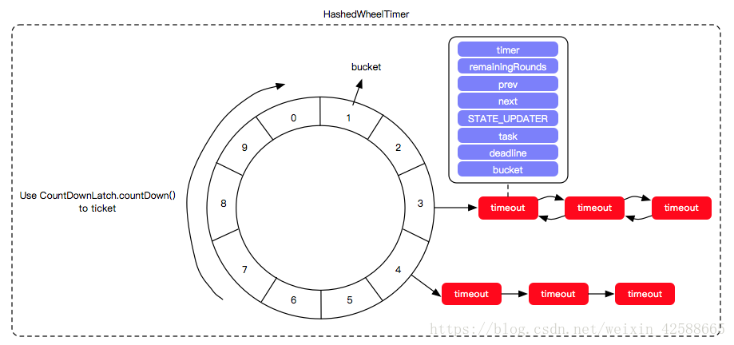

## raft实现优化

作者：TiDB Robot
链接：https://zhuanlan.zhihu.com/p/25735592

### Simple Request Flow
这里首先介绍一下一次简单的 Raft 流程：
1. Leader 收到 client 发送的 request。
2. Leader 将 request append 到自己的 log。
3. Leader 将对应的 log entry 发送给其他的 follower。
4. Leader 等待 follower 的结果，如果大多数节点提交了这个 log，则 apply。
5. Leader 将结果返回给 client。Leader 继续处理下一次 request。

可以看到，上面的流程是一个典型的顺序操作，如果真的按照这样的方式来写，那性能是完全不行的。

#### Batch and Pipeline

首先可以做的就是 batch，大家知道，在很多情况下面，使用 batch 能明显提升性能.
譬如对于 RocksDB 的写入来说，我们通常不会每次写入一个值，而是会用一个 WriteBatch 缓存一批修改，然后在整个写入。 

对于 Raft 来说，Leader 可以一次收集多个 requests，然后一批发送给 Follower。
当然，我们也需要有一个最大发送 size 来限制每次最多可以发送多少数据。

如果只是用 batch，Leader 还是需要等待 Follower 返回才能继续后面的流程，我们这里还可以使用 Pipeline 来进行加速。

大家知道，Leader 会维护一个 NextIndex 的变量来表示下一个给 Follower 发送的 log 位置.

通常情况下面，只要 Leader 跟 Follower 建立起了连接，我们都会认为网络是稳定互通的。
所以当 Leader 给 Follower 发送了一批 log 之后，它可以直接更新 NextIndex，并且立刻发送后面的 log，不需要等待 Follower 的返回。
如果网络出现了错误，或者 Follower 返回一些错误，Leader 就需要重新调整 NextIndex，然后重新发送 log 了。

如果要保证性能和正确性，需要做到以下两点：
1. Leader到某一个Follower之间的发送管道必须是有序的，保证Follower有序的处理AppendEntries。
2. 能够处理丢失AppendEntries的状况，比如连续发送了Index是2,3,4的三个Append消息，其中3这个消息丢包了，
    Follower收到了2和4，那么Leader必须重新发送3,4两个Append消息（因为4这个消息会被Follower丢弃）。
    
 对于第二点，Etcd的库已经做了处理，在Follower收到Append消息的时候，会检查是不是匹配已经接收到的最后一个Raft Log，
 如果不匹配，就返回Reject消息，那么按照Raft协议，Leader收到这个Reject消息，就会从3（4-1）重试。
 
 Elasticell的实现方式：
 1. 保证用于发送Raft消息的链接在每两个节点直接只有一个
 2. 把当前节点待发送的Raft消息按照对端节点的ID做简单的hash，放到不同的线程中去，
    由这些线程负责发送（线程的数量就相当于Pipelining的管道数）这样就能保证每个Follower收到的Raft消息是有序的，
    并且每个Raft都只有一个Goroutine来处理Raft事件，这些消息能够保证被顺序的处理。
    

#### Append Log Parallelly

对于上面提到的一次 request 简易 Raft 流程来说，我们可以将 2 和 3 并行处理。

也就是 **Leader 可以先并行的将 log 发送给 Followers，然后再将 log append**。

为什么可以这么做，主要是因为在 Raft 里面，如果一个 log 被大多数的节点append，我们就可以认为这个 log 是被 committed 了，

所以即使 Leader 再给 Follower 发送 log 之后，自己 append log 失败 panic 了，只要 N / 2 + 1个 Follower 能接收到这个 log 并成功 append。
我们仍然可以认为这个 log 是被 committed 了，被 committed 的 log 后续就一定能被成功 apply。

那为什么我们要这么做呢？主要是因为 append log 会涉及到落盘，有开销，
所以我们完全可以在 Leader 落盘的同时让 Follower 也尽快的收到 log 并 append。

这里我们还需要注意，虽然 Leader 能在 append log 之前给 Follower 发 log，
但是 Follower 却不能在 append log 之前告诉 Leader 已经成功 append 这个 log。
如果 Follower 提前告诉 Leader 说已经成功 append，但实际后面 append log 的时候失败了，
Leader 仍然会认为这个 log 是被 committed 了，这样系统就有丢失数据的风险了。

#### Asynchronous Apply

上面提到，当一个 log 被大部分节点 append 之后，我们就可以认为这个 log 被 committed 了，
被 committed 的 log 在什么时候被 apply 都不会再影响数据的一致性。

所以当一个 log 被 committed 之后，我们可以用另一个线程去异步的 apply 这个 log。

所以整个 Raft 流程就可以变成：
1. Leader 接受一个 client 发送的 request。
2. Leader 将对应的 log 发送给其他 follower 并本地 append。
3. Leader 继续接受其他 client 的 requests，持续进行步骤 2。
4. Leader 发现 log 已经被 committed，在另一个线程 apply。
5. Leader 异步 apply log 之后，返回结果给对应的 client。

使用 asychronous apply 的好处在于我们现在可以完全的并行处理 append log 和 apply log，
虽然对于一个 client 来说，它的一次 request 仍然要走完完整的 Raft 流程，但对于多个 clients 来说，整体的并发和吞吐量是上去了

####  SST Snapshot
在 Raft 里面，如果 Follower 落后 Leader 太多，Leader 就可能会给 Follower 直接发送 snapshot。

在 TiKV，PD 也有时候会直接将一个 Raft Group 里面的一些副本调度到其他机器上面。
上面这些都会涉及到 Snapshot 的处理。

在现在的实现中，一个 Snapshot 流程是这样的：
1. Leader scan 一个 region 的所有数据，生成一个 snapshot file
2. Leader 发送 snapshot file 给 Follower
3. Follower 接受到 snapshot file，读取，并且分批次的写入到 RocksDB

如果一个节点上面同时有多个 Raft Group 的 Follower 在处理 snapshot file，RocksDB 的写入压力会非常的大，
然后极易引起 RocksDB 因为 compaction 处理不过来导致的整体写入 slow 或者 stall。

幸运的是，RocksDB 提供了 SST 机制，我们可以直接生成一个 SST 的 snapshot file，
然后 Follower 通过 injest 接口直接将 SST file load 进入 RocksDB。

#### Asynchronous Lease Read

在之前的 Lease Read 文章中，我提到过 TiKV 使用 ReadIndex 和 Lease Read 优化了 Raft Read 操作，
但这两个操作现在仍然是在 Raft 自己线程里面处理的，也就是跟 Raft 的 append log 流程在一个线程。
无论 append log 写入 RocksDB 有多么的快，这个流程仍然会 delay Lease Read 操作。

所以现阶段我们正在做的一个比较大的优化就是在另一个线程异步实现 Lease Read。
也就是我们会将 Leader Lease 的判断移到另一个线程异步进行，Raft 这边的线程会定期的通过消息去更新 Lease，
这样我们就能保证 Raft 的 write 流程不会影响到 read。

#### 物理连接多路复用

当系统中的Raft-Group越来越多的时候，每个Raft-Group中的所有副本都会两两建链，
从物理上看，最后会看到2台物理机器（可以是物理机，虚机，容器等等）之间会存在大量的TCP链接，
造成链接爆炸。

Elasticell的做法：使用链路复用技术，让单个Store进程上所有的Raft-Group都复用一个物理链接包装Raft消息，
增加Header（Header中存在Raft-Group的元信息），
这样在Store收到Raft消息的时候，就能够知道这些消息是属于哪一个Raft-Group的，从而驱动Raft。
     
     
#### batch其他点
整个链路几乎都是 Batch 的，依靠 disruptor 的 MPSC 模型批量消费，对整体性能有着极大的提升，
包括但不限于：
- 批量提交 task
- 批量网络发送
- 本地 IO batch 写入
- 要保证日志不丢，一般每条 log entry 都要进行 fsync 同步刷盘，比较耗时，SOFAJRaft 中做了合并写入的优化。
- 批量应用到状态机
使用了 Batch 技巧，不会对请求做延时的攒批处理。

batch 处理，主要是用Disruptor的高性能，所有的task(读写请求等)都是发往Disruptor，BatchingHandler进行处理，
可以赞批处理也可以直接处理

作者：fagongzi
链接：https://zhuanlan.zhihu.com/p/33083857
来源：知乎
著作权归作者所有。商业转载请联系作者获得授权，非商业转载请注明出处。

### Batching和Pipelining的trade off
Batching能够提高系统的吞吐量（会带来系统Latency增大），Pipelining能够降低系统的Latency（也能在一定程度上提高吞吐量）。

这个2个优化在决策的时候是有冲突的
（在Pipelining中发送下一个请求的时候，需要等多少的Batch Size，也许多等一会就回收集更多的请求）

目前Elasticell采用的方式是在不影响Pipelining的前提下，尽可能多的收集2次Pipelining之间的请求Batching处理策略，
显然这并不是一个最优的解决方案。

### 其他优化
fagongzi
Elasticell, Gateway项目作者
以上是Elasticell目前已经做的一些优化，还有一些是未来需要做的：
1. 不使用RocksDB存储Raft Log，由于Raft Log和RocksDB的WAL存在功能重复的地方，这样就多了一次文件IO
2. Raft的heartbeat合并，当一个节点上的Raft-Group的很多的时候，heartbeat消息过多
3. Batching Apply的时候，当前节点上所有正在Apply的Raft-Group一起做Batching而不是在一个Raft-Group上做Batching
4. 更高效的Batching和Pipelining模式，参考论文 Tuning Paxos for high-throughput with batching and pipelining

### 调度时间轮
在raft协议种有很多周期性的任务，比如选举周期，心跳等.
如果一个系统中存在着大量的调度任务，而大量的调度任务如果每一个都使用自己的调度器来管理任务的生命周期的话，浪费cpu的资源并且很低效。

时间轮是一种高效来利用线程资源来进行批量化调度的一种调度模型。把大批量的调度任务全部都绑定到同一个的调度器上面，
使用这一个调度器来进行所有任务的管理（manager），触发（trigger）以及运行（runnable）。能够高效的管理各种延时任务，周期任务，通知任务等等。
放/取任务的时间复杂度都是O(1)，和timer，ScheduledThreadPoolExecutor基于最小堆的O(logN)的性能更高

如图，JRaft中时间轮（HashedWheelTimer）是一个存储定时任务的环形队列，底层采用数组实现，
数组中的每个元素可以存放一个定时任务列表（HashedWheelBucket），HashedWheelBucket是一个环形的双向链表，
链表中的每一项表示的都是定时任务项（HashedWheelTimeout），其中封装了真正的定时任务（TimerTask）。

时间轮由多个时间格组成，每个时间格代表当前时间轮的基本时间跨度（tickDuration）。时间轮的时间格个数是固定的，可用 wheel.length 来表示。

时间轮还有一个表盘指针（tick），用来表示时间轮当前指针跳动的次数，可以用tickDuration * (tick + 1)来表示下一次到期的任务，需要处理此时间格所对应的 HashedWheelBucket 中的所有任务。

> 不过，时间轮调度器的时间精度可能不是很高，对于精度要求特别高的调度任务可能不太适合。

因为时间轮算法的精度取决于，时间段“指针”单元的最小粒度大小，比如时间轮的格子是一秒跳一次，那么调度精度小于一秒的任务就无法被时间轮所调度。

时间轮的调度算法在很多中间件上都有应用，比如netty,kafka,akka,zookeeper等

还有一种是通过多层次的时间轮，这个和我们的手表就更像了，像我们秒针走一圈，分针走一格，分针走一圈，时针走一格。

多层次时间轮示例：

假设第一层有8格，那么第一层走了一圈，第二层就走一格。
可以得知第二层的一格就是8秒，假设第二层也是 8 个槽，那么第二层走一圈，第三层走一格，
可以得知第三层一格就是 64 秒。那么一格三层，每层8个槽，
一共 24 个槽时间轮就可以处理最多延迟 512 秒的任务。
        
而多层次时间轮还会有降级的操作，假设一个任务延迟 500 秒执行，
那么刚开始加进来肯定是放在第三层的，当时间过了 436 秒后，
此时还需要 64 秒就会触发任务的执行，而此时相对而言它就是个延迟 64 秒后的任务，
因此它会被降低放在第二层中，第一层还放不下它。再过个 56 秒，相对而言它就是个延迟 8 秒后执行的任务，因此它会再被降级放在第一层中，等待执行。
降级是为了保证时间精度一致性。Kafka内部用的就是多层次的时间轮算法

延迟任务的实现都不是很精确的，并且或多或少都会有阻塞的情况，即使你异步执行，线程不够的情况下还是会阻塞。

对比Timer、DelayQueue 和 ScheduledThreadPool基于优先队列实现的调度，时间轮更适合任务数很大的延时场景

### 红黑树定时器
在讲Nginx的实现之前，我们可以先回顾一下linux的定时器的实现。在linux中通过每次系统定时器时钟的中断的中断处理程序来设置相应的软中断位，
该软中断的中断处理程序目的就是为了扫描系统中所有挂起的定时器，如果他们已经超时的话，那么就调用他们相应的函数，这样说白了就是利用中断来实现定时器。

而在Nginx中，timer是自己实现的，而且实现的方法完全不同，而是通过红黑树来维护所有的timer节点，
在worker进程的每一次循环中都会调用ngx_process_events_and_timers函数，在该函数中就会调用处理定时器的函数ngx_event_expire_timers，
**每次该函数都不断的从红黑树中取出时间值最小的，查看他们是否已经超时，然后执行他们的函数，直到取出的节点的时间没有超时为止**。
其实在Nginx的运行环境中，这种实现方式可能比linux本身的实现方式更为高效。

相对于时间轮定时器，红黑树定时器精度更高，实现更简单

#### 红黑树和堆对比
定时器管理：nginx的红黑树和libevent的堆
libevent 发生超时后，

while循环一次从堆顶del timer——直到最新调整的最小堆顶不是超时事件为止，（实际是del event），但是会稍后把这个timeout的 event放到active 任务list里，

等待处理，event标记为timeout，等处理actvie队列时再由应用层callback函数决定怎么处理标记为timeout的事件。

 

nginx处理超时时，直接删除红黑树中（ event结构体里的 ）rb node成员，同时调用应用层早已通过add timer注册好的超时handler函数。之所以没有用堆，

因为每次直接从内部删除节点，而不是堆顶部。

不谈内存，从算法上来讲
- 红黑树插入是最坏情况要比较2logN次(最高的高度）外加不超过两次旋转，最小堆最坏情况是logN次
- 红黑树删除不需要比较只需要不超过3旋转，查找最小值需要遍历logN，如果删除最小值树调整一般很小
- 最小堆查询顶节点是O(1),而删除顶节点在任何情况下都是个最坏的情况，需要比较2logN次
- 红黑树的最坏情况在旋转中不断调整变化，插入性能比最小堆差，但删除最小性能却比最小堆好上几倍
- 如果插入+查找最小+删除最小总体来确定红黑树和最小堆，红黑树占优，性能波动相对较小，红黑树不过多的依赖比较，
相对最小堆由比较带来的的性能影响较小（如果比较是调用自定义函数、比较的是字符串等，那么性能就牺牲很大）
- 最小堆最大的优势在于取最小值性能是O(1),如果插入的数据基本有序，那么最小堆能获得比较好的性能，
在频繁不断地取最小值的是否满足条件的应用中有更加好的性能（如超时队列），红黑树相应就要尽量避免不必要的查询次数才能在超时队列这种应用中获得更好的性能

从实际出发：
- 由于最小堆一般是采用堆的方式实现，元素访问速度远高于采用链表方式的红黑树，插入性能快红黑树好几倍，但最小堆的删除性能并不快于红黑树
- **最小堆的最大缺点就在于必须是连续的内存**

> 微软VC++的STL中的map是修改过的红黑树, 还维护了一个最小值和一个最大值, 所以vc++里的map性能是吊打最小堆的
### 日志压缩
日志如果不做压缩处理，理论上会无限期膨胀，期间可能很多重复多余的数据，浪费空间。

最简单的做法就是利用snapshot，将系统整个的状态数据作为一个snapshot保存到stable storage上，
这样在上一个时间点的snapshot就可以被删除了（FLink的 checkpoint 和Doris的metadata里面也是这么做的）

一些其他的方式如：LSM Tree, log cleaning 等都可以

### rpc自定义协议
分布式系统需要频繁的rpc请求，自定义协议只解析需要的数据，可以大大提高性能