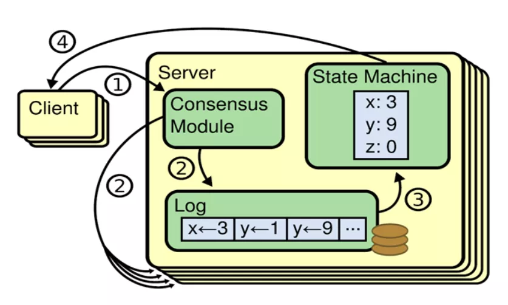
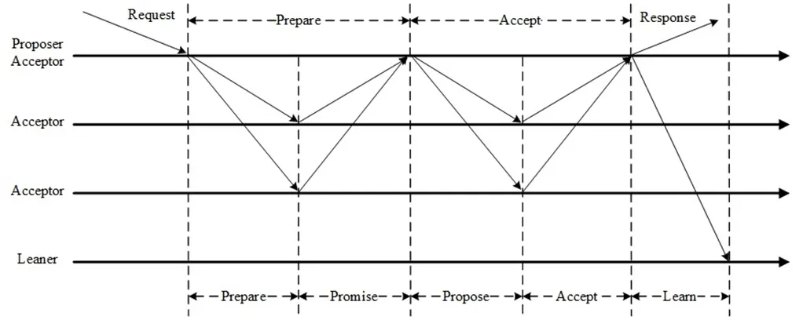
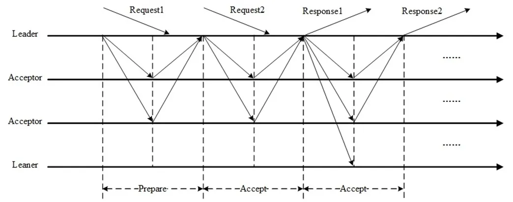
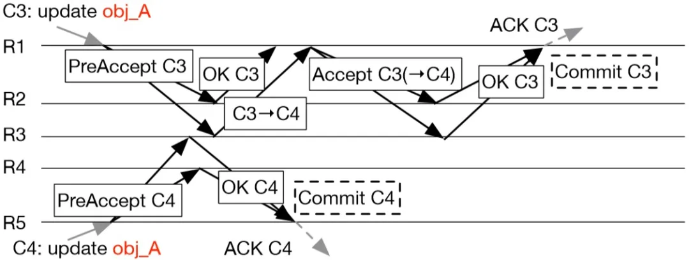

# 一文总结：分布式一致性技术是如何演进的？

>简介： 分布式一致性（Consensus）作为分布式系统的基石，一直都是计算机系统领域的热点。
近年来随着分布式系统的规模越来越大，对可用性和一致性的要求越来越高，分布式一致性的应用也越来越广泛。
纵观分布式一致性在工业界的应用，从最开始的鼻祖Paxos的一统天下，到横空出世的Raft的流行，
再到如今Leaderless的EPaxos开始备受关注，背后的技术是如何演进的？
本文将从技术角度探讨分布式一致性在工业界的应用，并从可理解性、可用性、效率和适用场景等几个角度进行对比分析。
image.png

## 分布式一致性
分布式一致性，简单的说就是在一个或多个进程提议了一个值后，使系统中所有进程对这个值达成一致。

image.png

为了就某个值达成一致，每个进程都可以提出自己的提议，最终通过分布式一致性算法，所有正确运行的进程学习到相同的值。

工业界对分布式一致性的应用，都是为了构建多副本状态机模型（Replicated State Machine），实现高可用和强一致。

image.png

分布式一致性使多台机器具有相同的状态，运行相同的确定性状态机，在少数机器故障时整体仍能正常工作。

Paxos
Paxos达成一个决议至少需要两个阶段（Prepare阶段和Accept阶段）。

Prepare阶段的作用：

争取提议权，争取到了提议权才能在Accept阶段发起提议，否则需要重新争取。
学习之前已经提议的值。
Accept阶段使提议形成多数派，提议一旦形成多数派则决议达成，可以开始学习达成的决议。Accept阶段若被拒绝需要重新走Prepare阶段。

Multi-Paxos
Basic Paxos达成一次决议至少需要两次网络来回，并发情况下可能需要更多，极端情况下甚至可能形成活锁，效率低下，Multi-Paxos正是为解决此问题而提出。

Multi-Paxos选举一个Leader，提议由Leader发起，没有竞争，解决了活锁问题。提议都由Leader发起的情况下，Prepare阶段可以跳过，将两阶段变为一阶段，提高效率。Multi-Paxos并不假设唯一Leader，它允许多Leader并发提议，不影响安全性，极端情况下退化为Basic Paxos。

Multi-Paxos与Basic Paxos的区别并不在于Multi（Basic Paxos也可以Multi），只是在同一Proposer连续提议时可以优化跳过Prepare直接进入Accept阶段，仅此而已。

Raft
不同于Paxos直接从分布式一致性问题出发推导出来，Raft则是从多副本状态机的角度提出，使用更强的假设来减少需要考虑的状态，使之变的易于理解和实现。

Raft与Multi-Paxos有着千丝万缕的关系，下面总结了Raft与Multi-Paxos的异同。

Raft与Multi-Paxos中相似的概念：

|raft|multi-paxos|
|----|----|
|Leader|proposer|
|Term|proposer ID|
|Log Entry|Proposal|
|Log Index|Instance ID|
|Leader选举|Prepare阶段|
|日志复制|Accept阶段|

Raft的Leader即Multi-Paxos的Proposer。

Raft的Term与Multi-Paxos的Proposal ID本质上是同一个东西。

Raft的Log Entry即Multi-Paxos的Proposal。

Raft的Log Index即Multi-Paxos的Instance ID。

Raft的Leader选举跟Multi-Paxos的Prepare阶段本质上是相同的。

Raft的日志复制即Multi-Paxos的Accept阶段。

Raft与Multi-Paxos的不同：

||raft|multi-paxos|
|----|----|----|
|领导者|强Leader|弱Leader|
|领导者选举权|具有最新已提交日志的副本|任意副本|
|日志复制|保证连续|允许空洞|
|日志提交|推进commit index|异步commit 消息|
Raft假设系统在任意时刻最多只有一个Leader，提议只能由Leader发出（强Leader），否则会影响正确性；而Multi-Paxos虽然也选举Leader，但只是为了提高效率，并不限制提议只能由Leader发出（弱Leader）。

强Leader在工程中一般使用Leader Lease和Leader Stickiness来保证：

Leader Lease：上一任Leader的Lease过期后，随机等待一段时间再发起Leader选举，保证新旧Leader的Lease不重叠。
Leader Stickiness：Leader Lease未过期的Follower拒绝新的Leader选举请求。
Raft限制具有最新已提交的日志的节点才有资格成为Leader，Multi-Paxos无此限制。

Raft在确认一条日志之前会检查日志连续性，若检查到日志不连续会拒绝此日志，保证日志连续性，Multi-Paxos不做此检查，允许日志中有空洞。

Raft在AppendEntries中携带Leader的commit index，一旦日志形成多数派，Leader更新本地的commit index即完成提交，下一条AppendEntries会携带新的commit index通知其它节点；Multi-Paxos没有日志连接性假设，需要额外的commit消息通知其它节点。

EPaxos
EPaxos（Egalitarian Paxos）于SOSP'13提出，比Raft还稍早一些，但Raft在工业界大行其道的时间里，EPaxos却长期无人问津，直到最近，EPaxos开始被工业界所关注。

EPaxos是一个Leaderless的一致性算法，任意副本均可提交日志，通常情况下，一次日志提交需要一次或两次网络来回。

EPaxos无Leader选举开销，一个副本不可用可立即访问其他副本，具有更高的可用性。各副本负载均衡，无Leader瓶颈，具有更高的吞吐量。客户端可选择最近的副本提供服务，在跨AZ跨地域场景下具有更小的延迟。

不同于Paxos和Raft，事先对所有Instance编号排序，然后再对每个Instance的值达成一致。EPaxos不事先规定Instance的顺序，而是在运行时动态决定各Instance之间的顺序。EPaxos不仅对每个Instance的值达成一致，还对Instance之间的相对顺序达成一致。EPaxos将不同Instance之间的相对顺序也做为一致性问题，在各个副本之间达成一致，因此各个副本可并发地在各自的Instance中发起提议，在这些Instance的值和相对顺序达成一致后，再对它们按照相对顺序重新排序，最后按顺序应用到状态机。

从图论的角度看，日志是图的结点，日志之间的顺序是图的边，EPaxos对结点和边分别达成一致，然后使用拓扑排序，决定日志的顺序。图中也可能形成环路，EPaxos需要处理循环依赖的问题。

EPaxos引入日志冲突的概念（与Parallel Raft类似，与并发冲突不是一个概念），若两条日志之间没有冲突（例如访问不同的key），则它们的相对顺序无关紧要，因此EPaxos只处理有冲突的日志之间的相对顺序。

若并发提议的日志之间没有冲突，EPaxos只需要运行PreAccept阶段即可提交（Fast Path），否则需要运行Accept阶段才能提交（Slow Path）。

PreAccept阶段尝试将日志以及与其它日志之间的相对顺序达成一致，同时维护该日志与其它日志之间的冲突关系，如果运行完PreAccept阶段，没有发现该日志与其它并发提议的日志之间有冲突，则该日志以及与其它日志之间的相对顺序已经达成一致，直接发送异步的Commit消息提交；否则如果发现该日志与其它并发提议的日志之间有冲突，则日志之间的相对顺序还未达成一致，需要运行Accept阶段将冲突依赖关系达成多数派，再发送Commit消息提交。

EPaxos的Fast Path Quorum为2F，可优化至F + [ (F + 1) / 2 ]，在3副本和5副本时，与Paxos、Raft一致。Slow Path 为Paxos Accept阶段，Quorum固定为F + 1。

EPaxos还有一个主动Learn的算法，在恢复的时候可用来追赶日志，这里就不做具体的介绍了，感兴趣的可以看论文。

对比分析
从Paxos到Raft再到EPaxos，背后的技术是怎么样演进的，我们可以从算法本身来做个对比，下面主要从可理解性、效率、可用性和适用场景等几个角度进行对比分析。

1 可理解性
众所周知，Paxos是出了名的晦涩难懂，不仅难以理解，更难以实现。而Raft则以可理解性和易于实现为目标，Raft的提出大大降低了使用分布式一致性的门槛，将分布式一致性变的大众化、平民化，因此当Raft提出之后，迅速得到青睐，极大地推动了分布式一致性的工程应用。

EPaxos的提出比Raft还早，但却长期无人问津，很大一个原因就是EPaxos实在是难以理解。EPaxos基于Paxos，但却比Paxos更难以理解，大大地阻碍了EPaxos的工程应用。不过，是金子总会发光的，EPaxos因着它独特的优势，终于被人们发现，具有广阔的前景。

2 效率
从Paxos到Raft再到EPaxos，效率有没有提升呢？我们主要从负载均衡、消息复杂度、Pipeline以及并发处理几个方面来对比Multi-Paxos、Raft和EPaxos。

负载均衡

Multi-Paxos和Raft的Leader负载更高，各副本之间负载不均衡，Leader容易成为瓶颈，而EPaxos无需Leader，各副本之间负载完全均衡。

消息复杂度

Multi-Paxos和Raft选举出Leader之后，正常只需要一次网络来回就可以提交一条日志，但Multi-Paxos需要额外的异步Commit消息提交，Raft只需要推进本地的commit index，不使用额外的消息，EPaxos根据日志冲突情况需要一次或两次网络来回。因此消息复杂度，Raft最低，Paxos其次，EPaxos最高。

Pipeline

我们将Pipeline分为顺序Pipeline和乱序Pipeline。Multi-Paxos和EPaxos支持乱序Pipeline，Raft因为日志连续性假设，只支持顺序Pipeline。但Raft也可以实现乱序Pipeline，只需要在Leader上给每个Follower维护一个类似于TCP的滑动窗口，对应每个Follower上维护一个接收窗口，允许窗口里面的日志不连续，窗口外面是已经连续的日志，日志一旦连续则向前滑动窗口，窗口里面可乱序Pipeline。

并发处理

Multi-Paxos沿用Paxos的策略，一旦发现并发冲突则回退重试，直到成功；Raft则使用强Leader来避免并发冲突，Follwer不与Leader竞争，避免了并发冲突；EPaxos则直面并发冲突问题，将冲突依赖也做为一致性问题对待，解决并发冲突。Paxos是冲突回退，Raft是冲突避免，EPaxos是冲突解决。Paxos和Raft的日志都是线性的，而EPaxos的日志是图状的，因此EPaxos的并行性更好，吞吐量也更高。

3 可用性
EPaxos任意副本均可提供服务，某个副本不可用了可立即切换到其它副本，副本失效对可用性的影响微乎其微；而Multi-Paxos和Raft均依赖Leader，Leader不可用了需要重新选举Leader，在新Leader未选举出来之前服务不可用。显然EPaxos的可用性比Multi-Paxos和Raft更好，但Multi-Paxos和Raft比谁的可用性更好呢。

Raft是强Leader，Follower必须等旧Leader的Lease到期后才能发起选举，Multi-Paxos是弱Leader，Follwer可以随时竞选Leader，虽然会对效率造成一定影响，但在Leader失效的时候能更快的恢复服务，因此Multi-Paxos比Raft可用性更好。

4 适用场景
EPaxos更适用于跨AZ跨地域场景，对可用性要求极高的场景，Leader容易形成瓶颈的场景。Multi-Paxos和Raft本身非常相似，适用场景也类似，适用于内网场景，一般的高可用场景，Leader不容易形成瓶颈的场景。

思考
最后留下几个思考题，感兴趣的同学可以思考思考：

1）Paxos的Proposal ID需要唯一吗，不唯一会影响正确性吗？

2）Paxos如果不区分Max Proposal ID和Accepted Proposal ID，合并成一个Max Proposal ID，过滤Proposal ID小于等于Max Proposal ID的Prepare请求和Accept请求，会影响正确性吗？

3）Raft的PreVote有什么作用，是否一定需要PreVote？